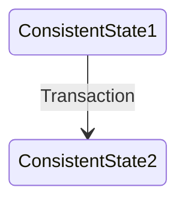

# CS162 Lecture 23: Filesystems III — Buffer Cache, Reliability, and Transactions
**Comprehensive Exam-Ready Reference Study Guide**

---

## 1. Architectural Review: Multilevel Indexed Filesystems

To understand how operating systems manage data efficiently, we must first review the structural layout of classic storage abstractions, such as the **Original UNIX Multilevel Indexed Filesystem (4.1 BSD, 1981)**. 

### 1.1 Structural Layout of the 4.1 BSD Inode
Rather than storing file mapping records inside directory frames, the operating system tracks files using a fixed-size system data structure called an **Inode (Index Node)**. The unique system identifier for a file, known as its **`inumber` (inode number)**, serves as a direct index into a master on-disk array of inodes. 


The original 4.1 BSD inode architecture organizes block pointers using an asymmetric tree structure to support both tiny metadata footprints and large maximum file capacities:
* **File Metadata Block:** Contains the file's file mode flags (permissions), ownership bitfields (user ID and group ID), metadata tracking counters (reference counts, block counts), and three distinct access/modify timestamps (`atime`, `mtime`, `ctime`).
* **Direct Pointers:** Contains exactly **10 Direct Pointers**. Each direct pointer stores the absolute physical disk address of a data block. In a system with a base block size of $1\text{ KB}$ ($1024\text{ bytes}$), these ten pointers can directly access up to $10\text{ KB}$ of data without any intermediary lookups.
* **Single Indirect Pointer:** Points to an intermediary block filled entirely with data block addresses. For a 4-byte ($32\text{-bit}$) pointer layout, a $1\text{ KB}$ indirect block can store exactly:
  $$\frac{1024\text{ bytes}}{4\text{ bytes/pointer}} = 256\text{ block pointers}$$
  This expands file capacity by an additional $256\text{ KB}$.
* **Double Indirect Pointer:** Points to an indirect block that contains pointers to 256 *single indirect* blocks, which in turn point to data blocks. This expands file capacity by:
  $$256 \times 256 = 65,536\text{ blocks} \implies 64\text{ MB}$$
* **Triple Indirect Pointer:** Extends this hierarchy down a third layer, pointing to a block containing 256 double indirect pointers, expanding capacity by:
  $$256 \times 256 \times 256 = 16,777,216\text{ blocks} \implies 16\text{ GB}$$

---

### 1.2 Mathematical Derivation of I/O Lookup Penalties
Assuming that a file's inode has already been fetched and cached in system memory during the initial `open()` call, the number of additional physical disk I/O operations required to read a block depends entirely on its logical offset within the file:

* **Case 1: Accessing Logical Block #5 (Direct Range)** 
  Because Block 5 falls within the first ten blocks of the file (indices 0 to 9), its disk address is stored directly inside the inode. 
  $$\text{Total Disk Accesses} = \mathbf{1} \text{ (One I/O to read the target data block directly)} \quad \text{}$$
* **Case 2: Accessing Logical Block #23 (Single Indirect Range)** 
  Since index 23 exceeds the direct pointer boundary ($23 \ge 10$) but falls within the single indirect limit ($10 \le 23 < 266$), the kernel must parse the single indirect address block.
  $$\text{Total Disk Accesses} = \mathbf{2} \text{ (One I/O to load the indirect pointer block + One I/O to read the data block)} \quad \text{}$$
* **Case 3: Accessing Logical Block #340 (Double Indirect Range)** 
  Because index 340 exceeds the single indirect limit ($340 \ge 266$), the translation must route through the double indirect pointer array.
  $$\text{Total Disk Accesses} = \mathbf{3} \text{ (One for the double-indirect block + One for the indirect block + One for the data block)} \quad \text{}$$

#### Trade-off Analysis of Multilevel Indexing
* *Advantages:* Simple implementation footprint. Small files are lightweight and fast to access since they require zero indirection. Files can easily expand dynamically on-demand up to the system's hard addressing limits.
* *Disadvantages:* Severe disk head seek penalties can occur over time as files become fragmented across the disk. Accessing massive files requires multiple sequential block reads through indirect layers, which can add significant overhead if metadata blocks aren't cached efficiently.

---

## 2. The File System Buffer Cache Subsystem

### 2.1 The Impedance Match Problem between Memory and Storage
Operating systems handle a major design challenge: bridging the structural and performance gap between user-space application models and physical storage hardware.


This challenge arises from three main mismatches between application I/O and hardware storage layers:
1. **The Alignment and Size Mismatch:** Applications perform arbitrary I/O requests using variable-sized buffers that are rarely aligned to page or sector boundaries. In contrast, physical storage devices operate exclusively using fixed-size blocks (e.g., $512\text{-byte}$ or $4\text{ KB}$ sectors on hard drives, and $4\text{ KB}$ pages on solid-state drives).
2. **The Operational Disparity:** To read or write even a single byte inside a block, the filesystem must read the entire block into memory, modify the target byte, and write the whole block back to the physical medium. This multi-step process applies to data blocks, inodes, directory listings, and free-space tracking maps alike.
3. **The Latency Chasm:** CPU registers and volatile RAM operate at sub-nanosecond to nanosecond speeds, whereas mechanical storage drives take milliseconds ($10^{-3}\text{ s}$) to service a request due to physical arm seeks and rotational delays. This speed difference can stall thread execution if every I/O operation has to hit the physical disk.

---

### 2.2 Core Definition and Motivation of the Buffer Cache
To mask these latency penalties and smooth out data alignment differences, the operating system layers a block-based **Buffer Cache** directly between the Virtual File System (VFS) and low-level platform device drivers.

```
+-------------------------------------------------------------------------+
|                    Virtual File System (VFS) Layer                      |
+------------------------------------+------------------------------------+
                                     | Maps POSIX read()/write() APIs
                                     v
+-------------------------------------------------------------------------+
|                  The Unified Block Buffer Cache                         |
|  [ Cached Inodes ]   [ Cached Directories ]   [ Cached Data Blocks ]   |
+------------------------------------+------------------------------------+
                                     | Coordinates Logical Block Addressing
                                     v
+-------------------------------------------------------------------------+
|                Low-Level Platform Hardware Drivers                      |
|            (Direct Memory Access (DMA) Control Pipelines)               |
+-------------------------------------------------------------------------+
```

The buffer cache is a dedicated pool of kernel memory used to cache physical disk blocks, inodes, free bitmaps, and path-to-inode name translations. It operates using specific design rules:
* **The Cache Mapping Rule:** Every block tracked in the buffer cache maps a specific physical block address to its current memory representation.
* **Data Transparency:** When an application modifies data in the cache, the block is flagged as **Dirty** in its descriptor state. This flag tells the operating system that the memory copy contains new changes that must eventually be written back to secondary storage.

---

### 2.3 Comprehensive Data Flow Lifecycles

#### 1. The Name Resolution and Lifecycle Path of `open()`
When an application invokes an `open("/home/tom/foo.txt", O_RDWR)` system call, the command must trace the file path across the directory hierarchy to resolve its inode:

```
[ open() Syscall ] -> Check Name Translation Cache for "/home/tom/foo.txt"
                            |
             +--------------+--------------+
             |                             |
        (Cache Hit)                  (Cache Miss)
             |                             |
             v                             v
     Return Cached Inode          Bootstrap Root Inode (Fixed Block)
                                  Loop: Load Directory Data Block into Cache
                                        Search Entry Map for Next Target String
                                        Fetch Matching inumber Reference
                                  End Loop: Allocate In-Memory Inode Descriptor
                                            Bind File Descriptor in Process PCB Table
```

1. **Name Cache Verification:** The kernel checks its internal name translation table for the path string. If it finds a match (cache hit), the system returns the cached inode pointer immediately, skipping disk directory processing.
2. **Directory Walk Bootstrapping:** If a cache miss occurs, the VFS loads the root directory (`/`) inode from its fixed location on disk.
3. **Directory Block Processing Loop:** To resolve the next component in the path (e.g., `"home"`), the kernel reads the directory's data blocks into the buffer cache. It searches the directory mapping for the string `"home"` to locate its corresponding `inumber`. 
4. **Iterative Path Traversal:** The kernel repeats this process, using the resolved `inumber` to fetch the next directory's data blocks into the cache, parsing them until it reaches the target file `"foo.txt"`.
5. **In-Memory Descriptor Mapping:** Once the target file's inode is found, the kernel creates an active entry in the global system open file table, sets its reference counter, and maps an integer file descriptor (`fd`) into the process's Process Control Block (PCB).

#### 2. The Structural Lifecycle Path of `read()`
When a process executes a `read(fd, buffer, length)` system call, data is moved through the cache layer using the following pipeline:

```
                     +---------------------------------------+
                     | App Invokes read() via File Descriptor |
                     +-------------------+-------------------+
                                         |
                                         v
                     +---------------------------------------+
                     | VFS Translates Target Offset Pointer  |
                     | Maps Logical Offset to Logical Block  |
                     +-------------------+-------------------+
                                         |
                                         v
                     +---------------------------------------+
                     |    Query Unified Block Buffer Cache   |
                     +-------------------+-------------------+
                                         |
                        +----------------+----------------+
                        |                                 |
                   (Cache Hit)                      (Cache Miss)
                        |                                 |
                        |                                 v
                        |                    Halt Thread Execution
                        |                    Allocate Clean Buffer Frame
                        |                    Issue DMA Read Command to Device
                        |                    [ Hardware Streams Sector Bytes ]
                        |                    Interrupt Raised: Wake Thread
                        v                                 |
                     +------------------------------------+
                     | Copy Requested Byte Sub-Range From |
                     | Kernel Buffer to User-Space Memory |
                     +------------------------------------+
```

1. **Virtual Offset Pointer Mapping:** The VFS reads the file's current byte offset from the open file descriptor table and translates that offset into a target **Logical Block Index**.
2. **Buffer Cache Inspection:** The kernel queries the buffer cache using the logical block address. 
3. **Handling a Cache Miss:** If the block is missing from the cache, the kernel halts the thread's execution, allocates an empty buffer frame, and sends a Direct Memory Access (DMA) read request down to the device controller. The hardware streams the physical sector bytes directly into kernel memory over the system bus. Once the transfer finishes, the controller raises an interrupt, and the scheduler moves the blocked thread back to the ready queue.
4. **User-Space Memory Synchronization:** Once the block is resident in the buffer cache, the kernel copies the requested byte range out of the kernel buffer into the application's user-space memory buffer.

#### 3. The Structural Lifecycle Path of `write()`
When a process calls `write(fd, buffer, length)`, the operation uses a **Delayed Write (Write-Back)** policy to decouple application execution from physical disk latency:
1. **Cache Space Verification:** The VFS maps the target file offset to its corresponding logical block index. If the operation extends the file, the kernel updates the free-space allocation bitmaps in memory to reserve new blocks.
2. **Memory Copy Execution:** The kernel copies the data bytes directly from the application's user-space memory buffer into the designated block inside the kernel buffer cache.
3. **Dirty State Flagging:** The buffer cache marks the modified block descriptor as **Dirty** and immediately returns execution control to the user application, without waiting for the data to be written to disk.
4. **Data Visibility Guarantees:** Any subsequent `read()` system calls targeting these coordinates are served directly out of the buffer cache, ensuring that applications see up-to-date modifications even if the data hasn't hit physical storage yet.

---

## 3. Buffer Cache Replacement and Management Policies

### 3.1 LRU Feasibility: Buffer Cache vs. Demand Paging
Although both demand paging and the filesystem buffer cache act as volatile memory layers backed by secondary storage, they use fundamentally different cache replacement strategies due to hardware constraints:

```
+-----------------------------------------------------------------------------+
| DEMAND PAGING FRAMEWORK (Hardware Bounded)                                  |
| Hardware MMU manages page translations directly on the memory bus.          |
| Tracking exact LRU timestamps on every memory reference is too slow.        |
| Rationale: Must use lightweight approximations (e.g., NRU / Clock).        |
+-----------------------------------------------------------------------------+

+-----------------------------------------------------------------------------+
| FILE SYSTEM BUFFER CACHE (Software Bounded)                                 |
| Data requests must cross the software kernel boundary via system calls.     |
| Rationale: Kernel software manages lists directly, making true LRU viable.  |
+-----------------------------------------------------------------------------+
```

* **Demand Paging Limitations:** In a virtual memory system, the hardware Memory Management Unit (MMU) handles page lookups directly on the memory bus. Forcing the hardware to update linked lists or record exact timestamps on every single memory reference would add severe latency and slow down the processor. As a result, demand paging systems use lightweight approximations of Least Recently Used (LRU) algorithms, such as the Not Recently Used (NRU) or Clock algorithms.
* **Buffer Cache Advantages:** In contrast, every file access must explicitly cross the software kernel boundary through system calls (e.g., `read()` and `write()`). Because the kernel handles these requests via software subroutines, the overhead of updating links and tracking exact timestamps within its descriptor structures is negligible compared to total I/O latencies. This allows the filesystem to run a **Full, True LRU Replacement Policy** to manage its blocks.

---

### 3.2 The Cache Pollution Problem (Scanning Scans)
While a true LRU policy is highly effective for applications with strong temporal locality, it is vulnerable to a performance issue known as **Cache Pollution**.

This issue occurs when an application streams sequentially through a large filesystem volume (for instance, running a bulk maintenance command like `find . -exec grep foo {} \;`). 

```
Normal Cache State:    [ Hot Inodes ][ Active Directories ][ Working Set Files ]
Sequential Scan Pass:  =======================================================>
Polluted Cache State:  [ Dead Stream Block 994 ][ Dead Stream Block 995 ][ ... ]
```

Because the scanning application reads every block sequentially, an unmitigated LRU policy will continually fetch these stream blocks to the head of the cache list. This evicts the system's entire active working set of file headers, directories, and hot application blocks to make room for data that may never be accessed again.

#### Mitigating Pollution via Alternative Policies
To prevent scanning operations from wiping out hot caches, modern operating systems implement alternative buffer management strategies:
* **The 'Use Once' Strategy:** Applications or kernel threads can hint that a file is being read sequentially. The filesystem processes these blocks using a **Use Once** policy, immediately discarding the buffer frames or placing them straight at the tail of the eviction list as soon as the system call completes, protecting the main cache.

---

### 3.3 Dynamic Boundary Sizing and Memory Allocation
To optimize performance, the operating system must continually balance memory allocations between the **File System Buffer Cache** and the **Anonymous Virtual Memory Allocation Pool** (used for application heap and stack spaces):
* **The Storage Boundary Dilemma:** Allocating too much memory to the buffer cache leaves too little room for virtual memory, forcing applications to swap pages to disk frequently. Conversely, dedicating too much space to application memory starves the buffer cache, leading to severe disk thrashing as the filesystem repeatedly drops and reloads critical metadata blocks.
* **Dynamic Boundary Adjustments:** Modern kernels solve this dilemma by dynamically adjusting the memory boundary between the two pools. The system monitors disk access rates for both paging and file access over time. It balances memory allocations using an optimization heuristic:

$$\text{Memory Allocation Metric} \longrightarrow \text{Minimize } \left| \text{Disk Paging Rate} - \text{File Access Miss Rate} \right| \quad \text{}$$

---

### 3.4 File System Prefetching (Read-Ahead Heuristics)
To maximize throughput, the filesystem leverages the sequential access patterns of typical workloads by running **Read-Ahead Prefetching** algorithms.

```
Application Reads:       [ Block N ] 
Kernel Prefetch Engine:               ===========> [ Fetch Block N+1 ][ Fetch Block N+2 ]
```

When an application reads block $N$, the prefetch engine detects the sequential pattern and proactively issues background read requests for blocks $N+1$ and $N+2$ into the buffer cache before the application explicitly asks for them.
* **Elevator Scheduling Interleaving:** The I/O subsystem uses an elevator scheduling algorithm to interleave prefetch requests from concurrent applications efficiently. This groups scattered block requests into large, continuous disk reads, minimizing mechanical arm seeks and rotational delays.
* **Prefetch Bounding Constraints:** The prefetch engine must tightly control its read-ahead window. Prefetching too aggressively floods the cache with unread data and delays urgent explicit I/O requests from other applications. Conversely, prefetching too conservatively fails to clear rotational delays, causing the drive head to miss sectors and reducing throughput.

---

### 3.5 Delayed Writes (Writeback Cache Mechanics)
By treating the buffer cache as a write-back cache, the operating system can optimize on-disk layouts and accelerate write operations. When an application calls `write()`, data is committed directly to memory, allowing the system call to return immediately. The modified blocks are later flushed to physical disk storage when triggered by specific events:
1. **Cache Capacity Saturation:** The buffer cache fills up, forcing the eviction engine to run a replacement policy to free up space. The engine selects dirty blocks, writes their contents back to disk, and clears their dirty flags before reclaiming the frames.
2. **Periodic Flushing Intervals:** To limit data loss in the event of an unexpected crash, a background kernel thread (such as `pdflush` or `fsflush`) periodically wakes up to flush dirty blocks to disk. For example, Linux systems enforce a standard **30-second periodic flush window**.

#### Rationale for Eviction Policy Mismatches
This design explains a key difference between demand paging and buffer cache eviction behaviors:
* *Demand Paging:* Evicts clean or unmodified pages only when physical memory runs low, keeping data resident as long as possible.
* *Buffer Cache:* Periodically flushes dirty blocks back to persistent storage even if they are being actively and frequently modified in memory. This proactive flushing minimizes the window of data exposure and reduces corruption risks in the event of a system crash.

#### Architectural Benefits of Delayed Writes
* **Elevator Reordering Optimization:** Gathering writes in memory gives the disk scheduler a larger pool of pending requests to sort. The scheduler applies an elevator algorithm to organize random updates into a clean, continuous sequential write pass, eliminating unnecessary head seeks.
* **Contiguous Block Allocation:** Delaying disk writes allows the block allocator to calculate the total size of a growing file before committing it to storage. This enables the filesystem to allocate large, contiguous runs of blocks on disk, preventing fragmentation.
* **Volatile File Elimination:** Many temporary files (such as compiler intermediate files or short-lived pipeline buffers) are created, processed, and deleted within a few seconds. Delayed writes allow these short-lived files to be created and deleted entirely within memory, bypassing physical disk storage completely and saving I/O bandwidth.

---

## 4. Memory-Mapped Files (`mmap`)

### 4.1 Traditional I/O System Calls vs. Memory Mapping
Traditional file interactions rely on explicit data transfers using the POSIX `read()` and `write()` system calls. This architecture introduces significant performance costs for high-frequency operations:

```
TRADITIONAL SYSCALL PATHWAY:
[ Disk Platters / Flash Cells ] 
           | Direct Memory Access (DMA) Transfer Loop
           v
[ Kernel Unified Buffer Cache Buffer ] 
           | Kernel Software Memory Copy Routine (sys_read / sys_write)
           v
[ Application User-Space Memory Space Buffer ]
```

This model requires copying data twice: first from the disk to the kernel's buffer cache via DMA, and second from the kernel buffer to the application's user-space memory space via a software memory copy routine. Each transfer also requires executing a full system call, which incurs context-switching overhead.

**Memory Mapping (`mmap`)** eliminates this double-copying bottleneck by mapping a file's contents directly into an empty region of the process's Virtual Address Space (VAS).

```
MEMORY-MAPPED (mmap) FILE ARCHITECTURE:
Process Address Space (VAS Line) ----> [ Page Table Translation Entry ] 
                                                   |
                                                   v Maps directly to shared frame
                                    [ Kernel Unified Buffer Cache Buffer Frame ]
                                                   ^
                                                   | Direct Memory Access (DMA)
                                    [ Disk Storage / Persistent Medium ]
```

When an application uses `mmap()`, the kernel updates the process's page table entries to point directly to the physical memory frames allocated to the file inside the unified buffer cache. This allows the application to read and modify file data using standard memory pointer instructions (e.g., pointer dereferencing and `strcpy()`), completely bypassing the context switches and buffer copying overhead of traditional system calls.

---

### 4.2 Handling Page Faults on Mapped Files
When an application first initializes a memory-mapped file via `mmap()`, the kernel marks the associated page table entries as **Not Present** to defer expensive disk loads:

```
1. Application attempts to read or write data via pointer: `char access = mfile[offset];`
2. The hardware MMU intercepts the translation, detects the invalid entry, and raises a Page Fault trap.
3. The Kernel Page Fault Handler catches the trap and looks up the file descriptor associated with that address range.
4. The handler allocates a clean physical memory frame inside the buffer cache.
5. The storage subsystem issues a DMA command to load the requested page block from disk into the allocated frame.
6. The handler updates the process's Page Table Entry, maps it to the new frame, and sets its validation flags.
7. The scheduler resumes the stalled thread, prompting the CPU to re-run the original memory instruction transparently.
```

---

### 4.3 The `mmap()` System Call Interface Specification
The standard POSIX signature for mapping files into a process's virtual address space is defined as follows:

```c
#include <sys/mman.h>

void *mmap(void *addr, size_t len, int prot, int flags, int fd, off_t offset);
```

#### Detailed Parameter Demarcation
* `addr`: Specifies the preferred starting virtual address for the mapping. Passing `0` (`NULL`) delegates this decision to the kernel, prompting it to automatically find a suitable, page-aligned empty slot in the process's address space.
* `len`: Specifies the total length of the file segment to map, quantified in bytes.
* `prot`: Defines the memory protection flags for the mapped region, which must align with the open permissions of the file descriptor:
  * `PROT_READ`: Allows the process to read data from the mapped page frames.
  * `PROT_WRITE`: Allows the process to write data to the mapped page frames.
  * `PROT_EXEC`: Allows the process to execute instructions stored within the mapped region (used implicitly when loading executable binaries via `exec()`).
* `flags`: Controls how modifications are shared across the system:
  * `MAP_SHARED`: Modifications are written directly to the underlying file through the shared buffer cache, making updates visible to all other processes mapping the same file.
  * `MAP_PRIVATE`: Creates a copy-on-write mapping. Modifications remain private to the calling process's memory space and are never written back to the underlying file on disk.
* `fd`: The open file descriptor of the file to map.
* `offset`: The absolute byte offset within the file where the mapping begins. This value must be an integer multiple of the system's hardware page size.

---

### 4.4 Fully Realized C Implementation of Memory Mapping
The following program demonstrates how to safely open, memory-map, inspect, and modify a file using standard POSIX `mmap()` mechanics:

```c
#include <stdio.h>
#include <stdlib.h>
#include <string.h>
#include <fcntl.h>
#include <unistd.h>
#include <sys/mman.h>
#include <sys/stat.h>

// Global marker variable to inspect memory segment placements 
int global_marker_data = 162; 

int main(int argc, char *argv[]) {
    int file_descriptor;
    char *mapped_file_buffer;
    struct stat file_statistics;
    long stack_tracking_variable = 0x7FFF;

    // Validate command-line arguments
    if (argc < 2) {
        fprintf(stderr, "Usage: %s <target_file_path>\n", argv[0]);
        return EXIT_FAILURE;
    }

    // Print address locations to inspect virtual memory layout 
    printf("Data Segment Location:  0x%16lx\n", (unsigned long)&global_marker_data); //
    printf("Heap Segment Location:  0x%16lx\n", (unsigned long)malloc(1));            //
    printf("Stack Segment Location: 0x%16lx\n", (unsigned long)&stack_tracking_variable); //

    // Step 1: Open the target file with Read-Write permissions 
    file_descriptor = open(argv[1], O_RDWR); //
    if (file_descriptor < 0) {
        perror("Error opening target file");
        return EXIT_FAILURE;
    }

    // Retrieve file statistics to identify its total size
    if (fstat(file_descriptor, &file_statistics) < 0) {
        perror("Error analyzing file statistics");
        close(file_descriptor);
        return EXIT_FAILURE;
    }

    // Step 2: Map the file directly into the process's address space 
    mapped_file_buffer = (char *)mmap(
        NULL,                        // Let the system choose the virtual address slot 
        file_statistics.st_size,     // Map the full length of the file 
        PROT_READ | PROT_WRITE,      // Enable both read and write operations 
        MAP_SHARED,                  // Shared changes are written back to disk 
        file_descriptor,             // Provide the file descriptor 
        0                            // Start mapping from byte offset 0 
    );

    if (mapped_file_buffer == MAP_FAILED) {
        perror("mmap system call failed");
        close(file_descriptor);
        return EXIT_FAILURE;
    }

    // Print the memory coordinates of the newly mapped file 
    printf("mmap Segment Location:  0x%16lx\n", (unsigned long)mapped_file_buffer); //

    // Step 3: Read file contents directly out of memory 
    printf("\n--- Current Mapped File Contents ---\n%s\n", mapped_file_buffer); //

    // Step 4: Modify file contents directly using pointer operations 
    if (file_statistics.st_size > 40) {
        // Overwrite bytes starting at index 20 
        strcpy(mapped_file_buffer + 20, "Let's write over its line three\n"); //
    } else {
        printf("File is too small to perform inline string modifications.\n");
    }

    // Step 5: Clean up system resources 
    if (munmap(mapped_file_buffer, file_statistics.st_size) < 0) {
        perror("Error releasing memory mapping");
    }
    
    close(file_descriptor); //
    return EXIT_SUCCESS;
}
```

---

### 4.5 Inter-Process Communication and Sharing via Mapped Files
Memory mapping provides an efficient mechanism for high-speed Inter-Process Communication (IPC) by allowing independent processes to share the same physical memory frames:


* **Shared File-Backed Mapping (`MAP_SHARED`):** When two distinct processes call `mmap()` on the same file with the `MAP_SHARED` flag, the kernel updates both processes' page tables to point to the exact same physical memory frames inside the unified buffer cache. Any modifications written by Process 1 are instantly visible to Process 2 via memory instructions, completely bypassing the file system layer and accelerating IPC data transfers.
* **Anonymous Shared Mapping (`MAP_ANONYMOUS`):** Processes can also create shared memory regions that aren't backed by any physical file on disk. By configuring the `MAP_ANONYMOUS` flag during an `mmap()` call, the kernel sets up a raw memory space backed purely by system swap space. This technique is commonly used to establish high-speed shared memory channels between parent and child processes after a UNIX `fork()` call.

---

## 5. System Dependability and Redundant Storage Arrays (RAID)

### 5.1 Bounding Dependability Parameters
To build reliable enterprise systems, engineers use strict parameters defined by the IEEE to measure system dependability and fault tolerance:
* **Availability ($A$):** The statistical probability that a system is up, operational, and able to accept and process incoming user requests at any given instant. Availability is measured using a standardized "nines of probability" scale (e.g., $99.9\%$ availability represents "3-nines of uptime"). It relies heavily on minimizing independent component failures across the machine.
* **Durability ($D$):** The long-term ability of a storage system to preserve data integrity and recover data correctly even in the face of underlying media defects or hardware faults. 

  *Crucial Rationale Difference:* Durability measures data survival, whereas availability measures data access. For example, historical records carved into ancient stone monuments are incredibly *durability-stable*, but they had low *availability* for centuries until the discovery of the Rosetta Stone enabled scholars to read them.
* **Reliability ($R$):** Defined by the IEEE as the ability of a system or component to perform its required functions correctly under stated conditions for a specified period of time. Reliability is a broad, comprehensive metric that requires both high availability (the system is up) and high durability (data is correct and uncorrupted).

---

### 5.2 Storage Hardware Protection Mechanisms
Modern systems protect data integrity across multiple layers of the storage hierarchy:
* **Sector-Level Error Correcting Codes (ECC):** Individual disk sectors store data alongside specialized Reed-Solomon Error Correcting Codes. These on-disk codes allow the hardware controller to automatically detect and correct small localized media defects or data corruption errors during read operations.
* **Non-Volatile RAM (NVRAM) Buffering:** To accelerate performance safely, high-end storage controllers back up their buffer caches using battery-backed **Non-Volatile RAM (NVRAM)**. If an unexpected power failure or system crash occurs, the battery backup keeps the NVRAM powered, allowing the controller to safely flush any unwritten dirty blocks back to disk upon reboot and preventing data loss.

---

### 5.3 Redundant Arrays of Independent Disks (RAID) Topologies

Developed at UC Berkeley, **RAID (Redundant Array of Independent Disks)** architectures use data distribution and redundancy across multiple physical drives to achieve high durability and availability.

#### 1. RAID 1: Disk Mirroring / Shadowing
RAID 1 mirrors data completely across pairs of physical drives, ensuring absolute redundancy.

```
           +-------------------------+-------------------------+
           | Master Disk Drive 1     | Shadow Mirror Drive 2   |
           +-------------------------+-------------------------+
           | Block 0 Payload Data    | Block 0 Duplicated Copy |
           | Block 1 Payload Data    | Block 1 Duplicated Copy |
           +-------------------------+-------------------------+
```

* **Storage Capacity Cost Overhead:** Enforces a steep **100% capacity storage overhead cost**, as every byte written requires duplicating the data onto an identical mirror drive.
* **Performance Constraints:** Write operations are bounded by the speed of dual writes, requiring the controller to duplicate every update across both physical drives. However, read performance can be optimized significantly: the controller can handle two independent read operations simultaneously by splitting requests across the twin heads.
* **Fault Recovery Operations:** If a drive encounters a physical failure, the controller seamlessly switches all traffic to the surviving mirror drive without interrupting availability. The broken drive is replaced, and the system automatically rebuilds the mirror by copying data over from the healthy drive. Enterprise environments often attach an idle **Hot Spare** drive to the array, allowing the controller to initialize the mirror rebuild instantly if a drive fails.

#### 2. RAID 5: Distributed Block-Level Striping with Parity
RAID 5 balances high storage efficiency with fault tolerance by striping data blocks and parity bits evenly across an array of $N$ disks ($N \ge 3$).

```
          Disk 1        Disk 2        Disk 3        Disk 4        Disk 5
       +------------+------------+------------+------------+------------+
Row 0  |  Block D0  |  Block D1  |  Block D2  |  Block D3  | Parity P0  | -> Stripe 0
Row 1  |  Block D4  |  Block D5  |  Block D6  | Parity P1  |  Block D7  | -> Stripe 1
Row 2  |  Block D8  |  Block D9  | Parity P2  |  Block D10 |  Block D11 | -> Stripe 2
       +------------+------------+------------+------------+------------+
```
*Source: Stripe visualization adapted from Lecture 23, Page 30* 

* **Mathematical Parity Verification Arithmetic:** The array generates a redundant **Parity Block (`P`)** for each stripe row by executing a bitwise Exclusive-OR (`XOR`) operation across its matching data blocks:
  $$P_0 = D_0 \oplus D_1 \oplus D_2 \oplus D_3 \quad \text{}$$
* **Fault Reconstruction Heuristics:** RAID 5 can recover from the complete loss of any single drive in the array without data loss. For example, if Disk 3 crashes, the controller can reconstruct the missing data block $D_2$ on the fly by XORing the remaining data blocks with the stripe's parity block:
  $$D_2 = D_0 \oplus D_1 \oplus D_3 \oplus P_0 \quad \text{}$$
* *Storage Efficiency:* The capacity cost overhead is limited to the equivalent of a single drive's space ($1/N$), providing much higher storage efficiency than RAID 1.

#### 3. RAID 6 and High-Order Advanced Erasure Codes
As hard drive capacities have scaled into multi-terabyte dimensions, RAID 5 arrays face a major risk: the **RAID 5 Rebuild Bottleneck**. Rebuilding a failed multi-terabyte drive requires reading every sector across the remaining disks, a process that can take days. If a second drive encounters an unrecoverable read error or physical fault during this long rebuild window, the entire array collapses, leading to permanent data loss.

To prevent these dual-failure collapses, enterprise systems implement **RAID 6** and high-order **Erasure Codes**:
* **RAID 6 Multi-Fault Tolerance:** RAID 6 allocates two distinct parity blocks per stripe row (often using specialized matrix math like the **EVENODD code**), allowing the array to tolerate the **simultaneous loss of any two physical drives** concurrently without data corruption.
* **General Reed-Solomon Codes:** High-order erasure codes treat data blocks as coefficients of a mathematical polynomial over a Galois Field $GF(2^k)$. The encoding engine maps $m$ data points onto a polynomial curve to generate $n$ total fragments ($n > m$). This mathematical mapping ensures that **any $m$ surviving points are sufficient to fully reconstruct the original polynomial**, allowing the system to survive the concurrent loss of up to $n-m$ fragments.

```
                Geographic Erasure Code Distribution Engine
+-------------------------+                  +-------------------------+
| Enterprise Datacenter   |                  | Cloud Infrastructure    |
+-------------------------+                  +-------------------------+
| Source File Payload     |                  | Fragment 1 -> US-East   |
| Mapped onto Polynomial  +=================>| Fragment 2 -> EU-West   |
| m = 4 Chunks Generated  |                  | Fragment 3 -> Asia-South|
|                         |                  | Fragment 4 -> AU-East   |
+-------------------------+                  +-------------------------+
                                             \=========================/
                                               Any 4 fragments can fully
                                               rebuild the original file.
```

* **Geographic Scale Redundancy:** Erasure coding principles extend well beyond local disk arrays. Cloud storage providers use geographic replication to split data into $m=4$ base chunks, generate $n=16$ fragments, and distribute them across datacenters worldwide. Because any 4 fragments can fully rebuild the original file, the data remains highly durable and available even if multiple datacenters are knocked offline by severe weather or network outages.

---

## 6. Filesystem Crash Consistency and Recovery Paradigms

### 6.1 The Crash Consistency Problem
A single logical operation in a filesystem (such as appending data to a file) frequently requires updating multiple separate data structures on disk:
1. **The Block Bitmap (`Free Map`):** Must be updated to mark the newly allocated data block as in-use.
2. **The Inode Table Header:** Must be updated to increase the file size field and add a pointer to the new data block.
3. **The Data Block Pool:** Must be written to store the actual file payload bytes on disk.

Because persistent storage hardware can only update one sector at a time, a sudden power failure or kernel panic midway through these modifications will leave the filesystem in an **Inconsistent State**. 

For instance, if the block bitmap is updated in memory but the system crashes before the new inode pointer is written to disk, those data blocks become permanently leaked, causing space to disappear from the volume.

---

### 6.2 Approach 1: Careful Ordering and File System Checkers (`fsck`)
Early filesystems, such as **MS-DOS FAT** and the **Original Berkeley FFS**, managed crash consistency by strictly ordering their disk write operations.

#### Step-by-Step Careful Ordering Sequence for File Creation
To ensure the filesystem can recover safely if an operation is interrupted, the kernel sequences its updates in a specific order:
1. **Allocate and Write Data Blocks:** The system allocates and writes the file's raw data blocks to disk first. This ensures that if the operation crashes later, the metadata won't accidentally point to uninitialized or garbage disk sectors.
2. **Allocate and Write the Inode Entry:** The kernel allocates an empty inode slot and writes the file metadata and block pointers to the inode table.
3. **Update Directory Mappings:** The system writes the filename string and its matching `inumber` into the parent directory's data blocks.
4. **Update Free Space Bitmaps:** The kernel updates the on-disk block and inode bitmaps to finalize the allocations.

#### The Post-Crash Verification Scan (`fsck`)
If a system crashes with unwritten dirty blocks in its cache, the operating system must run a specialized utility called **`fsck` (File System Checker)** upon reboot to scan and repair metadata inconsistencies:
* **Inode Table Audit:** The checker scans every inode entry on the disk. If it discovers an allocated inode that isn't linked to any directory directory, it moves the orphan file to a dedicated `/lost+found` folder or clears it to reclaim space.
* **Bitmap Recomputations:** The utility traverses every active inode pointer tree to manually recompute the true block allocation map. It compares this recomputed map against the on-disk free bitmaps, correcting any mismatches to resolve leaked space.
* **The Scaling Bottleneck:** Because `fsck` must scan the entire partition structure sequentially, its recovery time scales linearly with the total capacity of the storage volume. For modern multi-terabyte arrays, an `fsck` scan can take hours to complete, keeping critical systems offline and severely hurting availability.

---

### 6.3 Approach 2: Copy-on-Write (COW) Filesystems
Modern enterprise storage platforms—such as NetApp's **Write Anywhere File Layout (WAFL)** and Oracle's **ZFS / OpenZFS**—eliminate crash consistency bugs by using a **Copy-on-Write (COW)** filesystem layout.

```
OLD VERSION TREE STATE:                NEW VERSION TREE STATE (Leading Fringe Update):
       [ Root Inode Block O ]                 [ Root Inode Block N ]
          /            \                         /            \
  [ Inode A ]        [ Inode B ]         [ Inode A ]        [ Inode B_New ]
   /       \          /       \           /       \          /        \
[D0]       [D1]    [D2]       [D3]     [D0]       [D1]    [D2]        [D3_New]
                                                                        ^
                                                                        | (Modified Data Block Written)
                                                                 [ Clean Data Payload Written ]
```
*Source: Structural logic mapped from Lecture 23, Page 38* 

#### Core Mechanics of COW File Adjustments
Instead of modifying data blocks in place, a COW filesystem writes updated data onto a clean, unallocated block elsewhere on the disk. 
1. **Fringe Update Propagation:** When an application modifies data block $D3$, the filesystem writes the new data onto a clean block named $D3_{\text{New}}$.
2. **Path Traversal Reconstruction:** To link this new block into the file, the filesystem generates a new copy of the parent inode block ($B_{\text{New}}$) containing an updated pointer to $D3_{\text{New}}$, while keeping its remaining pointers linked to the unmodified blocks ($D2$).
3. **Atomic Root Swapping Activation:** The system updates the master root pointer to point to the new top-level inode block ($N$). Because the old tree remains completely untouched on disk until this root pointer is updated, the operation is inherently atomic. If a crash occurs midway through the write, the system simply reloads the old root pointer, discarding the partial update and ensuring instant recovery without needing an `fsck` scan.

#### Example: ZFS and OpenZFS
Real-world COW systems like **ZFS** and **OpenZFS** implement several advanced features based on this model:
* **Variable Sized Blocks:** Supports block sizes ranging from $512\text{ B}$ up to $128\text{ KB}$.
* **Symmetric Trees:** Knows whether a file is large or small when making a copy.
* **Versioned Pointers:** Stores version numbers directly with pointers, allowing the creation of new versions simply by adding blocks and new pointers.
* **Write Buffering:** Buffers a collection of writes in memory before creating a new single version with all of them simultaneously.
* **Extent-Based Free Space Trees:** Free space is represented as a tree of extents within each block group. It delays updates to free space (writing them into a log) and applies them all at once when a block group is activated.

---

### 6.4 Approach 3: Journaling (Write-Ahead Logging)
**Journaling File Systems**—such as Linux **Ext3 / Ext4** and Windows **NTFS**—solve the crash consistency problem by implementing a **Write-Ahead Log (WAL)** called a **Journal**.


#### Step-by-Step Lifecycle for Creating a File with Journaling
Instead of modifying on-disk file structures directly, a journaling filesystem records updates as a sequential series of transactions inside a dedicated log on disk:

```
                  Step-by-Step Journaling Implementation Path
+-----------------------------------------------------------------------------+
| Step 1: Initialize Transaction Intent Log                                  |
| The kernel appends a [Tx_Start] tag to the journal to open a transaction.    |
+-----------------------------------------------------------------------------+
                                     |
                                     v
+-----------------------------------------------------------------------------+
| Step 2: Write Modifications directly to the Journal                         |
| The filesystem writes all intended modifications (block updates, inodes,   |
| directory changes) sequentially into the journal region.|
+-----------------------------------------------------------------------------+
                                     |
                                     v
+-----------------------------------------------------------------------------+
| Step 3: Append the Commit Tag (The Atomic Boundary)                         |
| Once all updates are written to the log, the kernel appends a [Tx_Commit]   |
| tag to the journal. The transaction is now safely committed.   |
+-----------------------------------------------------------------------------+
                                     |
                                     v
+-----------------------------------------------------------------------------+
| Step 4: Asynchronous Replay (Checkpointing)                                 |
| In the background, the filesystem copies the modifications from the log    |
| into the actual filesystem structures on disk.            |
+-----------------------------------------------------------------------------+
                                     |
                                     v
+-----------------------------------------------------------------------------+
| Step 5: Garbage Collection Freeing                                          |
| Once the updates are fully written to the main filesystem structures, the    |
| kernel reclaims the journal space, removing the transaction entry.|
+-----------------------------------------------------------------------------+
```

---

#### Crash Recovery Scenarios

##### Scenario A: Crash Occurs Prior to Commit
If the system encounters a sudden power loss before the `[Tx_Commit]` tag is fully written to disk, the transaction is incomplete. Upon reboot, the recovery engine scans the journal and detects the missing commit tag. It immediately discards the partial log entries, leaving the master filesystem structures completely unchanged and preventing metadata corruption.

##### Scenario B: Crash Occurs After Commit but Before Checkpointing
If the system crashes after the `[Tx_Commit]` tag is safely written to disk but before the changes are copied to the main filesystem structures, the data is secure. Upon reboot, the recovery engine scans the journal, finds the matching commit tag, and replays the transaction sequentially to apply the changes to the filesystem structures, completing recovery in seconds.

#### Metadata-Only Journaling Optimization
Writing every update twice (once to the journal log and once to the main filesystem structures) introduces a double-writing performance bottleneck. To optimize performance, modern filesystems run **Metadata-Only Journaling** by default:
* **The Optimization Principle:** The system logs only the structural metadata updates (inodes, directory mappings, and free-space bitmaps) to the journal. The actual large data payloads are written directly to the allocated file blocks on disk, bypassing the log entirely. This metadata-only approach protects the internal structural integrity of the filesystem from corruption while maximizing raw data transfer speeds.

---

### 6.5 Transactions: Generalizing Atomic Updates
More general reliability solutions utilize **Transactions** to provide atomic updates and **Redundancy** (like ECC and RAID) for media failures. 

**Key Concept:** A transaction is an atomic sequence of reads and writes that takes the system from one consistent state to another.


* **Extending Critical Sections:** While code inside a memory critical section appears atomic to other threads, transactions extend this concept of atomic updates from memory to stable, persistent storage.
* **Atomic Property:** They ensure that multiple related updates are performed atomically—if a crash occurs in the middle, the state of the system reflects either *all* or *none* of the updates.
* **Ad-Hoc vs. Built-In:** Historically, systems used many ad-hoc approaches (like FFS's careful ordering + fsck, or applications using temporary files and then renaming them). Most modern file systems, however, use transactions natively and internally to update filesystem structures and metadata. Many applications also implement their own transactions to avoid data corruption (e.g., preventing a bank transfer from being interrupted after the withdrawal but before the deposit).

---

## 7. Core Memory and Storage Reference Architecture

### Technical Operations and Rationale Matrix

```
BUFFER CACHE PERFORMANCES LOGISTRY TABLE:
+-------------------+---------------------------------------------------------+
| Design Choice     | System Architectural Rationale and Metrics              |
+-------------------+---------------------------------------------------------+
| LRU Eviction      | Fully feasible because software calls cross the kernel  |
| Implementation    | system boundary, making lookup tracking costs minor     |
|                   | compared to physical disk latencies. |
+-------------------+---------------------------------------------------------+
| Delayed Writes    | Dramatically reduces user write latency.  |
| Optimization      | Enables elevator algorithms to group random updates     |
|                   | into clean sequential write passes.        |
+-------------------+---------------------------------------------------------+
| Use Once Heuristics| Mitigates cache pollution by immediately discarding     |
| Enforcement       | sequential data blocks from streaming operations        |
|                   | like find/grep commands.       |
+-------------------+---------------------------------------------------------+

STORAGE RAID TOPOLOGIES LOGISTRY TABLE:
+-------------------+---------------------------------------------------------+
| RAID Type         | Redundancy Arithmetic and Fault Performance Metrics    |
+-------------------+---------------------------------------------------------+
| RAID 1 Mirror     | Enforces a steep 100% capacity cost overhead.|
| Architecture      | Optimizes read speeds by splitting independent requests |
|                   | concurrently across duplicate drive heads. |
+-------------------+---------------------------------------------------------+
| RAID 5 Striped    | Constructs parity blocks via bitwise XOR operations     |
| Array             | across the stripe: P0 = D0 (+) D1 (+) D2 (+) D3.|
|                   | Tolerates the complete loss of any 1 drive.|
+-------------------+---------------------------------------------------------+
| RAID 6 Advanced   | Allocates dual parity blocks per stripe row to tolerate |
| Arrays            | the simultaneous loss of any 2 drives.     |
|                   | Leverages Reed-Solomon polynomial math.     |
+-------------------+---------------------------------------------------------+
```
*Source: Core metrics compiled from Lecture 23, Pages 12, 13, 17, 18, 28, 29, 30, & 31*

---
