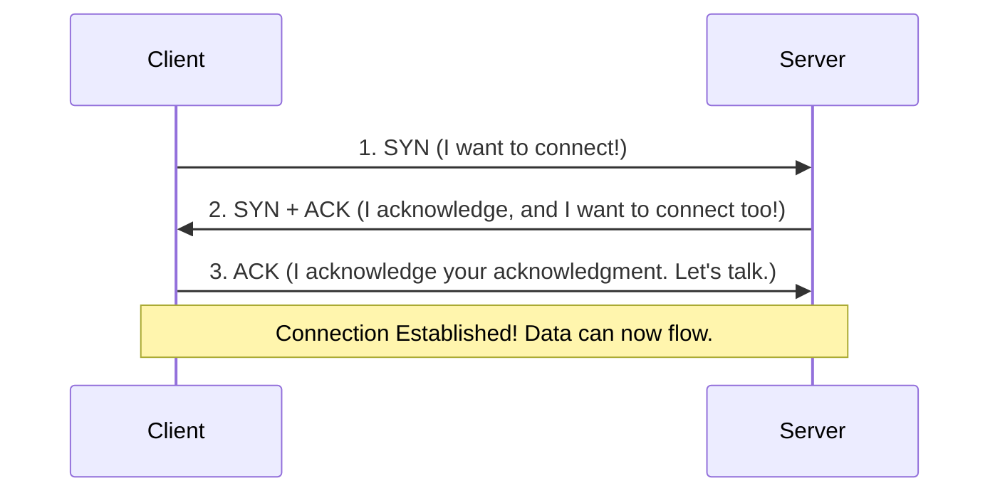
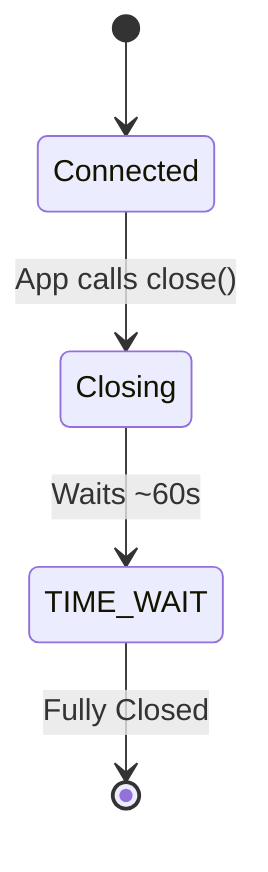

# Networking Foundations: The Absolute Basics

> **Why does this matter?** Before you can write code that talks across the internet, you need to understand *how* the internet talks. If you don't know what ports, IP addresses, or TCP handshakes are, your socket code will crash, and you won't know why. This guide builds the mental model you need.

---

## 1. What is a Socket?

**The Real-World Analogy:**  
A socket is exactly like a **telephone**. 
Imagine you want to call your friend. You need a phone (the socket). You need their phone number (the IP address and port). When the connection is made, you speak into your phone, and the voice comes out of theirs. A socket is simply **one end of a two-way conversation** between two programs.

### Core Concepts

In your operating system, a socket is a virtual object (a kernel data structure + file descriptor) created by the OS to handle network communication. In Python, the `socket` module provides an easy way to interact with this OS object.

A socket's identity is defined by a **5-tuple** (a set of 5 values):
1. **Protocol:** How we are talking (e.g., TCP or UDP)
2. **Local IP:** Your computer's address
3. **Local Port:** Your app's specific door
4. **Remote IP:** Their computer's address
5. **Remote Port:** Their app's specific door

💡 **Key Insight:** Because a connection is identified by *all five* of these things, a server with just *one* port (like port 80 for a web server) can handle **millions** of simultaneous connections! Each connected user has a different Remote IP/Port, making each 5-tuple unique.

---

## 2. The Protocol Stack

**The Real-World Analogy:**  
Imagine sending a letter. 
- You write the letter (**Application Layer**).
- You put it in a sealed envelope and request tracking (**Transport Layer**).
- The post office figures out the zip code routing (**Network Layer**).
- The mail truck drives it down the physical road (**Link Layer**).

### Visualizing the Stack

```text
┌─────────────────────────────────────────┐
│ 4. Application layer  │ HTTP, SMTP, SSH │  <-- Your Python code lives here
├─────────────────────────────────────────┤
│ 3. Transport layer    │ TCP, UDP        │  <-- Sockets operate here!
├─────────────────────────────────────────┤
│ 2. Network layer      │ IP (v4/v6)      │  <-- Routing the packet across the globe
├─────────────────────────────────────────┤
│ 1. Link layer         │ Ethernet, Wi-Fi │  <-- The physical cables and radio waves
└─────────────────────────────────────────┘
```

When you use Python's `socket` module, you are interacting primarily at the **Transport Layer**. The OS handles layers 2 and 1 automatically.

---

## 3. IP Addresses & Subnets

**The Real-World Analogy:**  
An IP address is like the **street address of an apartment building**. It tells the internet exactly which machine on the planet to deliver data to.

### IPv4 vs IPv6

- **IPv4:** The older, common standard. It looks like `192.168.1.10`. It's 32 bits long, meaning there are only about 4.3 billion possible addresses (we ran out!).
- **IPv6:** The new standard. It looks like `2001:0db8:85a3:0000:0000:8a2e:0370:7334`. It's 128 bits long, offering enough addresses for every grain of sand on Earth.

### Subnets and CIDR
CIDR (Classless Inter-Domain Routing) is a way to group IP addresses. When you see `192.168.1.0/24`, the `/24` means the first 24 bits are the "network" (the neighborhood), and the remaining bits are for the specific computers in that neighborhood.

### Special IP Ranges (Know These!)

| Address Range | What it is | Why it matters |
|---------------|------------|----------------|
| `127.0.0.1` (or `::1`) | **Loopback (localhost)** | Talks only to your own computer. Traffic never hits the Wi-Fi card. Perfect for safe local testing. |
| `0.0.0.0` (or `::`) | **All Interfaces** | When a server listens on this, it accepts connections from *any* network card (Wi-Fi, Ethernet, localhost). |
| `192.168.x.x`, `10.x.x.x` | **Private (LAN)** | Used inside homes and offices. Not visible to the public internet (requires a router/NAT). |
| `255.255.255.255` | **Broadcast** | Sends a message to *everyone* on your local network. |

---

## 4. Ports

**The Real-World Analogy:**  
If the IP address is the apartment building, the **port is the specific apartment number**. 
Once a package reaches your computer, the OS looks at the port to know which app should get the data (Web browser? Chat app? Game?).

Ports are numbers from `0` to `65535`.

- **0 - 1023 (Well-Known Ports):** Reserved for system services. (e.g., 80 is HTTP, 443 is HTTPS). You usually need Admin/Root privileges to bind a server to these.
- **1024 - 49151 (Registered Ports):** Used by user applications and databases (e.g., 5432 is PostgreSQL, 3306 is MySQL).
- **49152 - 65535 (Ephemeral Ports):** "Temporary" ports. When your web browser connects to Google, your OS randomly picks an ephemeral port for *your* side of the connection.

🔑 **Interview Tip:** Passing Port `0` when setting up a server tells the operating system, "Please pick any available random ephemeral port for me."

---

## 5. TCP vs UDP: The Heavyweights

**The Real-World Analogy:**  
- **TCP (Transmission Control Protocol) = Certified Registered Mail.** You know exactly when it arrives. If a page goes missing, the post office automatically resends it. The pages arrive in the exact order they were sent.
- **UDP (User Datagram Protocol) = Shouting across a crowded room.** It's incredibly fast, but there are no guarantees. Someone might not hear you, they might hear you twice, or they might hear the end of your sentence before the beginning.

### Comparison Table

| Feature | TCP (`SOCK_STREAM`) | UDP (`SOCK_DGRAM`) |
|---------|---------------------|--------------------|
| **Connection** | Connection-oriented (requires a handshake) | Connectionless (just send it) |
| **Reliability** | ✅ Guaranteed delivery (retransmits lost data) | ❌ No guarantees (data can drop) |
| **Ordering** | ✅ Data arrives in exact order sent | ❌ Data can arrive scrambled |
| **Format** | **Stream of bytes** (like pouring water) | **Datagrams** (individual envelopes) |
| **Speed** | Slower (overhead of safety checks) | Blazing fast |
| **Best For** | Web browsing, files, database queries | Multiplayer games, video calls, DNS |

---

## 6. TCP Under the Hood

Because TCP is connection-oriented, it has a strict lifecycle.

### The 3-Way Handshake
Before any data is sent, TCP establishes a connection using a 3-way handshake.



### TCP Teardown and TIME_WAIT
When shutting down, TCP uses a 4-step teardown (`FIN`, `ACK`, `FIN`, `ACK`). 
Crucially, the side that initiates the close enters a state called **TIME_WAIT** for about a minute. 



⚠️ **Common Mistake:** If you stop your Python server and immediately restart it, you might get an `Address already in use` error. This is because the port is stuck in `TIME_WAIT`. You fix this using the `SO_REUSEADDR` socket option (covered in later chapters).

### MSS, MTU, and Nagle
- **MTU (Maximum Transmission Unit):** The maximum size of a packet the physical network allows (usually 1500 bytes).
- **MSS (Maximum Segment Size):** The max data TCP can put in one packet (usually 1460 bytes). If you send a 10MB file, TCP invisibly chops it up into thousands of 1460-byte pieces!
- **Nagle's Algorithm:** To avoid sending tiny packets (like just 1 byte), TCP waits a few milliseconds to group data together. This saves bandwidth but adds latency. For chatty real-time apps, you often disable this.

---

## 7. Byte Order (Endianness)

**The Real-World Analogy:**  
Imagine writing the date. Americans write `MM/DD/YYYY`. Europeans write `DD/MM/YYYY`. If you don't agree on the order, confusion ensues. Computers have the same problem with numbers!

- **Little-Endian:** How most modern CPUs (Intel, AMD) read numbers (least significant byte first).
- **Big-Endian:** How the internet reads numbers (most significant byte first). Also called **Network Byte Order**.

If you send a port number like `80` (which is `0x0050` in hex) as Little-Endian, the network might read it backward as `0x5000` (which is port 20480)!

### Visualizing Endianness

```text
Sending the 32-bit number 0x12345678:

Memory Address:   0x00      0x01      0x02      0x03
                  ┌────────┬────────┬────────┬────────┐
Big-Endian:       │   12   │   34   │   56   │   78   │ (Network standard)
                  └────────┴────────┴────────┴────────┘
                  ┌────────┬────────┬────────┬────────┐
Little-Endian:    │   78   │   56   │   34   │   12   │ (Your CPU)
                  └────────┴────────┴────────┴────────┘
```

You must convert numbers to Network Byte Order before sending them across a socket!

---

## 8. Complete Runnable Code Example

Here is how you handle Endianness and verify your local IP in Python.

```python
import socket
import struct

def main():
    # 1. Byte Order Conversion
    port = 80
    
    # socket.htons means "Host TO Network Short (16-bit integer)"
    network_port = socket.htons(port)
    print(f"Original Port: {port} (0x{port:04x})")
    print(f"Network Port: {network_port} (0x{network_port:04x})")
    
    # Struct module is standard for packing data for the network
    # '!' means Network Byte Order (Big-Endian), 'H' means Unsigned Short (16-bit)
    packed_bytes = struct.pack('!H', port)
    print(f"Packed bytes ready for wire: {packed_bytes}\n")

    # 2. Finding your own Local IP address
    # We create a UDP socket (SOCK_DGRAM)
    # Analogy: Addressing an envelope to Google, but not actually dropping it in the mailbox
    with socket.socket(socket.AF_INET, socket.SOCK_DGRAM) as s:
        # We "connect" to Google's DNS (8.8.8.8) on port 80.
        # UDP connect doesn't actually send a packet, it just figures out the routing!
        s.connect(("8.8.8.8", 80))
        
        # getsockname() returns a tuple: (My_IP, My_Ephemeral_Port)
        my_ip = s.getsockname()[0]
        print(f"My network IP address is: {my_ip}")

if __name__ == "__main__":
    main()
```

**Expected Output:**
```text
Original Port: 80 (0x0050)
Network Port: 20480 (0x5000)
Packed bytes ready for wire: b'\x00P'

My network IP address is: 192.168.1.5 (Your IP will vary)
```

---

## ⚠️ Common Mistakes & Pitfalls

1. **Assuming TCP preserves message boundaries:** TCP is a continuous stream of bytes. If you send "Hello" and then "World", the receiver might read it as one chunk "HelloWorld", or three chunks "He", "lloWo", "rld".
2. **Binding to `127.0.0.1` when testing with a phone:** If you run a server on your laptop and want to connect with your phone on the same Wi-Fi, binding to `127.0.0.1` won't work. You MUST bind to `0.0.0.0` or your laptop's LAN IP (`192.168.x.x`).
3. **Forgetting Endianness:** Sending raw integers using standard Python strings or unformatted bytes will cause bizarre bugs when talking to servers written in C or Go. Always use `struct.pack('!...', data)`.

---

## 📌 Quick Reference / Cheat Sheet

| Term | Simple Definition |
|------|-------------------|
| **Socket** | One endpoint of a two-way network connection. |
| **5-Tuple** | The 5 ingredients of a connection: Protocol, Local IP, Local Port, Remote IP, Remote Port. |
| **IP Address** | The computer's identity on the network (e.g., 192.168.1.5). |
| **Port** | The specific application's door on the computer (0-65535). |
| **TCP** | Reliable, ordered, slow, stream-oriented (Web, Files). |
| **UDP** | Unreliable, unordered, fast, datagram-oriented (Games, Video). |
| **TIME_WAIT** | A 60-second cooldown period after a TCP connection closes. |
| **Big-Endian** | Network standard for reading bytes. Most significant byte first. |

---

## ✅ Self-Check Questions

1. If you want a server to be accessible from other devices on your home Wi-Fi network, which IP address should you bind it to: `127.0.0.1` or `0.0.0.0`?
2. What are the 5 pieces of information (the 5-tuple) that uniquely identify a network connection?
3. If you are building a real-time multiplayer shooting game, should you use TCP or UDP? Why?
4. What happens during the 3-way TCP handshake?
5. Why must you convert multi-byte integers to "Network Byte Order" before sending them?
