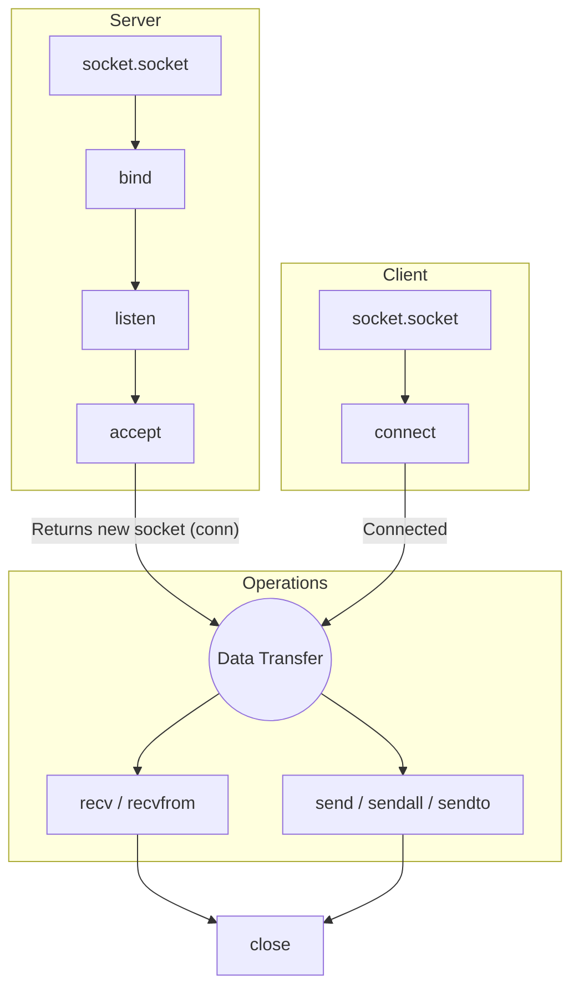

# Part 2: The `socket` Module Core API

> **Why does this matter?** 
> To build network applications, you need to speak the language of the operating system's networking stack. The Python `socket` module is your direct bridge to the OS's core networking capabilities (the "Berkeley Sockets API"). Mastering these core methods is like learning the alphabet—you need it before you can write poetry (or high-performance servers).

---

## 📞 Real-World Analogy: The Telephone System

Imagine you want to talk to a friend in another country:
1. **The Phone (`socket()`):** You need a physical device capable of making calls.
2. **The Phone Number (`bind()` / `Address Family`):** You need a number where people can reach you.
3. **Waiting for Calls (`listen()` & `accept()`):** You sit by the phone waiting for it to ring, and pick it up when it does.
4. **Dialing (`connect()`):** If you are the caller, you dial your friend's number.
5. **Talking (`send()` / `recv()`):** You exchange words over the active line.
6. **Hanging up (`close()`):** You put the phone down to free up the line.

A socket is simply the software version of this telephone.

---

## 🏗️ 1. Creating a Socket: The `socket()` Constructor

To communicate over a network, the first step is to create a socket object.

```python
import socket

# Creating a standard TCP/IP socket
s = socket.socket(family=socket.AF_INET,      # 1. Address Family (IPv4)
                  type=socket.SOCK_STREAM,    # 2. Socket Type (TCP)
                  proto=0)                    # 3. Protocol (Default)
```

Let's break down these three parameters.

### Address Families (`family`)
The address family determines the **format of the address** the socket will use to identify its peers. 

*ASCII Art: Address Families*
```text
                  ┌─────────────────┐
                  │ Address Families│
                  └────────┬────────┘
           ┌───────────────┼───────────────┐
           ▼               ▼               ▼
    AF_INET (IPv4)   AF_INET6 (IPv6)    AF_UNIX (Local)
   [192.168.1.5:80]  [2001:db8::1:80]   [/tmp/my_socket]
    (Host, Port)     (Host, Port, ...)  (File Path)
```

| Constant | Meaning | Address Format (`sockaddr`) |
|---|---|---|
| `socket.AF_INET` | **IPv4** (The classic Internet) | `(host: str, port: int)` |
| `socket.AF_INET6` | **IPv6** (The modern Internet) | `(host, port, flowinfo, scope_id)` |
| `socket.AF_UNIX` | **Unix Domain** (Same-machine) | String path (e.g., `"/tmp/sock"`) |

💡 **Key Insight:** `AF_UNIX` (or `AF_LOCAL`) is extremely fast because it never hits the network card. It's used for processes on the *same machine* (like a web server talking to a local database).

### Socket Types (`type`)
The socket type determines **how** data is transmitted.

| Constant | Meaning | Characteristics |
|---|---|---|
| `socket.SOCK_STREAM` | **TCP** | Reliable, connection-oriented, in-order byte stream. |
| `socket.SOCK_DGRAM` | **UDP** | Connectionless, unreliable datagrams (messages). |
| `socket.SOCK_RAW` | **Raw Packets** | Direct access to IP layer (Requires admin/root privileges). |

### Protocol (`proto`)
Almost always `0`. Setting it to `0` tells the OS to choose the default protocol for the given family and type (e.g., if you choose `AF_INET` and `SOCK_STREAM`, it knows to use TCP).

---

## 🧹 2. Context Managers and the "FD Leak"

A socket is represented in your Operating System as a **File Descriptor (FD)**. FDs are limited resources. If you create a socket and forget to close it, your OS will eventually run out of FDs, and your program will crash with `OSError: [Errno 24] Too many open files`.

### ⚠️ The Wrong Way (FD Leak Hazard)
```python
import socket

def check_port(port):
    s = socket.socket(socket.AF_INET, socket.SOCK_STREAM)
    s.connect(("127.0.0.1", port))
    # If an exception happens here, s.close() is never called!
    # The file descriptor leaks.
    s.sendall(b"Hello")
    s.close() 
```

### ✅ The Right Way (Context Managers)
Always use the `with` statement. It guarantees that the socket is closed, even if your code crashes.

```python
import socket

def check_port(port):
    with socket.socket(socket.AF_INET, socket.SOCK_STREAM) as s:
        s.connect(("127.0.0.1", port))
        s.sendall(b"Hello")
    # s is AUTOMATICALLY closed here, no matter what!
```

🔑 **Interview Tip:** When asked how to prevent resource leaks in network programming, immediately mention using context managers (`with` statement) to handle unexpected exceptions cleanly.

---

## 🗺️ 3. The Complete Method Map

How do the various socket methods fit together? 



### A. Server Methods (Passive)
| Method | Purpose |
|---|---|
| `bind(address)` | Assigns a local IP and port to the socket. |
| `listen([backlog])` | Marks the socket as passive (waiting for clients). `backlog` is the queue size. |
| `accept()` | Dequeues a pending connection. Returns `(conn, addr)` where `conn` is a **NEW** socket for this client. |

### B. Client Methods (Active)
| Method | Purpose |
|---|---|
| `connect(address)` | Blocks until connection is established. Raises an error on failure. |
| `connect_ex(address)` | Same as `connect()`, but returns an error code (0 for success) instead of raising an exception. Useful for non-blocking sockets. |

### C. Data Transfer
| Method | Purpose |
|---|---|
| `send(bytes)` | Sends data. Returns the *number of bytes actually sent* (might be less than what you gave it!). |
| `sendall(bytes)` | Loops `send()` under the hood until ALL data is sent. ✅ **Always use this.** |
| `recv(bufsize)` | Receives up to `bufsize` bytes. Returns `b""` (empty bytes) if the peer cleanly closed the connection. |
| `sendto(bytes, addr)` | UDP only. Sends a standalone datagram to a specific address. |
| `recvfrom(bufsize)` | UDP only. Receives a datagram and returns `(data, sender_address)`. |

### D. Lifecycle & State
| Method | Purpose |
|---|---|
| `close()` | Frees the file descriptor. |
| `shutdown(how)` | Half-closes the connection (e.g., "I am done sending, but I can still read"). Options: `SHUT_RD`, `SHUT_WR`, `SHUT_RDWR`. |
| `setblocking(bool)` | Sets whether socket operations block execution or raise an error instantly if not ready. |
| `settimeout(sec)` | Sets a timeout for blocking operations. |

### E. Introspection
| Method | Purpose |
|---|---|
| `getsockname()` | Returns the local IP and port `(ip, port)`. |
| `getpeername()` | Returns the remote (client's) IP and port `(ip, port)`. |

---

## 🛠️ 4. Module-Level Convenience Functions

Python provides incredible helper functions. **Use these instead of building sockets manually when possible!**

| Function | What it does | Why it's amazing |
|---|---|---|
| `socket.create_server(address, ...)` | Creates a socket, binds it, and listens in one line. | (Python 3.8+) Handles `SO_REUSEADDR` correctly across different OS (Linux vs Windows). **Best for servers.** |
| `socket.create_connection(address, ...)` | Resolves DNS, tries IPv6 and IPv4, and connects. | Much more robust than a raw `connect()`. **Best for clients.** |
| `socket.getaddrinfo(host, port, ...)` | The modern way to do DNS lookups. | Returns all available IPs (v4 and v6) for a hostname. |

---

## 🚀 5. Minimal TCP Echo Server & Client

Let's put it all together. An "Echo Server" simply repeats whatever the client sends it.

### The Server (`server.py`)
```python
import socket

HOST = "127.0.0.1"  # Localhost only
PORT = 65432        # Non-privileged port (> 1023)

# 1. create_server handles socket(), bind(), and listen() safely
with socket.create_server((HOST, PORT)) as server_socket:
    print(f"✅ Server listening on {server_socket.getsockname()}")
    
    # 2. Block and wait for a client to connect
    conn, addr = server_socket.accept()
    
    # 3. Manage the specific client connection with a context manager
    with conn:
        print(f"🤝 Connected by {addr}")
        
        while True:
            # 4. Receive up to 1024 bytes
            data = conn.recv(1024)
            
            # 5. Empty bytes (b"") means the client closed the connection
            if not data:
                print("👋 Client disconnected.")
                break
                
            print(f"📥 Received: {data}")
            
            # 6. Send the exact data back to the client
            conn.sendall(data)

print("🛑 Server shutting down.")
```

### The Client (`client.py`)
```python
import socket

HOST = "127.0.0.1"
PORT = 65432

# 1. create_connection handles DNS resolution and connect() safely
with socket.create_connection((HOST, PORT), timeout=5) as s:
    message = b"Hello, Sockets!"
    
    print(f"📤 Sending: {message}")
    # 2. Send the entire message
    s.sendall(message)
    
    # 3. Wait for the echo response
    data = s.recv(1024)
    print(f"📥 Received Echo: {data}")
```

**Expected Output (Server):**
```
✅ Server listening on ('127.0.0.1', 65432)
🤝 Connected by ('127.0.0.1', 54321)
📥 Received: b'Hello, Sockets!'
👋 Client disconnected.
🛑 Server shutting down.
```

---

## 🪢 6. `socketpair()` and `fromfd()`

These are advanced tools you will see in testing or multi-processing.

### `socket.socketpair()`
Creates a pair of *already connected* Unix domain sockets (`AF_UNIX`).
- **Analogy:** Buying two walkie-talkies that are already tuned to the same channel.
- **Why it's useful:** Perfect for testing network logic without dealing with ports, IPs, or `bind()` / `accept()` calls. It is also used to send messages between threads or processes.

```python
import socket
s1, s2 = socket.socketpair()

s1.sendall(b"Ping")
print(s2.recv(1024)) # b'Ping'
```

### `socket.fromfd(fd, family, type, proto)`
Wraps an existing raw Operating System file descriptor in a Python `socket` object.
- **Why it's useful:** If a C-library or a parent process hands you an integer representing a socket (like `3`), you can use `fromfd(3, ...)` to interact with it using Python's convenient socket methods.

---

## ❌ Common Mistakes & Pitfalls

1. ⚠️ **Using `send()` instead of `sendall()`:** `send()` might only send a portion of your data if the OS buffers are full. `sendall()` guarantees it all goes out.
2. ⚠️ **Forgetting that `recv()` returns a chunk, not a message:** `recv(1024)` might return 10 bytes, 100 bytes, or 1024 bytes. It does NOT respect your "message boundaries" (more on this in Protocol Design).
3. ⚠️ **Checking for data with `len(data) == 0`:** In Python, an empty byte string `b""` evaluates to `False`. Always use `if not data:` to check if the connection was closed.
4. ⚠️ **Assuming the listening socket sends data:** The socket created by `socket()` and `bind()` on a server **never** transfers data. It only spawns *new* sockets via `accept()`.

---

## 📑 Quick Reference Cheat Sheet

| I want to... | Use this |
|---|---|
| Write a robust server | `with socket.create_server((host, port)) as s:` |
| Write a robust client | `with socket.create_connection((host, port)) as s:` |
| Send data (TCP) | `s.sendall(b"data")` |
| Close connection securely | Use `with` blocks (Context managers) |
| Check if peer closed TCP | `data = s.recv(1024); if not data: print("Closed")` |
| Talk to a local process fast | Use `socket.AF_UNIX` |

---

## 🧠 Self-Check Questions

1. Why should you always use a context manager (`with socket.socket() as s:`)?
2. What is the difference between `socket.AF_INET` and `socket.AF_UNIX`?
3. If a client calls `sendall(b"Hello")`, does it guarantee the server has processed the word "Hello"? (Hint: Think about OS buffers vs application logic).
4. What is the difference between the socket you call `bind()` on, and the socket returned by `accept()`?
5. Why is `socket.create_connection()` better than a manual `socket()` and `connect()`?

[See `03-tcp-programming.md` for the next part on advanced TCP lifecycles!]
