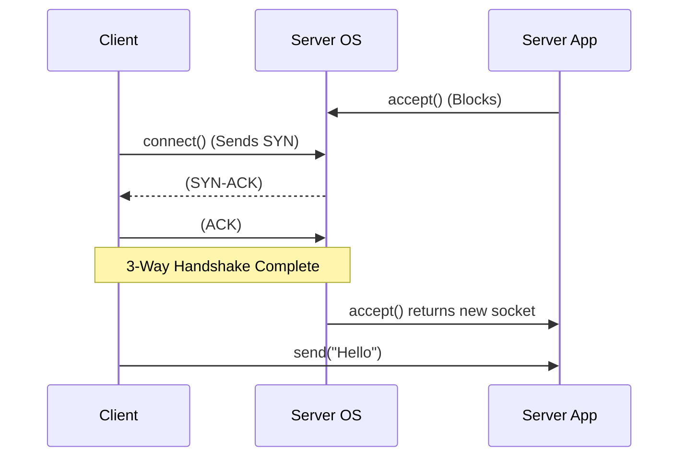
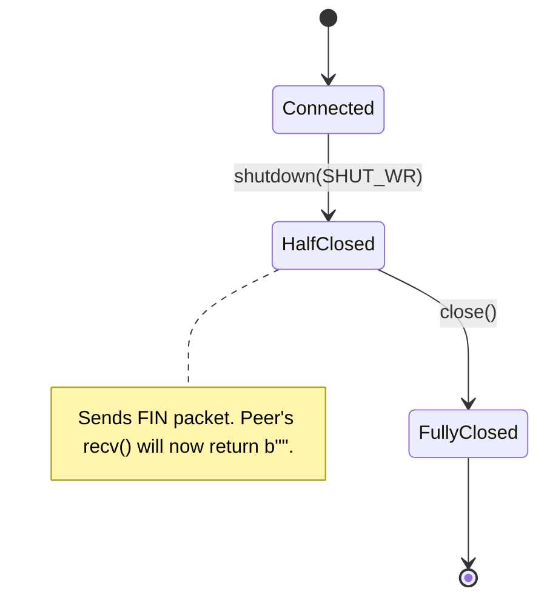

# Part 3: TCP Programming in Depth

Welcome to the heart of socket programming. If you've ever wondered how web servers, chat apps, or multiplayer games establish reliable connections, this is where the magic happens. 

**Why does this matter?** 
TCP (Transmission Control Protocol) is the backbone of the internet. It provides a reliable, ordered, error-checked stream of data between applications. However, using TCP correctly requires understanding the precise sequence of operations an operating system expects. If you skip a step or misunderstand a function, your application might drop connections, freeze, or silently corrupt data.

---

## 1. The Real-World Analogy: The Restaurant 🍽️

Before we dive into the code, let's map the TCP server lifecycle to something familiar: **Opening a Restaurant**.

1. **`socket()`** — Getting a business license. You declare your intent to open a business, but you don't have a building yet.
2. **`bind()`** — Leasing a physical building. You claim a specific address (IP) and suite number (Port).
3. **`listen()`** — Unlocking the front doors. You tell the host to start letting people into the waiting area (the queue).
4. **`accept()`** — Seating a customer. The host takes the first person from the waiting area, assigns them a **dedicated waiter** (a *new* socket), and goes back to the host stand. 
5. **`recv()` / `send()`** — The waiter taking orders and serving food.
6. **`close()`** — The customer pays and leaves; the waiter is free to help someone else.

💡 **Key Insight:** The host (`listen` socket) *never* serves food. They only greet people and assign them a waiter. The waiter (the *new* socket from `accept`) is the one who actually handles the conversation.

---

## 2. The TCP Server Lifecycle

Here is the exact sequence of system calls a TCP server must make. 

```mermaid
flowchart TD
    S([socket.socket()]) -->|Create endpoint| B(bind)
    B -->|Claim IP + Port| L(listen)
    
    subgraph Passive Socket
    L -->|Open for business| A(accept)
    end
    
    subgraph Dedicated Connection Socket
    A -->|Returns NEW socket| R(recv / send)
    R -->|Data exchange| R
    R -->|Peer closes| C(close)
    end
    
    C -.->|Wait for next client| A
    
    style S fill:#f9f,stroke:#333,stroke-width:2px
    style A fill:#bbf,stroke:#333,stroke-width:2px
```

🔑 **Interview Tip:** The most common question for beginners is "How many sockets does a server handling 10 clients use?" The answer is **11**. One listening socket, plus 10 connected sockets.

---

## 3. `bind()`: Claiming Your Address

Once you have a socket, you must bind it to a network interface and a port.

### Code
```python
import socket

# Create a TCP socket
server_sock = socket.socket(socket.AF_INET, socket.SOCK_STREAM)

# Claim port 8080 on the loopback interface
server_sock.bind(("127.0.0.1", 8080))
```

### Special Addresses to Know

| Address | Meaning | When to use |
|---|---|---|
| `"127.0.0.1"` | **Localhost** (Loopback) | Development. Only programs on the same computer can connect. |
| `"0.0.0.0"` | **Any Address** | Production servers. Listens on *all* available network interfaces (Wi-Fi, Ethernet, VPN). |
| Port `0` | **Ephemeral Port** | Testing. Tells the OS: "Give me any available free port." Read it back with `sock.getsockname()[1]`. |

⚠️ **Warning:** If you bind to `"0.0.0.0"` in development without a firewall, anyone on your local Wi-Fi can connect to your server. 

### The `EADDRINUSE` Error
If you stop a server and try to restart it immediately, `bind()` might crash with `OSError: [Errno 98] Address already in use`. This is because TCP keeps recently closed connections in a `TIME_WAIT` state to ensure delayed packets don't cause confusion.

✅ **Best Practice:** Always use `SO_REUSEADDR` to tell the OS you want to reuse the port immediately upon restart.
```python
server_sock.setsockopt(socket.SOL_SOCKET, socket.SO_REUSEADDR, 1)
server_sock.bind(("0.0.0.0", 8080))
```

---

## 4. `listen(backlog)`: Opening the Doors

`listen()` tells the OS to transition the socket from "active" (like a client) to "passive" (waiting for incoming connections). 

The `backlog` argument specifies how many unaccepted connections the OS should queue up before it starts rejecting new clients.

### Under the Hood: The Two Queues

When a client tries to connect, the kernel doesn't just hand it to you immediately. It passes through two queues (ASCII Art below):

```text
Client            Kernel (OS)                                 Python
──────            ───────────                                 ──────
 [SYN] ────────> ┌─────────────────────────────┐
                 │ SYN Queue (Half-open)       │
                 │ 1. [Client A - Handshaking] │
 [ACK] ────────> │ 2. [Client B - Handshaking] │
                 └──────────┬──────────────────┘
                            │ (Handshake Complete)
                            ▼
                 ┌─────────────────────────────┐    accept()
                 │ Accept Queue (Ready)        ├─────────────> Returns
                 │ 1. [Client C - Waiting]     │               NEW Socket
                 │ 2. [Client D - Waiting]     │
                 └─────────────────────────────┘
```

💡 **Insight:** The `backlog` parameter primarily sizes the **Accept Queue**. If your server receives a spike of traffic and your code is too slow to call `accept()`, this queue fills up. Once full, the OS simply drops new incoming connection attempts (the client gets a timeout or "Connection Refused"). Setting a high backlog (e.g., `128` or `1024`) buys you a buffer during traffic spikes.

---

## 5. `accept()`: Seating the Customer

`accept()` pulls the first completed connection off the Accept Queue.

```python
# Blocks execution until a client connects!
conn_sock, client_addr = server_sock.accept()

print(f"New connection from {client_addr}")
# conn_sock is a BRAND NEW socket object, tied to this specific client.
# server_sock is STILL LISTENING for others.
```

⚠️ **Warning:** `accept()` is a **blocking** call by default. Your program will completely freeze at this line until someone connects.

---

## 6. `connect()` and `connect_ex()`: The Client Side

Clients don't bind or listen; they just create a socket and `connect()`.



### Blocking vs Non-Blocking Connect

Normally, `connect()` blocks until the 3-way handshake finishes. If the server is offline, it might block for seconds before raising a `ConnectionRefusedError` or `TimeoutError`.

Advanced applications (like async event loops) use **non-blocking connects**:

```python
import socket, selectors

# 1. Create socket and make it non-blocking
client = socket.socket(socket.AF_INET, socket.SOCK_STREAM)
client.setblocking(False)

# 2. connect_ex returns an error code instead of raising an exception.
# EINPROGRESS or EWOULDBLOCK means "I started the handshake in the background".
err = client.connect_ex(("example.com", 80))

# 3. Wait for the socket to become "writable" (meaning handshake finished)
sel = selectors.DefaultSelector()
sel.register(client, selectors.EVENT_WRITE)

events = sel.select(timeout=5.0)
if events:
    # 4. Check if the connection succeeded or failed
    so_error = client.getsockopt(socket.SOL_SOCKET, socket.SO_ERROR)
    if so_error == 0:
        print("Connected successfully!")
    else:
        print(f"Connection failed with error code: {so_error}")
else:
    print("Connection timed out!")
```
🔑 **Interview Tip:** Checking `SO_ERROR` after a socket becomes writable is the canonical way to verify a non-blocking connection succeeded in C, Python, and Go.

---

## 7. `send()` vs `sendall()`: The #1 TCP Bug

This is the most common mistake beginners make with TCP.

When you call `send(b"Hello World")`, you are **not** sending it to the network. You are just copying it into a buffer in your Operating System. If that buffer is nearly full, `send()` might only copy a portion of your data.

```text
Your string:   [ H | E | L | L | O |   | W | O | R | L | D ]
                     ▼        ▼        ▼        ▼ 
OS Buffer:     [ X | X | X | X | X | X | X | H | E | L | L ] (Buffer Full!)

send() returns: 4 (bytes accepted)
The remaining "O WORLD" was NOT sent!
```

To fix this, you must loop until everything is sent. Python provides `sendall()` which does this loop for you in C, making it extremely fast and safe.

✅ **Best Practice:** **Always** use `sendall()`. Never use `send()` unless you are writing a custom async event loop.

---

## 8. `recv()`: Reading the Stream

TCP is a **Stream** protocol. It has no concept of "messages" or "boundaries". It's a pipe of flowing water.

If the client does this:
```python
client.sendall(b"HELLO")
client.sendall(b"WORLD")
```

The server calling `recv(1024)` might receive:
- `b"HELLOWORLD"` (Merged together)
- `b"HEL"` (First piece)
- `b"HELLO"` followed by `b"WORLD"` on the next call.

### The "End of Stream" Signal
If `recv()` returns an empty byte string `b""`, it means **the peer closed their side of the connection cleanly**. 
It does *not* mean "no data right now". If there is no data, a blocking `recv()` will just freeze and wait.

### The Ultimate Helper: `recv_exact`
Because TCP doesn't respect boundaries, you often need to read exactly $N$ bytes (e.g., when reading a fixed-length header). Paste this helper into every TCP project:

```python
def recv_exact(sock, n):
    """Read exactly n bytes from a TCP socket, or raise an error."""
    buf = bytearray()
    while len(buf) < n:
        chunk = sock.recv(n - len(buf))
        if not chunk:
            raise ConnectionError(f"Peer closed connection early. Read {len(buf)}/{n} bytes.")
        buf.extend(chunk)
    return bytes(buf)
```

---

## 9. `shutdown()` vs `close()`: Half-Closing

When you are done with a socket, you call `close()`. But what if you want to say "I'm done sending data, but I still want to receive your final reply"?

This is called a **Half-Close**, and you do it with `shutdown()`.



- `shutdown(socket.SHUT_WR)`: Sends a FIN packet. Tells the other side "I am done talking." They will receive `b""`. But you can still `recv()` from them!
- `close()`: Completely destroys the file descriptor. No more reading or writing.

✅ **Best Practice:** If your protocol requires a clean EOF (End of File) signal, use `shutdown(SHUT_WR)` before `close()`.

---

## 10. `makefile()`: Sockets as Files

Python allows you to treat a socket exactly like an opened file. This is amazing for text-based, line-by-line protocols (like HTTP or IRC).

```python
# Wrap socket in a file object
# "r" = read mode, automatically decode utf-8, split on newlines
f = client_sock.makefile("r", encoding="utf-8", newline="\n")

for line in f:
    print("Received line:", line.strip())
```

⚠️ **Warning:** The file object maintains its own internal buffer. **Never mix** `f.read()` and `sock.recv()` on the same socket, or data will go missing in the buffers!

---

## 11. Putting It All Together: Threaded Echo Server

Here is a complete, production-ready, threaded TCP Echo server. It handles multiple clients concurrently by spawning a thread for each one.

### `server.py`
```python
import socket
import threading

def handle_client(conn_sock, client_addr):
    """Handles a single client connection in its own thread."""
    print(f"[+] Connection accepted from {client_addr}")
    
    # Use 'with' to ensure the socket closes automatically when done
    with conn_sock:
        try:
            while True:
                # 1. Read up to 4096 bytes
                data = conn_sock.recv(4096)
                
                # 2. Empty bytes means client disconnected gracefully
                if not data:
                    print(f"[-] {client_addr} disconnected.")
                    break
                    
                print(f"[{client_addr}] Received: {data.decode('utf-8')}")
                
                # 3. Echo the data back. Always use sendall!
                conn_sock.sendall(data)
                
        except (ConnectionResetError, BrokenPipeError):
             # Client crashed or pulled the plug mid-conversation
             print(f"[!] {client_addr} connection dropped unexpectedly.")

def start_server(host="127.0.0.1", port=65432):
    # socket.create_server does bind() + listen() + sets SO_REUSEADDR safely across all OS's!
    with socket.create_server((host, port)) as server_sock:
        print(f"[*] Server listening on {host}:{port}...")
        
        while True:
            # Block until a new client connects
            conn_sock, client_addr = server_sock.accept()
            
            # Spawn a thread. daemon=True means the thread won't prevent Python from exiting.
            client_thread = threading.Thread(
                target=handle_client, 
                args=(conn_sock, client_addr),
                daemon=True
            )
            client_thread.start()

if __name__ == "__main__":
    start_server()
```

### `client.py`
```python
import socket

def run_client():
    # create_connection handles DNS resolution and connection automatically
    with socket.create_connection(("127.0.0.1", 65432), timeout=5.0) as client:
        print("[*] Connected to server!")
        
        # Send a message
        msg = "Hello, TCP Server!"
        client.sendall(msg.encode('utf-8'))
        
        # Wait for the echo
        response = client.recv(4096)
        print(f"[*] Server replied: {response.decode('utf-8')}")
        
if __name__ == "__main__":
    run_client()
```

---

## 12. Quick Reference Cheat Sheet

| Function | What it does | Return Value | Blocking? |
|---|---|---|---|
| `bind((ip, port))` | Claims an address | `None` | No |
| `listen(backlog)` | Opens doors, sets queue size | `None` | No |
| `accept()` | Waits for next client | `(new_socket, address)` | **Yes** |
| `connect((ip, port))` | Handshakes with server | `None` | **Yes** |
| `sendall(bytes)` | Sends until empty | `None` | **Yes** |
| `recv(bufsize)` | Reads up to bufsize bytes | `bytes` (`b""` on close) | **Yes** |

---

## 13. Self-Check Questions

1. You call `accept()` on a server, and 5 clients connect at the exact same time. How many sockets exist in your program now? What is the role of each?
2. You write a program that uses `sock.send(data)`. In testing on your laptop, it works perfectly. In production over a slow 3G network, chunks of data are missing. Why? What should you use instead?
3. Your server's `recv(1024)` line suddenly returns `b""`. Did the client stop typing, or did they close the app? How do you know?
4. What is the difference between the SYN queue and the Accept queue inside the OS kernel? 
5. What does setting `port=0` in `bind()` do, and why is it useful for automated testing?
