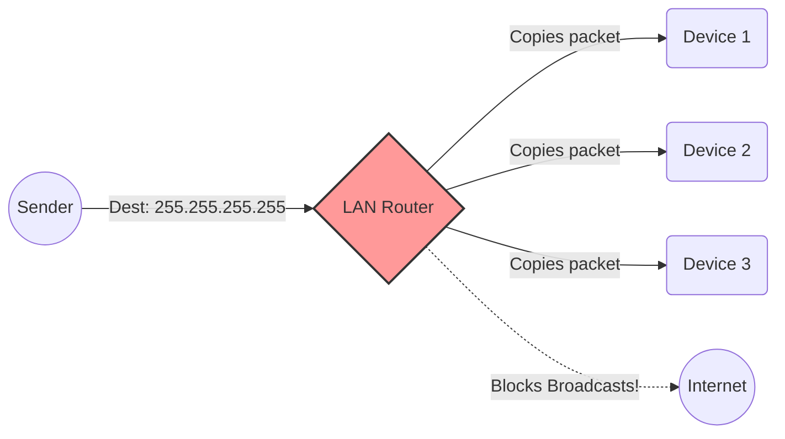
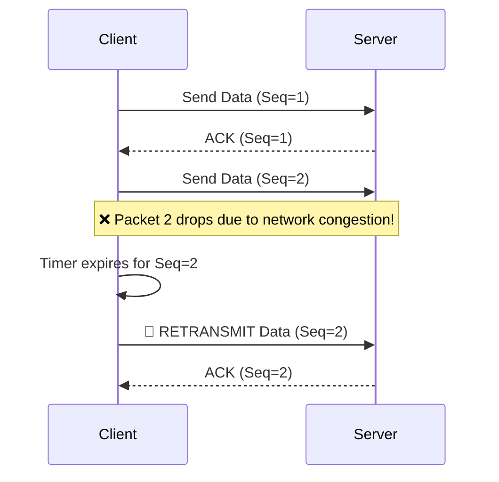

# Part 4 — UDP Programming: Fast, Loose, and Connectionless

Welcome to the world of UDP (User Datagram Protocol)! If TCP is the reliable, slow-and-steady worker, UDP is the speed demon that doesn't care if a few things break along the way. In this section, we will learn how to write connectionless network applications.

> [!NOTE]
> **Why does this matter?**
> Not every application needs perfect reliability. For live video streaming, multiplayer gaming, or DNS lookups, speed and low latency are far more important than ensuring every single byte arrives perfectly. UDP is the protocol that powers these high-speed, real-time applications.

---

## 📬 Real-World Analogy: Postcards vs. Phone Calls

Before diving into code, let's understand the fundamental difference between TCP and UDP:

*   **TCP is like a Phone Call:** You dial the number (`connect`), wait for the other person to pick up (`accept`), and then you have a dedicated, two-way conversation. If you say something and they don't hear it, they ask you to repeat it. You say "Goodbye" before hanging up.
*   **UDP is like sending Postcards:** You write a message on a postcard, address it, and drop it in the mailbox (`sendto`). You don't check if the recipient is home. You don't know if the mail carrier lost it. You don't know if postcards arrive in the same order you sent them. But it's extremely fast and requires zero setup.

---

## 1. The UDP Pattern (No Listen, No Accept)

Because UDP is connectionless, the socket lifecycle is drastically simpler than TCP. 

There is **no `listen()`** and **no `accept()`**. A single UDP socket acts like an open mailbox—it can receive messages from *anyone* and send messages to *anyone*, all from the same socket.

### 💻 Complete Server & Client Code

Here is a fully runnable "echo" server and client using UDP.

**UDP Server (`udp_server.py`)**
```python
import socket

# 1. Create a UDP socket
# AF_INET = IPv4, SOCK_DGRAM = UDP (Datagrams)
with socket.socket(socket.AF_INET, socket.SOCK_DGRAM) as s:
    
    # 2. Bind to an IP and Port
    s.bind(("127.0.0.1", 65432))
    print(f"✅ UDP Server listening on {s.getsockname()}")
    
    while True:
        # 3. Receive data from ANY client
        # recvfrom returns the data AND the address of the sender
        # 65535 is the maximum possible size of a UDP packet
        data, addr = s.recvfrom(65535)
        
        print(f"📥 Received {data!r} from {addr}")
        
        # 4. Send a reply explicitly to that sender's address
        reply = data.upper()
        s.sendto(reply, addr)
```

**UDP Client (`udp_client.py`)**
```python
import socket

with socket.socket(socket.AF_INET, socket.SOCK_DGRAM) as s:
    # ⚠️ CRITICAL: UDP has no reliability. If a packet drops, recvfrom() 
    # will block forever. Always set a timeout on UDP clients!
    s.settimeout(2.0)
    
    server_address = ("127.0.0.1", 65432)
    message = b"hello udp"
    
    # 1. Send data directly to the server (no connect needed!)
    print(f"📤 Sending {message!r} to {server_address}")
    s.sendto(message, server_address)
    
    try:
        # 2. Wait for a reply
        data, server = s.recvfrom(65535)
        print(f"📥 Got reply {data!r} from {server}")
    except socket.timeout:
        # 3. Handle packet loss
        print("❌ No reply received (packet lost in transit?) — you must retry manually!")
```

> [!WARNING]
> **Common Mistake:** Forgetting to set a timeout on a UDP client socket. Because there is no connection, the OS won't tell you if the server is offline. `recvfrom` will just hang forever waiting for a postcard that is never coming.

---

## 2. Connected UDP

Wait, didn't we just say UDP is connectionless? Yes! But you can still call `connect()` on a UDP socket. 

**What `connect()` actually does for UDP:**
It does **NOT** perform a network handshake. It simply updates the OS kernel's local state to say: *"For this socket, assume all outgoing packets go to this IP/Port, and drop any incoming packets that aren't from this IP/Port."*

### Why use Connected UDP?
1. **Convenience:** You can use `s.send(data)` instead of `s.sendto(data, addr)`.
2. **Security/Filtering:** The kernel automatically drops incoming packets from spoofed or unexpected IPs.
3. **Error Reporting:** On Linux, if you send a packet to a closed port on the local network, the router sends back an ICMP "Destination Unreachable" error. Only *connected* UDP sockets will surface this as a `ConnectionRefusedError` in Python!

### 💡 The Local IP Discovery Trick
Because `connect()` on UDP doesn't actually send network traffic, we can use it to safely figure out what local IP address our machine would use to reach the internet!

```python
import socket

def get_my_ip():
    with socket.socket(socket.AF_INET, socket.SOCK_DGRAM) as s:
        # Connect to Google's DNS (doesn't send a packet!)
        s.connect(("8.8.8.8", 53))
        # Now ask the socket what local IP it decided to bind to
        return s.getsockname()[0]

print(f"My network IP is: {get_my_ip()}")
```
🔑 *Interview Tip: This is the most reliable, cross-platform way to get your machine's actual LAN IP address in Python.*

---

## 3. Broadcast (One-to-All on the LAN)

TCP requires a 1-to-1 connection. UDP allows **Broadcasting**—sending one packet that every device on your local network receives. 

> [!IMPORTANT]
> To prevent spam, the OS explicitly forbids sending broadcast packets unless you set the `SO_BROADCAST` socket option. Furthermore, routers generally **block** broadcasts from leaving your local network (LAN) and entering the wider internet.



### Broadcast Code
```python
import socket

with socket.socket(socket.AF_INET, socket.SOCK_DGRAM) as s:
    # 1. Enable broadcast permission (REQUIRED)
    s.setsockopt(socket.SOL_SOCKET, socket.SO_BROADCAST, 1)
    
    # 2. Send to the special broadcast address
    # 255.255.255.255 means "everyone on this local network"
    # Directed broadcast (e.g., "192.168.1.255") is often preferred
    s.sendto(b"HELLO EVERYONE!", ("255.255.255.255", 5000))
```

Receivers don't need any special options; they just `bind()` to port 5000 like a normal UDP server.

---

## 4. Multicast (One-to-Group)

Broadcast is noisy (everyone gets it, even if they don't want it) and is IPv4 only. **Multicast** is the modern solution: you send a packet to a specific "Multicast Group" (an IP address in the `224.0.0.0/4` range), and only devices that explicitly "subscribe" to that group receive it.

### Multicast Sender
```python
import socket

MCAST_GRP = "239.1.1.1"  # Administratively scoped private group
MCAST_PORT = 5007

with socket.socket(socket.AF_INET, socket.SOCK_DGRAM, socket.IPPROTO_UDP) as s:
    # Set Time-To-Live (TTL). 
    # 0 = same host, 1 = same subnet, <32 = same site.
    s.setsockopt(socket.IPPROTO_IP, socket.IP_MULTICAST_TTL, 2)
    
    s.sendto(b"Multicast news flash!", (MCAST_GRP, MCAST_PORT))
```

### Multicast Receiver
Receiving multicast requires telling your OS kernel to join the group using `IP_ADD_MEMBERSHIP`.

```python
import socket
import struct

MCAST_GRP = "239.1.1.1"
MCAST_PORT = 5007

with socket.socket(socket.AF_INET, socket.SOCK_DGRAM, socket.IPPROTO_UDP) as s:
    # Allow multiple receivers to bind to the same port on this machine
    s.setsockopt(socket.SOL_SOCKET, socket.SO_REUSEADDR, 1)
    s.bind(("", MCAST_PORT))
    
    # Tell the OS to subscribe to the multicast group
    # Pack the Multicast IP and the Local Interface IP into a C-struct
    mreq = struct.pack("4s4s", socket.inet_aton(MCAST_GRP), socket.inet_aton("0.0.0.0"))
    s.setsockopt(socket.IPPROTO_IP, socket.IP_ADD_MEMBERSHIP, mreq)
    
    print("Listening for multicast messages...")
    while True:
        data, addr = s.recvfrom(1024)
        print(f"Got multicast from {addr}: {data!r}")
```

---

## 5. UDP Max Payload and Fragmentation

How much data can you send in one `sendto()`?

The theoretical maximum is **65,507 bytes** for IPv4 (65,535 max minus 20 bytes for IP header and 8 bytes for UDP header).

```text
+-------------------------------------------------+
|              IP Header (20 bytes)               |
+-------------------------------------------------+
|             UDP Header (8 bytes)                |
|  [Source Port: 2]       [Dest Port: 2]          |
|  [Length: 2]            [Checksum: 2]           |
+-------------------------------------------------+
|                                                 |
|              Payload / Data                     |
|          (Up to 65,507 bytes max)               |
|                                                 |
+-------------------------------------------------+
```

> [!CAUTION]
> **Fragmentation Pitfall:** While the *theory* is 65k, the physical network (Ethernet MTU) usually only supports ~1500 bytes per frame. 
> 
> If you send a 4000-byte UDP packet, the OS will slice it into three IP fragments invisibly. If *even one* of those fragments is dropped by a router, the entire 4000-byte UDP packet is discarded. 
> **✅ Best Practice:** Keep UDP payloads under **1472 bytes** to avoid IP fragmentation entirely!

---

## 6. Building Reliability on UDP

If you need speed but *some* reliability, you must build it yourself (this is exactly what protocols like QUIC or WebRTC do). If you choose UDP, you inherit its problems.

To make UDP reliable, your protocol must manually add:
1.  **Sequence Numbers:** To detect dropped packets and reorder packets that arrive out-of-sequence.
2.  **ACKs (Acknowledgements):** The receiver must send back a message confirming receipt.
3.  **Retransmission:** The sender needs a timer. If it doesn't get an ACK before the timeout, it sends the packet again.

### Retransmission Flow (What happens when packets drop)


---

## 7. TCP vs UDP Quick Reference

| Feature | TCP (Stream) | UDP (Datagram) |
| :--- | :--- | :--- |
| **Connection** | Required (Handshake `SYN/ACK`) | None (Stateless) |
| **Reliability** | 100% Guaranteed delivery | No guarantee (Lossy) |
| **Ordering** | Arrives in exact order sent | Out of order delivery possible |
| **Boundaries**| Continuous Byte Stream | Discrete Messages (Datagrams) |
| **Speed** | Slower (Overhead, ACKs, Retries) | Blazing Fast |
| **Broadcast** | Not Possible | Native Support (`SO_BROADCAST`) |
| **Overhead** | High (20+ byte headers, stateful) | Low (8 byte headers) |

---

## 8. When to Choose UDP over TCP?

Not sure which to pick? Use this decision tree:

```mermaid
flowchart TD
    Start{What is your application?}
    Start -->|File Transfer, Web, Chat| TCP[✅ Use TCP]
    Start -->|Broadcasting to LAN| UDP3[✅ Use UDP Broadcast]
    Start -->|Fast, Real-time Data| Q1{Can you tolerate<br/>some lost data?}
    
    Q1 -->|Yes <br/>(Video, Audio, Games)| UDP[✅ Use UDP]
    Q1 -->|No| Q2{Are you willing to build<br/>custom retry logic?}
    
    Q2 -->|Yes| UDP2[✅ Use UDP + Custom ACKs<br/>(e.g., QUIC)]
    Q2 -->|No| TCP2[✅ Use TCP]
```

---

## 🎯 Self-Check Questions

1.  If a UDP client sends 10 packets, and the server calls `recvfrom` 5 times, what happens to the remaining 5 packets if there's no buffer room?
2.  Why is `recvfrom` used instead of `recv` in connectionless UDP servers?
3.  What is the purpose of calling `connect()` on a UDP socket if it doesn't do a network handshake?
4.  Why should you limit your UDP payload sizes to ~1472 bytes even though the protocol allows up to 65,507 bytes?
5.  What socket option must be set before sending a message to `255.255.255.255`?

<br/>
<div align="center">
  <i>(Ready to master more? Proceed to the next section on Protocol Design & Message Framing!)</i>
</div>
