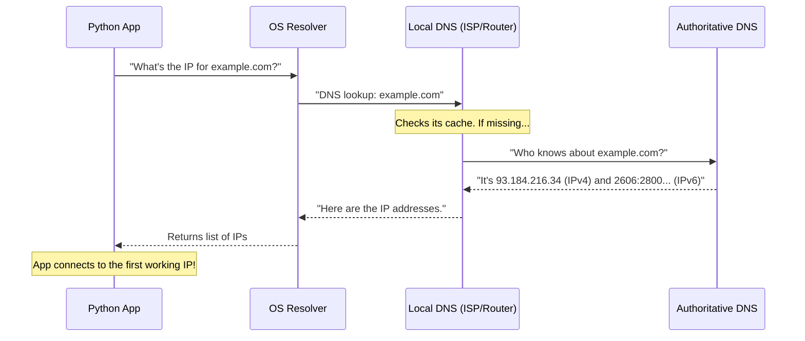

# Part 5: Addressing, DNS, and Utility Functions

## Why Does This Matter?
Before two computers can communicate using sockets, they need to know how to find each other. Just like you can't mail a letter without a physical address, you can't send network packets without an **IP Address**. However, humans are terrible at remembering numbers like `142.250.190.46`, and much better at remembering names like `google.com`. 

This chapter bridges the gap between human-readable domain names and machine-readable network addresses. You will learn how to translate names to IPs, how to pack them into bytes for the network, and how to write robust clients that handle complex network environments perfectly.

---

## The Core Analogy: DNS is the Internet's Phonebook
Imagine you want to call your friend "Alice". You don't memorize her 10-digit phone number. Instead, you open your phone's Contacts app, search for "Alice", and the app dials the hidden number for you.

**DNS (Domain Name System)** is exactly this, but for computers.
- **The Name (Alice):** The domain name (e.g., `github.com`).
- **The Phone Number:** The IP address (e.g., `140.82.113.3`).
- **The Contacts App:** The DNS Resolver on your computer.

### The DNS Resolution Process
When you tell a socket to connect to `example.com`, a multi-step conversation happens behind the scenes. Here is how it works under the hood:



---

## 1. `getaddrinfo()` — The Only Resolver You Should Use
In Python, the function that asks the OS for the IP address is `socket.getaddrinfo()`. 

> [!IMPORTANT]
> **Interview Tip**: Always use `getaddrinfo()`. Never use older functions like `gethostbyname()`. `getaddrinfo()` is the modern, universally accepted standard because it seamlessly handles both IPv4 and IPv6 without changing your code.

### What it returns
`getaddrinfo()` asks the OS to resolve a host and port, and returns a **list of 5-tuples**. Each tuple contains everything you need to create a socket and connect.

```python
import socket

# Let's ask for the addresses of example.com on HTTPS (port 443)
# We specify SOCK_STREAM because we want TCP connections.
infos = socket.getaddrinfo("example.com", 443, type=socket.SOCK_STREAM)

for info in infos:
    family, type_, proto, canonname, sockaddr = info
    print(f"Family: {family.name}")
    print(f"Address: {sockaddr}\n")
```

**Expected Output:**
```text
Family: AF_INET
Address: ('93.184.216.34', 443)

Family: AF_INET6
Address: ('2606:2800:220:1:248:1893:25c8:1946', 443, 0, 0)
```

Notice that it returned **two** results! One for IPv4 (`AF_INET`) and one for IPv6 (`AF_INET6`). 

### The 5-Tuple Breakdown
1. `family`: `AF_INET` (IPv4) or `AF_INET6` (IPv6).
2. `type`: `SOCK_STREAM` (TCP) or `SOCK_DGRAM` (UDP).
3. `proto`: Protocol number (usually 6 for TCP, 17 for UDP).
4. `canonname`: The "canonical" (official) name of the host, if requested.
5. `sockaddr`: The address tuple `(IP, Port)`. You pass this directly to `sock.connect()` or `sock.bind()`.

### Useful Flags for `getaddrinfo()`
You can pass a `flags` argument to modify its behavior:
- `socket.AI_PASSIVE`: Used when writing a **Server**. If you pass `host=None`, it fills in the wildcard address (`0.0.0.0` or `::`) so you can `bind()` and listen on all interfaces.
- `socket.AI_CANONNAME`: Asks the resolver to return the official name in the 4th element of the tuple.
- `socket.AI_NUMERICHOST`: Tells the resolver *not* to use DNS. It assumes the host string is already an IP address (e.g., `"192.168.1.1"`). It raises an error if it's a domain name.

---

## 2. The Golden Rule: Iterate Over Results

When `getaddrinfo()` returns multiple addresses (e.g., an IPv6 and an IPv4 address), **you must try them one by one until one works.** 

Why? Because the IPv6 route might be broken on the user's Wi-Fi network, but IPv4 works perfectly. Or vice versa! 

```mermaid
flowchart TD
    Start([Start]) --> GetAddr[Call getaddrinfo()]
    GetAddr --> Loop[For each address...]
    Loop --> TryConnect[Create socket & try connect()]
    TryConnect --> Check{Did it connect?}
    Check -- Yes --> Success([Success! Return Socket])
    Check -- No --> Close[Close failed socket]
    Close --> Loop
    Loop -. No more addresses .-> Fail([Raise Error])
```

### Building a Robust Client (`connect_any`)
Here is the professional way to connect to a server. This code gracefully handles multi-homed hosts (servers with multiple IPs) and dual-stack (IPv4+IPv6) setups.

```python
import socket

def connect_any(host: str, port: int, timeout: float = 5.0) -> socket.socket:
    """Connects to a host by trying all available resolved IP addresses."""
    last_err = None
    
    # 1. Resolve the name. Returns a list of connection parameters.
    # We specify SOCK_STREAM so we only get TCP results.
    infos = socket.getaddrinfo(host, port, type=socket.SOCK_STREAM)
    
    # 2. Iterate through every result
    for family, type_, proto, _, sockaddr in infos:
        # 3. Create a socket matching the specific family (IPv4/IPv6)
        s = socket.socket(family, type_, proto)
        s.settimeout(timeout)
        
        try:
            # 4. Attempt to connect
            print(f"Trying to connect to {sockaddr}...")
            s.connect(sockaddr)
            
            print(f"Success! Connected to {sockaddr}")
            return s  # It worked! Return the socket and exit the function.
            
        except OSError as e:
            # 5. It failed. Save the error and clean up the broken socket.
            print(f"Failed to connect to {sockaddr}: {e}")
            last_err = e
            s.close()  # MUST close the failed socket before moving to the next!
            
    # 6. If the loop finishes without returning, EVERY address failed.
    if last_err is not None:
        raise last_err
    else:
        raise OSError("No addresses resolved")

# Try it out!
if __name__ == "__main__":
    try:
        sock = connect_any("google.com", 80)
        sock.close()
    except Exception as err:
        print(f"Connection failed: {err}")
```

> [!TIP]
> **How `socket.create_connection()` works:**
> Python's standard library provides a convenience function called `socket.create_connection()`. Under the hood, its source code is *exactly* the iteration loop you just wrote above! Always use `create_connection()` in real projects to save yourself from typing this boilerplate.

---

## 3. Legacy DNS Helpers (And why they are bad)
You will see older tutorials use functions like `socket.gethostbyname()`. **Do not use them in new code.**

| Function | What it does | Why it's deprecated |
|----------|--------------|---------------------|
| `gethostbyname("host")` | Returns a single IPv4 string | **No IPv6 support.** Fails on modern v6-only networks. |
| `gethostbyname_ex("host")` | Returns aliases and multiple IPs | Still IPv4 only. |
| `gethostname()` | Returns your machine's name | Fine for local use, but not for resolving targets. |
| `getfqdn()` | Fully qualified domain name | |
| `gethostbyaddr("1.2.3.4")`| Reverse DNS (IP -> Name) | Clunky. Use `getnameinfo()` instead. |

⚠️ **Warning:** A common hack in old code is `socket.gethostbyname(socket.gethostname())` to find "my own IP address". This is highly unreliable and often returns `127.0.1.1` (localhost). To find your actual local IP, use the UDP-connect trick (covered in Part 4).

### Understanding DNS Errors: `gaierror` vs `herror`
When DNS lookups fail, Python raises specific exceptions:
*   **`socket.gaierror`**: (Get Address Info Error). Raised by `getaddrinfo()` when a domain doesn't exist or you have no internet. E.g., `[Errno -2] Name or service not known`.
*   **`socket.herror`**: (Host Error). Raised by legacy functions like `gethostbyaddr()` if a reverse lookup fails (meaning an IP doesn't have a name attached to it).

Both are subclasses of `OSError`, so `except OSError:` catches both safely.

---

## 4. Address Packing: Strings ↔ Bytes
When humans read IPs, we prefer strings like `"192.168.1.1"`.
When the network reads IPs (inside packet headers), it expects raw **packed bytes**.

IPv4 addresses are exactly 4 bytes long (32 bits). IPv6 addresses are 16 bytes long (128 bits). 
Python provides functions to convert between these formats.

```text
       Human Readable String                 Raw Bytes (Memory)
         "192.168.1.1"           <--->      b'\xc0\xa8\x01\x01'
  (11 characters, variable len)              (Exactly 4 bytes)
```

Use the modern `inet_pton` (Presentation to Network) and `inet_ntop` (Network to Presentation). They handle both IPv4 and IPv6 seamlessly.

```python
import socket

# 1. String to Bytes (Presentation TO Network)
v4_bytes = socket.inet_pton(socket.AF_INET, "192.168.1.1")
print(v4_bytes)  # Output: b'\xc0\xa8\x01\x01'

v6_bytes = socket.inet_pton(socket.AF_INET6, "::1")
print(v6_bytes)  # Output: b'\x00\x00\x00\x00\x00\x00\x00\x00\x00\x00\x00\x00\x00\x00\x00\x01'

# 2. Bytes to String (Network TO Presentation)
v4_str = socket.inet_ntop(socket.AF_INET, b'\x7f\x00\x00\x01')
print(v4_str)    # Output: '127.0.0.1'
```

*(Note: Older code uses `inet_aton` and `inet_ntoa`, but they only support IPv4!)*

### Bonus Trick: Validating IP Addresses
How do you check if a string is a valid IP address without accidentally performing a slow DNS lookup? 
Try to pack it! If `inet_pton` succeeds, it's a valid IP. If it throws an `OSError`, it's not.

```python
import socket

def is_valid_ipv4(ip_str: str) -> bool:
    try:
        socket.inet_pton(socket.AF_INET, ip_str)
        return True
    except OSError:
        return False

print(is_valid_ipv4("192.168.1.50")) # True
print(is_valid_ipv4("999.999.0.0"))  # False (Out of range)
print(is_valid_ipv4("google.com"))   # False (Not an IP)
```

---

## Quick Reference / Cheat Sheet

| Task | Function to use | Notes |
|---|---|---|
| **Resolve a domain to an IP** | `socket.getaddrinfo()` | Returns list of 5-tuples. Handles IPv4+IPv6. |
| **Write a robust client** | `socket.create_connection()` | Built-in loop over `getaddrinfo` results. |
| **Convert IP str → bytes** | `socket.inet_pton(family, ip)` | Handles both v4 and v6. |
| **Convert bytes → IP str** | `socket.inet_ntop(family, b)` | Handles both v4 and v6. |
| **Handle resolution errors** | `except socket.gaierror:` | Raised when domain doesn't exist. |

---

## Self-Check Questions
1. Why does `getaddrinfo()` return a *list* of addresses instead of just one?
2. If `getaddrinfo()` returns 3 addresses, why must we use a `try...except` block in a `for` loop to test them? What happens if we don't close the failed sockets?
3. Why should you avoid using `socket.gethostbyname()` in modern applications?
4. How long (in bytes) is a packed IPv4 address? How long is a packed IPv6 address?
5. What exception is raised if you try to `connect()` to a domain that doesn't exist? (e.g., `madeup-domain.test`)
