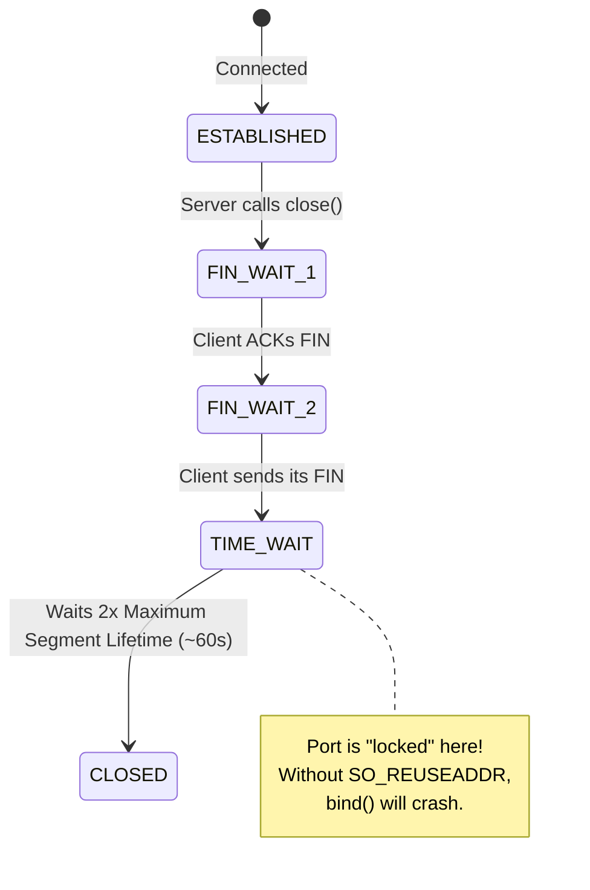
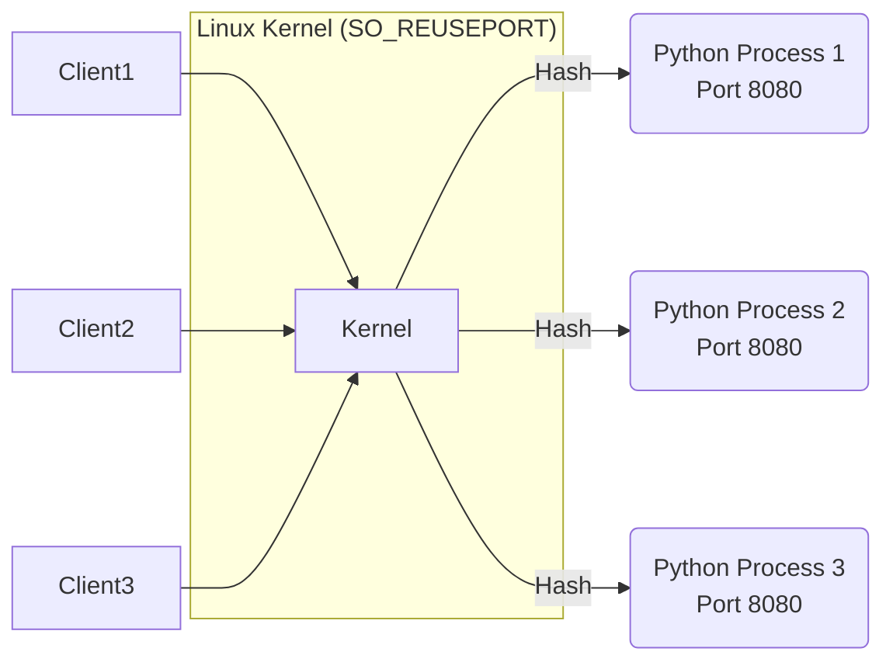
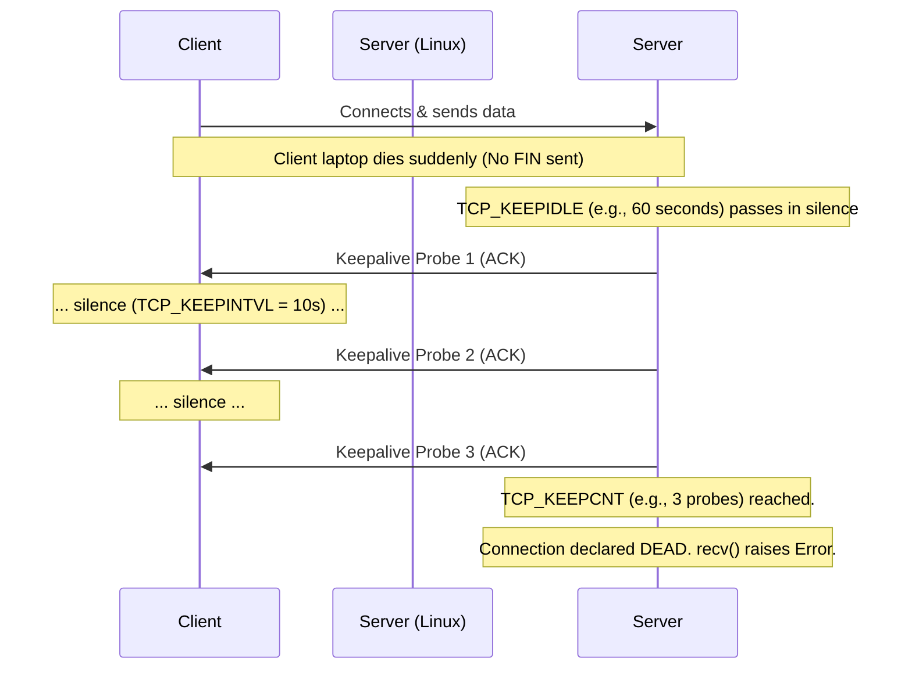
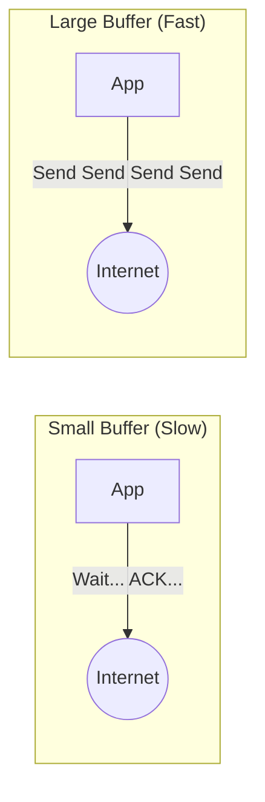

# Part 6: Socket Options — Tuning Under the Hood

## Introduction: Why Does This Matter?

By default, when you create a socket, the operating system gives you a set of safe, conservative defaults designed for the internet of the 1980s. But modern applications—like real-time multiplayer games, high-frequency trading bots, or massive web servers—have specific needs. To achieve low latency, handle sudden crashes, or maximize throughput, you need to tweak how the OS manages your connection.

**Real-World Analogy:**
Think of a brand new smartphone. Out of the box, it makes calls and texts perfectly fine. But if you want a longer screen timeout, dark mode, or Do Not Disturb, you have to go into the **Settings app**. 
**Socket options are the Settings app for your network connections.** 

---

## 6.1 The API: `setsockopt()` and `getsockopt()`

To change a setting, you need to tell the kernel exactly which "menu" to look in, and what option to toggle.

### 1. `setsockopt(level, optname, value)`
- **`level`**: The protocol layer you are configuring. 
  - `socket.SOL_SOCKET` (Socket Level) — Generic options for any socket type.
  - `socket.IPPROTO_TCP` — Options strictly for TCP.
  - `socket.IPPROTO_IP` — Options for IPv4 routing/multicast.
- **`optname`**: The specific setting you want to change (e.g., `SO_REUSEADDR`).
- **`value`**: The new setting. This is usually an integer (`1` for True, `0` for False). For complex settings, it might be raw bytes packed using Python's `struct` module.

### 2. `getsockopt(level, optname, buflen)`
Reads the current setting. If `buflen` is omitted, it returns an integer. If provided, it returns raw bytes.

### Runnable Example: The Basics
```python
import socket

s = socket.socket(socket.AF_INET, socket.SOCK_STREAM)

# Check the default receive buffer size (usually around 128KB or 256KB)
default_buf = s.getsockopt(socket.SOL_SOCKET, socket.SO_RCVBUF)
print(f"Default Receive Buffer: {default_buf} bytes")

# Change it to 1 Megabyte (1024 * 1024 bytes)
s.setsockopt(socket.SOL_SOCKET, socket.SO_RCVBUF, 1024 * 1024)

# Read it back! (Spoiler: Linux will double whatever you set for internal overhead)
new_buf = s.getsockopt(socket.SOL_SOCKET, socket.SO_RCVBUF)
print(f"New Receive Buffer: {new_buf} bytes")
```

---

## 6.2 The Complete Options Cheat Sheet

Here is a comprehensive reference of the options you will encounter in the wild.

| Level | Option | What It Does | Use Case |
|---|---|---|---|
| `SOL_SOCKET` | `SO_REUSEADDR` | Allows binding to a port stuck in TIME_WAIT. | **Mandatory** for almost every TCP server. |
| `SOL_SOCKET` | `SO_REUSEPORT` | Allows multiple processes to bind to the *same* port. | High-performance multiprocessing servers (Nginx). |
| `SOL_SOCKET` | `SO_KEEPALIVE` | Sends heartbeat probes on idle connections. | Detecting dead/unplugged clients. |
| `SOL_SOCKET` | `SO_RCVBUF` / `SO_SNDBUF` | Sets the kernel buffer sizes for this socket. | Tuning throughput on fast, high-ping links. |
| `SOL_SOCKET` | `SO_LINGER` | Changes how `close()` behaves (can force a hard abort). | Hard-killing broken connections. |
| `SOL_SOCKET` | `SO_BROADCAST` | Permits sending UDP packets to the broadcast IP. | UDP LAN discovery protocols. |
| `SOL_SOCKET` | `SO_ERROR` | Retrieves pending async errors. | Checking non-blocking `connect()` results. |
| `SOL_SOCKET` | `SO_BINDTODEVICE` | Pins the socket to a specific network card (e.g., `eth0`). | VPNs or multi-interface routers. |
| `IPPROTO_TCP` | `TCP_NODELAY` | Disables Nagle's Algorithm (sends data instantly). | Games, SSH, real-time RPCs. |

---

## 6.3 Deep Dive: `SO_REUSEADDR` (The Interview Favorite)

If you've ever stopped your Python server (Ctrl+C) and immediately restarted it, only to get `OSError: [Errno 98] Address already in use`, you've met the TIME_WAIT state.

**What people think `SO_REUSEADDR` does:** "It lets me hijack a port that is currently being used by another app."
**What it actually does (on Unix):** It tells the kernel, "If this port is only occupied by sockets in the **TIME_WAIT** state, let me bind to it anyway."

### The TIME_WAIT Problem
When a server cleanly closes a connection, the TCP protocol mandates that the socket stick around in a ghost state called `TIME_WAIT` for about 60 seconds. This is to ensure any delayed packets lingering on the internet don't accidentally get delivered to a *new* application that binds to the same port. 



⚠️ **Windows Warning:** On Windows, `SO_REUSEADDR` is dangerous. It actually *does* let two active applications bind to the same port at the same time, leading to port hijacking! Python's `socket.create_server()` automatically handles this safely cross-platform.

### ✅ Best Practice
Always set this *before* you call `bind()`.

```python
import socket

s = socket.socket(socket.AF_INET, socket.SOCK_STREAM)
# 1 = True (Enable REUSEADDR)
s.setsockopt(socket.SOL_SOCKET, socket.SO_REUSEADDR, 1) 
s.bind(("127.0.0.1", 8080))
```

---

## 6.4 `SO_REUSEPORT` (Kernel Load Balancing)

Added in Linux 3.9, `SO_REUSEPORT` allows multiple completely separate processes to bind to the **exact same IP and port**. 

Why? Without it, a multi-process server (like Gunicorn or Nginx) requires one master process to `accept()` connections and hand them off to workers, creating a bottleneck. With `SO_REUSEPORT`, the kernel does the load balancing for you in C, distributing incoming connections evenly among your Python processes.



---

## 6.5 `SO_KEEPALIVE`: Detecting "Ghost" Peers

TCP is inherently quiet. If you are connected to a server and you yank your ethernet cable out of the wall, **the server has no idea**. It didn't receive a polite `FIN` packet saying you were leaving. The server's `recv()` will block forever, waiting for data that will never come.

`SO_KEEPALIVE` tells the OS to send invisible "heartbeat" packets if the connection goes quiet. 

**The Catch:** By default, Linux waits **2 HOURS** before sending the first probe. That is useless for modern apps. You must tune it using TCP-specific options.



### Runnable Code: Tuning Keepalive
```python
import socket

s = socket.socket(socket.AF_INET, socket.SOCK_STREAM)

# 1. Turn on keepalive
s.setsockopt(socket.SOL_SOCKET, socket.SO_KEEPALIVE, 1)

# 2. Tune the parameters (Linux / macOS specific)
# Start probing after 60 seconds of silence
s.setsockopt(socket.IPPROTO_TCP, socket.TCP_KEEPIDLE, 60)
# Send a probe every 10 seconds
s.setsockopt(socket.IPPROTO_TCP, socket.TCP_KEEPINTVL, 10)
# Give up after 5 missed probes (Total time to detect death = 60 + (10*5) = 110 seconds)
s.setsockopt(socket.IPPROTO_TCP, socket.TCP_KEEPCNT, 5)
```

---

## 6.6 `TCP_NODELAY`: Defeating Nagle's Algorithm

In the early internet, sending a 1-byte packet required 40 bytes of headers. This was hugely wasteful. **Nagle's Algorithm** was invented to solve this: it buffers small chunks of data and waits to send them until it has a full packet's worth, or until the previous packet is acknowledged.

**The Problem:** This buffering adds arbitrary latency (sometimes up to 200ms!). If you are building a multiplayer game where the player presses "Jump", you cannot wait 200ms to send that data. 

Setting `TCP_NODELAY` turns off Nagle's Algorithm, forcing the kernel to send your data the millisecond you call `send()`.

```mermaid
gantt
    title Nagle ON vs Nagle OFF (TCP_NODELAY)
    dateFormat  s
    axisFormat %S
    
    section Nagle ON
    send("A") : active, a1, 0, 1s
    send("B") : active, a2, 1, 1s
    send("C") : active, a3, 2, 1s
    Kernel groups and sends "ABC" : a4, 3, 1s
    
    section Nagle OFF
    send("A") (Sent instantly) : active, b1, 0, 0.5s
    send("B") (Sent instantly) : active, b2, 1, 0.5s
    send("C") (Sent instantly) : active, b3, 2, 0.5s
```



```python
# Enable TCP_NODELAY (1 = True)
s.setsockopt(socket.IPPROTO_TCP, socket.TCP_NODELAY, 1)
```

---

## 6.7 `SO_LINGER`: The RST Trick (Danger Zone)

Normally, when you call `close()`, the kernel gently sends a `FIN` packet and makes sure all pending data is delivered (the polite goodbye).

Sometimes, a client is behaving so badly (e.g., a hacker, or a corrupted stream) that you want to slam the phone down instantly. You want to send a `RST` (Reset) packet, which tells the peer "Drop everything, this connection is violently terminated," and bypasses the `TIME_WAIT` state completely.

We use `SO_LINGER` packed with a C-struct `(onoff, linger_seconds)`.

```python
import socket
import struct

s = socket.socket(socket.AF_INET, socket.SOCK_STREAM)
s.connect(("example.com", 80))

# Pack two integers (i, i). 
# onoff = 1 (enable linger)
# linger_seconds = 0 (abort immediately)
linger_struct = struct.pack("ii", 1, 0)
s.setsockopt(socket.SOL_SOCKET, socket.SO_LINGER, linger_struct)

# This will NOT send a FIN. It sends an immediate RST and destroys the socket.
s.close() 
```
⚠️ **Warning:** Do not use this just to avoid `TIME_WAIT` in production. It causes data loss for in-flight packets and throws ugly `ConnectionResetError` exceptions on the client side.

---

## 6.8 Buffer Tuning: `SO_RCVBUF` and `SO_SNDBUF`

Data moving across the internet is limited by the **Bandwidth-Delay Product (BDP)**. If you have a gigabit connection (huge bandwidth) to a server in Japan (huge delay/ping), you need a massive TCP window to keep the "pipe" full. 

If your OS buffers are too small, your application will send a tiny chunk of data, stop, wait for an ACK from Japan, and repeat. You will only use 5% of your gigabit connection.



```python
# Set Send and Receive buffers to 4MB for a high-throughput connection
BDP_SIZE = 4 * 1024 * 1024 
s.setsockopt(socket.SOL_SOCKET, socket.SO_RCVBUF, BDP_SIZE)
s.setsockopt(socket.SOL_SOCKET, socket.SO_SNDBUF, BDP_SIZE)
```

---

## 6.9 Quick Hits: Other Notable Options

### `SO_BROADCAST`
If you want to send a UDP packet to `255.255.255.255` (every computer on your local network), the OS blocks it by default to prevent accidental spam. You must explicitly request permission:
```python
s.setsockopt(socket.SOL_SOCKET, socket.SO_BROADCAST, 1)
```

### `SO_ERROR`
When doing non-blocking `connect()` calls, the socket returns immediately. To find out if the connection eventually succeeded or failed, you can't check the return value. Instead, you read `SO_ERROR`:
```python
# Returns 0 if successful, or an Errno code (like ECONNREFUSED) if it failed
err = s.getsockopt(socket.SOL_SOCKET, socket.SO_ERROR)
```

### `SO_BINDTODEVICE` (Requires Root)
If your server has both Ethernet (`eth0`) and Wi-Fi (`wlan0`), you can force a socket to only use one specific physical interface.
```python
# Pass the interface name as a bytes string
s.setsockopt(socket.SOL_SOCKET, socket.SO_BINDTODEVICE, b"eth0")
```

---

## Self-Check Questions
1. Why should you almost always set `SO_REUSEADDR` on a Unix TCP server before binding?
2. If you are building a real-time multiplayer action game, which TCP option should you immediately enable, and why?
3. What is the difference between closing a socket normally and closing a socket with `SO_LINGER` set to a timeout of 0?
4. Your server hasn't received data from a client in an hour, but `recv()` is still blocking. What socket options fix this? 
5. Why does `setsockopt` sometimes require `struct.pack()` instead of just passing an integer?
