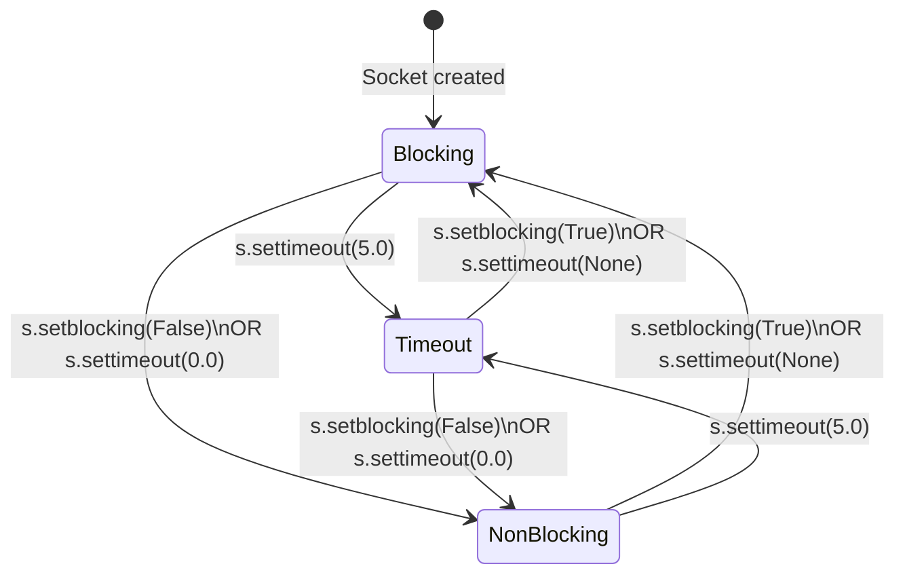
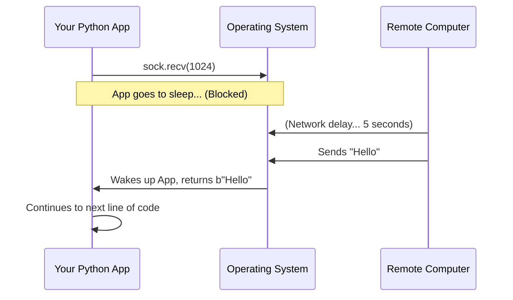
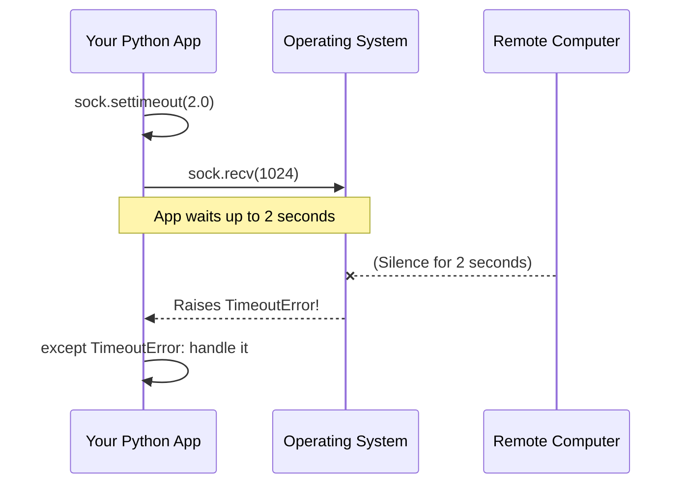
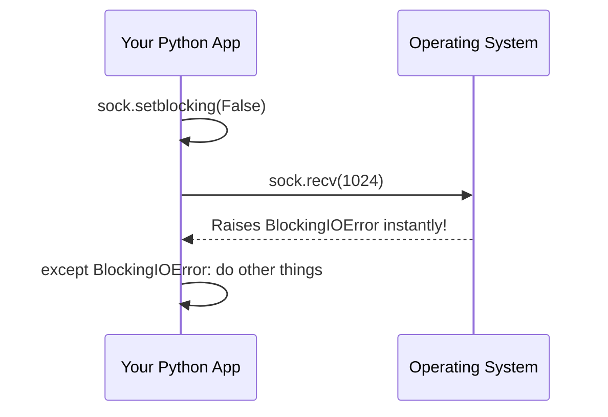

# Part 7: Modes of Operation - Blocking, Timeout, and Non-blocking

When you ask a socket to read data (`recv`), send data (`send`), or accept a connection (`accept`), what should the program do if the network isn't ready yet? Does it wait forever? Does it give up? Does it return immediately?

This behavior is controlled by the **socket's mode**. Every socket is always in exactly one of three modes:
1. **Blocking** (The default)
2. **Timeout** 
3. **Non-blocking**

Understanding these modes is crucial. Choosing the wrong mode is the #1 reason network programs freeze, spin at 100% CPU, or crash randomly.

---

## The Restaurant Analogy

Imagine you go to a restaurant and order a burger (this is like calling `recv()` to get data).

- **Blocking Mode**: You sit at the table and do absolutely nothing else. You just stare at the kitchen door. If it takes 2 minutes, you wait 2 minutes. If the chef died and it takes 3 years, you wait 3 years. You are **blocked** from doing anything else until you get your burger.
- **Timeout Mode**: You set a timer on your watch for 10 minutes. You wait at the table. If the burger arrives before the timer goes off, great! If the timer rings and there is no burger, you get angry, yell "TIMEOUT!" and leave.
- **Non-blocking Mode**: You walk to the counter and ask, "Is my burger ready?" If it is, you take it. If it isn't, they say "Not yet." You immediately walk away, do a sudoku puzzle, text your friend, and then come back 5 minutes later to ask again.

---

## The Three Modes at a Glance

Here is a state diagram showing the three modes and how you transition a socket between them using Python methods.



In Python, you can check a socket's current mode using `s.gettimeout()`:
- Returns `None` → **Blocking**
- Returns a float (e.g., `5.0`) → **Timeout**
- Returns `0.0` → **Non-blocking**

---

## 1. Blocking Mode (The Default)

When a socket is created, it is in **blocking mode** by default. 

### How it Works Under the Hood
When you call `sock.recv(1024)`, the OS checks the socket's receive buffer. If there is no data, the OS puts your program's thread to sleep. Your program literally stops executing at that line of code. The OS will wake your program up only when data arrives from the network.



### Code Example

```python
import socket

# Sockets are blocking by default!
sock = socket.socket(socket.AF_INET, socket.SOCK_STREAM)
sock.connect(("example.com", 80))

print("Waiting for data...")
# If example.com never sends anything, this line hangs FOREVER.
data = sock.recv(1024) 
print("Got data!", data)
```

### ✅ When is it fine?
- Simple scripts where you only talk to one trusted server.
- When you are using **threads** or **processes** (one thread per connection). If one thread blocks, the others can still run.

### ⚠️ When is it a problem?
- If the peer disconnects silently (e.g., their Wi-Fi drops), your `recv()` will hang forever.
- You cannot handle multiple clients in a single thread, because the first client who is slow to send data will block the entire server.

---

## 2. Timeout Mode

Timeout mode is a safety net. It bounds how long you are willing to wait for a network operation.

### How it Works
You call `sock.settimeout(5.0)`. Now, if a `recv()` or `send()` operation takes longer than 5 seconds, Python will abort the operation and raise a `TimeoutError`.



### Code Example

```python
import socket

sock = socket.socket(socket.AF_INET, socket.SOCK_STREAM)
sock.connect(("example.com", 80))

# Set a 3-second timeout
sock.settimeout(3.0)

try:
    print("Waiting for data...")
    data = sock.recv(1024)
    print("Got data!")
except TimeoutError:
    # In older Python versions, this was socket.timeout
    print("The server took too long to respond! Giving up.")
    sock.close()
```

> 💡 **Interview Tip:** In Python 3.10+, `socket.timeout` was merged into the built-in `TimeoutError`. For maximum compatibility with older codebases, you might see `except (socket.timeout, TimeoutError):`.

### ⚠️ The Pitfalls of Timeout Mode

1. **Ambiguous State after `sendall`:** 
   If you call `sock.sendall(10_000_bytes)` with a timeout, and it times out, you have a huge problem. Did it send 0 bytes? 2,000 bytes? 9,999 bytes? You don't know! The connection state is ruined. **The safest recovery after a timeout on a TCP socket is to close it and reconnect.**
2. **The `makefile()` Danger:**
   As we learned in Part 3, you can use `sock.makefile()` to treat a socket like a file. However, **timeouts do not mix well with `makefile` reads.** The internal buffer might read partial data and then time out, completely losing that partial data forever. The official Python docs explicitly warn against combining them.
3. **Timeouts apply per-syscall, not per-operation:**
   If a client trickles data to you at 1 byte per second, and you have a 5-second timeout, `recv(1024)` might never time out if it keeps getting at least *some* data before the 5 seconds are up! (This is called a Slowloris attack).

---

## 3. Non-blocking Mode

In non-blocking mode, the socket **never** waits. If an operation cannot be completed instantly, it fails immediately.

### How it Works
You set `sock.setblocking(False)`. Now, if you call `recv()` and there is no data, the OS instantly throws an error (specifically, a `BlockingIOError`). It's the OS's way of saying: "I don't have this right now, and you told me not to wait."

*(Under the hood, this corresponds to the C error codes `EAGAIN` or `EWOULDBLOCK`)*.



### Code Example: The Bad Way (Busy Polling)

A beginner's instinct is to use a `while True` loop and `time.sleep()` to wait for data.

```python
import socket
import time

sock = socket.socket(socket.AF_INET, socket.SOCK_STREAM)
sock.connect(("example.com", 80))
sock.setblocking(False)  # OR sock.settimeout(0.0)

# ⚠️ WARNING: THIS IS A TERRIBLE PATTERN ⚠️
while True:
    try:
        data = sock.recv(1024)
        print("Got data:", data)
        break
    except BlockingIOError:
        # No data yet!
        print("Nothing yet... doing other work...")
        time.sleep(0.1)  # Sleep so we don't fry the CPU
```

### 🛑 Why is the Sleep Loop BAD?
1. **Latency:** If data arrives 0.01s after you sleep, you still wait the full 0.1s to process it. Your app becomes sluggish.
2. **CPU Waste:** If you remove the `sleep()` to fix the latency, your `while` loop spins millions of times a second, maxing out an entire CPU core just asking "Are we there yet? Are we there yet?".

**The Right Way:** Non-blocking sockets are the foundation of high-performance servers (like Node.js, Nginx, or Python's `asyncio`). But you NEVER write a loop like the one above. Instead, you use an **I/O Multiplexer** (like `selectors` or `epoll` — see Part 9). The multiplexer lets you say to the OS: *"Put me to sleep, but wake me up as soon as ANY of these 10,000 non-blocking sockets has data."*

---

## 🔑 The Non-Blocking `connect()` Pattern

Connecting to a server can take time (DNS resolution, network latency, TCP handshakes). If you want to connect to a server without blocking your entire app, you must use a non-blocking connect.

This is a **classic interview question**. Because it's non-blocking, `connect()` will return immediately, but the connection isn't actually established yet! How do you know when it's done?

```python
import socket
import selectors

s = socket.socket()
s.setblocking(False)

# 1. Initiate the connection. 
# connect_ex() returns an error code instead of raising an exception.
err = s.connect_ex(("example.com", 80))

# On a non-blocking socket, it almost always returns EINPROGRESS or EWOULDBLOCK,
# meaning "I started connecting in the background."

# 2. Wait for the socket to become WRITABLE.
# When a background connect finishes, the socket becomes writable!
sel = selectors.DefaultSelector()
sel.register(s, selectors.EVENT_WRITE)

# Wait up to 5 seconds for the socket to become writable
events = sel.select(timeout=5)

if events:
    # 3. It's writable! But did it succeed or fail? 
    # We must ask the socket for its error status using getsockopt.
    so_error = s.getsockopt(socket.SOL_SOCKET, socket.SO_ERROR)
    
    if so_error == 0:
        print("Successfully connected!")
    else:
        print(f"Connection failed with error code: {so_error}")
else:
    print("Connection timed out!")

sel.close()
s.close()
```
*Why this is important:* This is the exact pattern underneath libraries like `asyncio` and `aiohttp`.

---

## Comparison Summary

| Mode | When to use it | How to set it | What happens if empty? |
| :--- | :--- | :--- | :--- |
| **Blocking** | Simple scripts, multi-threaded servers | Default. Or `s.setblocking(True)` | Thread freezes forever |
| **Timeout** | When you want to prevent hanging forever, but don't want the complexity of async | `s.settimeout(5.0)` | Waits up to N sec, then raises `TimeoutError` |
| **Non-blocking**| High-performance event loops, `asyncio`, managing 10k+ clients on a single core | `s.setblocking(False)` | Raises `BlockingIOError` instantly |

---

## Self-Check Questions

1. If your socket is in blocking mode, and you call `recv(1024)` but the peer never sends any data, what happens to your program?
2. Why is combining `sock.settimeout(2.0)` and `sock.makefile()` dangerous?
3. In non-blocking mode, if `recv()` has no data to read, what exception does it raise?
4. Why shouldn't you use a `while True: try: recv() except BlockingIOError: time.sleep(0.1)` loop to wait for data on a non-blocking socket? What should you use instead?
5. How do you check the success or failure of a non-blocking `connect()` once the socket becomes writable?
