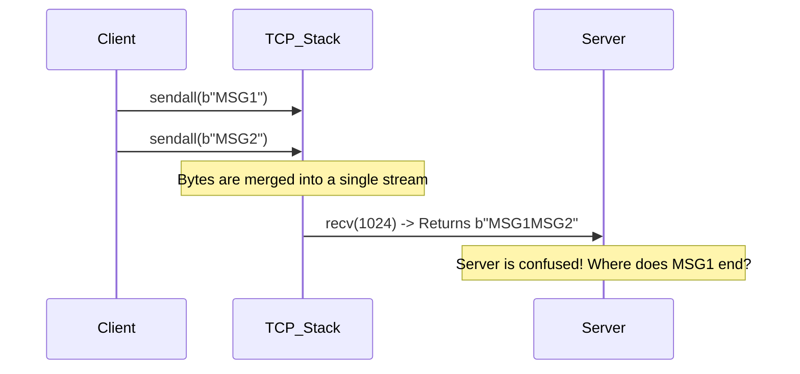

# Protocol Design and Message Framing

## Introduction: Why Protocol Design Matters

When you first learn socket programming, you often write simple programs that send a message and read a reply. They work perfectly on your local machine, but the moment you deploy them to a real network, data gets jumbled, cut in half, or merged together. 

Why? Because of **the stream illusion**. TCP does not know what a "message" is. It only knows about a continuous stream of bytes. **Framing** is the art of imposing boundaries on that stream so the receiver knows exactly where one message ends and the next begins.

This is **the most important topic in socket programming**. If you get this right, your network apps will be bulletproof. If you get it wrong, they will randomly fail under load.

---

## 🌎 Real-World Analogy: The Continuous Tape

Imagine a telegraph operator who receives a continuous reel of paper tape with letters on it, but **without any spaces or punctuation**.

If the sender transmits:
`SEND` then `HELP` then `NOW`

The receiver might read from the tape and get:
- Reading 1: `SENDH`
- Reading 2: `ELPNO`
- Reading 3: `W`

How does the receiver know where the words begin and end? They don't! Unless you agree on a rule beforehand, like:
1. Every word is exactly 5 letters, padded with X's (Fixed-length).
2. Every word ends with a dash `-` (Delimiter).
3. Every word is preceded by a number indicating its length: `4SEND4HELP3NOW` (Length-prefix).

This agreed-upon rule is called a **Protocol**, and the method of packaging the words is called **Framing**.

---

## 1. The Stream Illusion: The #1 Beginner Mistake

TCP delivers a **byte stream with no message boundaries**. 

If a client executes:
```python
sock.sendall(b"HELLO")
sock.sendall(b"WORLD")
```

Many beginners assume the server's `sock.recv(1024)` will magically return `b"HELLO"` the first time, and `b"WORLD"` the second time. 

⚠️ **WARNING: Any code that assumes one `send()` = one `recv()` is fundamentally broken.**

### What Actually Happens on the Wire (ASCII Art)

The bytes from both `sendall` calls go into the operating system's send buffer, travel across the network in packets, and arrive in the receiver's receive buffer as one continuous stream:

```text
[ Sender Buffer ] -> Network -> [ Receiver Buffer ]
  H E L L O W O R L D            H E L L O W O R L D
```

When the server calls `recv(1024)`, it just scoops up whatever bytes are currently in the buffer. Depending on timing, network latency, and buffer sizes, the server might get:
- `b"HELLOWORLD"` (Merged)
- `b"HE"` then `b"LLOWOR"` then `b"LD"` (Split)
- `b"HELLO"`, `b"WORLD"` (Only if you are very lucky or on localhost)

### Send/Receive Mismatch Diagram



---

## 2. The Four Framing Strategies

To solve this, we must use framing. Here are the four ways to do it:

| Strategy | How it works | Pros | Cons |
|---|---|---|---|
| **Fixed-length** | Every message is exactly N bytes | Trivial to implement | Wasteful (requires padding), inflexible |
| **Delimiter** | Read until a special marker (like `\n`) | Human-readable, easy to debug with tools like `netcat` | Must ensure the delimiter NEVER appears in the payload (requires escaping) |
| **Length-prefix** | Header carries payload length | Binary-safe, efficient, exact | The header itself needs framing (usually fixed-length) |
| **Self-describing** | Complex grammar (like JSON objects, HTTP headers with `Content-Length`) | Very powerful | Complex to parse |

💡 **Interview Tip:** When asked how to send arbitrary data over TCP, **Length-prefixing** is always the standard, most robust answer.

---

## 3. Fixed-Length Framing

The simplest approach: every message is exactly, say, 16 bytes. If the data is shorter, we pad it.

### Code Example: Fixed-Length

```python
import socket

MSG_SIZE = 16

def send_fixed(sock: socket.socket, message: str):
    # Encode string to bytes
    data = message.encode('utf-8')
    
    if len(data) > MSG_SIZE:
        raise ValueError("Message too long!")
        
    # Pad with spaces to make it exactly MSG_SIZE
    padded_data = data.ljust(MSG_SIZE, b' ')
    sock.sendall(padded_data)

def recv_fixed(sock: socket.socket) -> str:
    buf = bytearray()
    
    # We must keep reading until we have exactly MSG_SIZE bytes
    while len(buf) < MSG_SIZE:
        chunk = sock.recv(MSG_SIZE - len(buf))
        if not chunk:
            raise ConnectionError("Peer closed connection mid-message")
        buf.extend(chunk)
        
    # Strip the padding and decode
    return buf.decode('utf-8').rstrip(' ')
```

---

## 4. Delimiter Framing (e.g., `\n`)

Delimiter framing reads bytes until it hits a specific character. This is how many text-based protocols (like SMTP, Redis, IRC) work. 

⚠️ **The Pitfall:** If a hacker sends 5 Gigabytes of data *without* a newline, your server will buffer it all in memory and crash (Memory DoS). You **must** limit the buffer size.

### Code Example: The Robust `LineReader`

Writing a safe LineReader is a classic interview question!

```python
import socket

class LineReader:
    def __init__(self, sock: socket.socket, limit=65536):
        self.sock = sock
        self.buf = bytearray()
        self.limit = limit  # Maximum line length to prevent Memory DoS!

    def readline(self) -> bytes:
        while True:
            # Check if we already have a newline in our buffer
            if (i := self.buf.find(b"\n")) >= 0:
                # Extract the line (excluding the \n)
                line = bytes(self.buf[:i])
                # Remove the line and the \n from the buffer
                del self.buf[:i + 1]
                return line
            
            # No newline yet, read more from the socket
            chunk = self.sock.recv(4096)
            if not chunk:
                if self.buf:
                    raise ConnectionError("EOF before newline")
                return b"" # Clean EOF
                
            self.buf += chunk
            
            # Security Check: Prevent unbounded memory growth
            if len(self.buf) > self.limit:
                raise ValueError("Line exceeded maximum allowed length!")
```

---

## 5. Length-Prefix Framing (The Ultimate Solution)

This is the industry standard for binary protocols. We prepend every message with a fixed-length "Header" that tells the receiver exactly how many bytes the payload will be.

To pack integers into raw bytes, we use Python's `struct` module.

### Deep Dive: The `struct` Module

The `struct` module converts Python values into C-style raw bytes. 

```python
import struct

# Format string: "!I"
# ! means "Network Byte Order" (Big-Endian). ALWAYS use this for networks!
# I means "Unsigned 32-bit Integer" (4 bytes)

# Pack the integer 1024 into 4 bytes
header = struct.pack("!I", 1024)
print(header)  # b'\x00\x00\x04\x00'

# Unpack 4 bytes back into a tuple of integers
unpacked = struct.unpack("!I", b'\x00\x00\x04\x00')
print(unpacked[0])  # 1024
```

🔑 **Why Network Byte Order?** 
Different CPUs store integers differently in memory (Little-Endian vs Big-Endian). If an Intel CPU sends a 4-byte integer to an ARM CPU, the bytes might be read backwards. Network Byte Order (`!`) forces a universal standard (Big-Endian) so all machines agree.

### Code Example: Complete Length-Prefixed Protocol

```python
import socket
import struct

# 16 MiB maximum payload to prevent someone from sending a header
# that claims the payload is 4 GB, which would OOM the server!
MAX_PAYLOAD_SIZE = 16 * 1024 * 1024  

def send_msg(sock: socket.socket, payload: bytes) -> None:
    """Prefixes the payload with a 4-byte length header and sends it."""
    # Pack the length of the payload as a 4-byte integer
    header = struct.pack("!I", len(payload))
    # Send header + payload together
    sock.sendall(header + payload)

def _recv_exact(sock: socket.socket, num_bytes: int) -> bytes:
    """Helper: Reads EXACTLY num_bytes from the socket."""
    buf = bytearray()
    while len(buf) < num_bytes:
        # Ask only for the remaining bytes we need
        chunk = sock.recv(num_bytes - len(buf))
        if not chunk:
            raise ConnectionError("Peer closed connection mid-message")
        buf.extend(chunk)
    return bytes(buf)

def recv_msg(sock: socket.socket) -> bytes:
    """Reads the 4-byte header, then reads the exact payload."""
    try:
        # 1. Read exactly 4 bytes for the header
        header = _recv_exact(sock, 4)
    except ConnectionError:
        return b"" # Clean EOF when starting a new message
        
    # Unpack the 4 bytes into an integer
    (payload_length,) = struct.unpack("!I", header)
    
    # 2. SECURITY: Validate the length!
    if payload_length > MAX_PAYLOAD_SIZE:
        raise ValueError(f"Refusing malicious {payload_length}-byte message")
        
    # 3. Read exactly payload_length bytes
    return _recv_exact(sock, payload_length)
```

### Visualizing Length-Prefix on the Wire

If you send `b"HELLO"`, `len("HELLO")` is 5.
The 4-byte header for 5 is `\x00\x00\x00\x05`.

```text
[ 4-byte Header ] [ 5-byte Payload ]
 \x00\x00\x00\x05   H  E  L  L  O
```

---

## 6. Serialization Choices

Once you have framing, you need to decide how to encode your actual data (objects, dicts, arrays) into bytes.

| Format | When to use | Security / Notes |
|---|---|---|
| **JSON** | Default for text, highly readable | Safe. Great for web and simple apps. |
| **JSON Lines** | (`\n`-delimited JSON) | Very easy to debug. Just one JSON object per line. |
| **Pickle** | **NEVER USE WITH UNTRUSTED DATA** | ⚠️ **DANGER:** Pickle allows arbitrary code execution. A hacker can send a pickle payload that runs a virus on your server. |
| **Protobuf** | High-performance, cross-language | Binary, compact, requires defining a schema (`.proto` file). |
| **MessagePack** | Like JSON but binary | Fast, no schema required. |

---

## 7. Putting it together: A Length-Prefixed JSON Chat

Here is how you combine JSON serialization with Length-Prefix framing for a robust, production-grade protocol layer:

```python
import json

def send_json(sock: socket.socket, obj: dict):
    """Serializes a dict to JSON, encodes to bytes, and sends via length-prefix."""
    json_string = json.dumps(obj)
    payload = json_string.encode('utf-8')
    send_msg(sock, payload)  # Uses the send_msg from Section 5

def recv_json(sock: socket.socket) -> dict:
    """Receives a length-prefixed payload, decodes, and parses JSON."""
    payload = recv_msg(sock) # Uses the recv_msg from Section 5
    if not payload:
        return None
    json_string = payload.decode('utf-8')
    return json.loads(json_string)

# Usage in your app:
# send_json(sock, {"type": "chat", "user": "Alice", "msg": "Hi!"})
```

---

## 8. Security Pitfalls & Common Attacks

1. **Unbounded Lengths (Memory DoS):** In length-prefixed framing, if you blindly do `sock.recv(length)` based on the header, an attacker sends `\xFF\xFF\xFF\xFF` (4 GB) and your app crashes trying to allocate 4 GB of RAM. **Always enforce a `MAX_PAYLOAD_SIZE`.**
2. **Unbounded Lines (Memory DoS):** In delimiter framing, an attacker sends gigabytes of text without a `\n`. Your `LineReader` buffer grows until the server dies. **Always cap the buffer size.**
3. **Slow Loris Attack:** An attacker connects, sends the first byte of a 4-byte header, and then waits 10 minutes to send the next byte. They tie up your server's threads. **Always use timeouts (`sock.settimeout(5.0)`) or budgets to drop slow clients.**

---

## 📝 Quick Reference Cheat Sheet

- **The Problem:** TCP is a stream, not a message queue. `send()` != `recv()`.
- **The Solution:** Framing.
- **Delimiter Framing:** `data + b'\n'`. Easy, but needs escaping and max-length limits.
- **Length-Prefix Framing:** `[4-byte Length][Data]`. Best for binary. Use `struct.pack("!I", len)`.
- **Serialization:** Use JSON for text, Protobuf for high-perf binary. **NEVER use `pickle`.**

---

## 🧠 Self-Check Questions

1. If a client calls `sendall(b"AAA")` and then `sendall(b"BBB")`, is it guaranteed the server will get exactly `"AAA"` on its first `recv()`? Why or why not?
2. What does the `!` mean in `struct.pack("!I", 100)`, and why is it mandatory for network protocols?
3. Why is it dangerous to read a `\n`-delimited line by simply appending chunks to a buffer until `\n` is found, without any other checks?
4. If an attacker sends a 4-byte header claiming a payload is 10 gigabytes, what should your `recv_msg` function do?
5. Why should you never use Python's `pickle` module over a public network?
