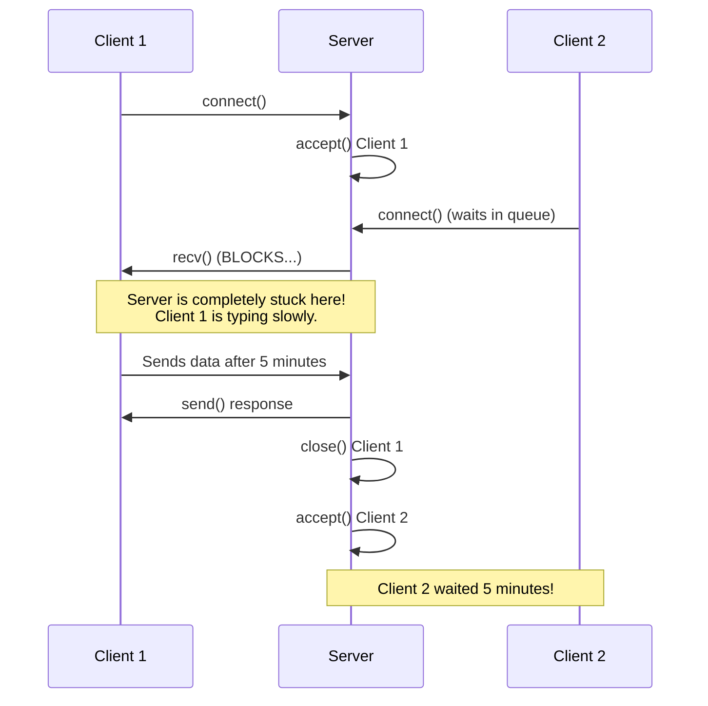
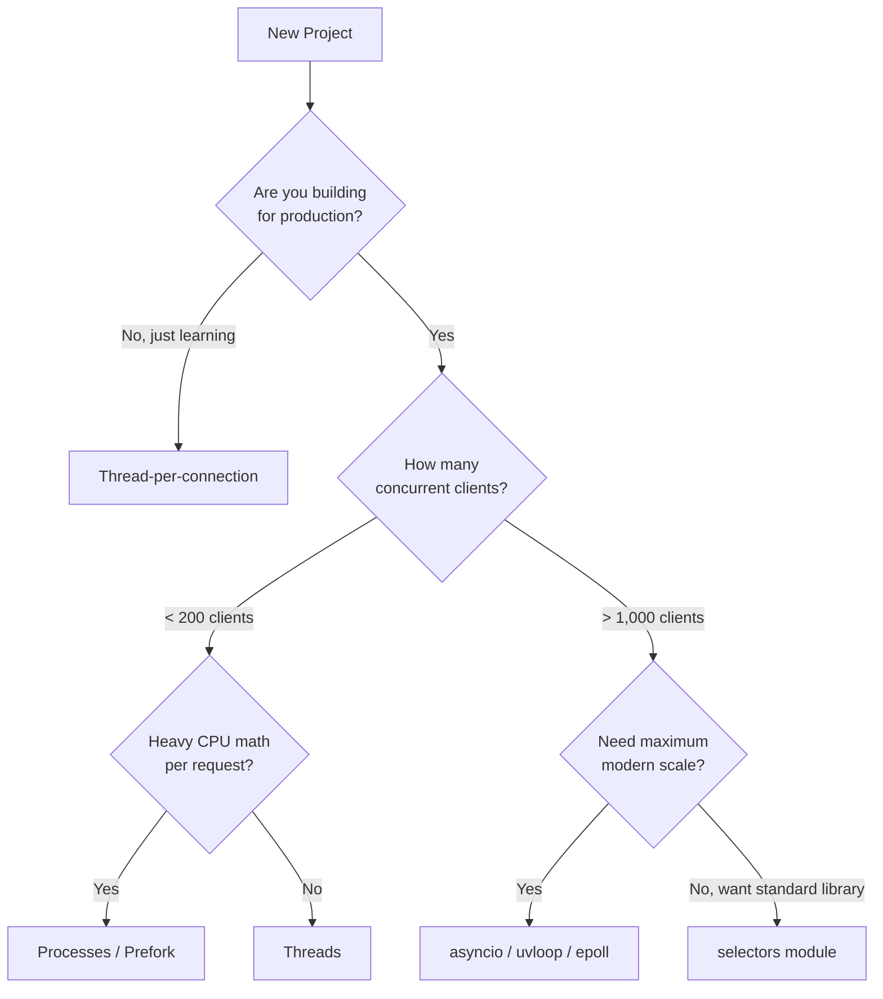

# Part 9: Concurrency — Serving Many Clients at Once

Welcome to the most critical topic in network programming: **Concurrency**. 

## Why Does This Matter?
If you've been following the guide so far, our server code has been fundamentally flawed for production use. It handles exactly **one client at a time**. If a client connects and decides to idle or send data very slowly, no other client can connect. In the real world, a server needs to handle thousands or millions of clients simultaneously (think of a web server, a chat application, or a multiplayer game). This chapter explains how to scale your server from 1 to 10,000+ simultaneous connections.

---

## The Real-World Analogy: The Coffee Shop ☕

Imagine a coffee shop with a single barista (your server). 

- **Naive Accept Loop:** The barista takes a customer's order, makes the coffee, waits for the customer to drink it, and waits for them to leave the store before taking the next person's order. The line out the door stretches for miles. This is our basic socket server.
- **Thread/Process per connection:** The manager hires a new barista for every single customer that walks through the door. This works great at first, but soon there are 1,000 baristas bumping into each other behind the counter, and the coffee shop goes bankrupt paying their salaries (CPU/Memory overhead).
- **I/O Multiplexing (Event Loop):** There is one super-efficient barista. They take Customer A's order, start the espresso machine, and while the shot is pulling (waiting for I/O), they turn and take Customer B's order. They only pay attention to machines or customers that are *ready*. 

---

## 1. The Naive Accept Loop (Why it's bad)

In our previous basic servers, the loop looked like this: `accept()` a client → `recv()` data → `send()` data → close → repeat. 

Because `recv()` is a **blocking** call by default, the server halts execution until that specific client sends something.



⚠️ **Common Mistake:** Beginners often deploy a simple `while True:` loop to production and wonder why their server "freezes" when a user on a bad mobile connection connects.

---

## 2. The Four Concurrency Strategies (Overview)

How do we fix this? We have four main paths. Here is an ASCII art breakdown:

```text
                        CONCURRENCY STRATEGIES
   ┌──────────────────┬──────────────────┬──────────────────┬──────────────────┐
   │ 1. Thread per    │ 2. Process per   │ 3. I/O Multiplex │ 4. Hybrid:       │
   │    connection    │    connection    │    (selectors /  │    prefork +     │
   │    (threading)   │    (forking)     │    epoll)        │    SO_REUSEPORT  │
   ├──────────────────┼──────────────────┼──────────────────┼──────────────────┤
   │ Each client gets │ Each client gets │ 1 thread handles │ Processes +      │
   │ its own thread.  │ its own process. │ EVERY client.    │ Event Loops.     │
   ├──────────────────┼──────────────────┼──────────────────┼──────────────────┤
   │ Simple code.     │ True parallelism.│ Ultimate scale.  │ What Nginx and   │
   │ ~100s of conns.  │ No GIL issues.   │ 10k–1M conns.    │ Gunicorn do.     │
   │ GIL limits CPU.  │ Heavy RAM usage. │ Complex code.    │ Best of both.    │
   └──────────────────┴──────────────────┴──────────────────┴──────────────────┘
```

---

## 3. Strategy 1: Thread-per-Connection

The easiest way to serve multiple clients is to spawn a new OS thread for each connection. A thread is a lightweight unit of execution that shares memory with the main program.

### 💡 The GIL (Global Interpreter Lock)
In Python (CPython specifically), the GIL ensures that only **one thread can execute Python bytecode at a time**. 
- If your server does heavy math (CPU-bound), threads won't make it faster.
- However, sockets are **I/O-bound** (waiting on the network). Python releases the GIL when a thread is blocking on `recv()` or `send()`. Therefore, **threading works perfectly for socket I/O in Python!**

### The Code

```python
import socket
import threading

def handle_client(conn, addr):
    """This function runs in a separate thread for every client."""
    print(f"[NEW CONNECTION] {addr} connected.")
    try:
        with conn:
            while True:
                data = conn.recv(1024)
                if not data:
                    break # Client disconnected
                conn.sendall(data.upper())
    except ConnectionError:
        pass
    print(f"[DISCONNECTED] {addr} left.")

def run_server():
    server = socket.create_server(("127.0.0.1", 65432))
    print("Server listening on port 65432...")
    
    try:
        while True:
            # 1. Main thread blocks here waiting for a new client
            conn, addr = server.accept()
            
            # 2. Create a new thread to handle this specific client
            # target=function to run, args=tuple of arguments for the function
            thread = threading.Thread(target=handle_client, args=(conn, addr))
            
            # 3. Make it a daemon thread! 
            # Daemon threads automatically die when the main program exits.
            # If False, you can't Ctrl+C to kill the server if clients are connected.
            thread.daemon = True 
            
            # 4. Start the thread (runs in background)
            thread.start()
            print(f"[ACTIVE CONNECTIONS] {threading.active_count() - 1}")
    except KeyboardInterrupt:
        print("\nShutting down server.")
    finally:
        server.close()

if __name__ == "__main__":
    run_server()
```

### ✅ Pros and ⚠️ Cons
- **Pros:** Extremely easy to read. Blocking code stays blocking. You don't have to learn new paradigms.
- **Cons:** Threads are not free. Each thread uses roughly 8MB of stack memory in the OS. If 10,000 clients connect, you need 80GB of RAM just for thread overhead! Also, the OS CPU scheduler will choke trying to context-switch between 10,000 threads (Context Switch Storm).

---

## 4. Strategy 2: Process-per-Connection / Prefork

If threads share memory and have a GIL, why not use entirely separate processes? 

### How `os.fork()` works
`fork()` is a Unix system call that clones the current running program into an exact replica (a "child" process). Both continue executing from the exact same line of code.
- `fork()` returns `0` inside the child process.
- `fork()` returns the child's Process ID (PID) inside the parent process.

### The Prefork Architecture
Instead of creating a process *when* a client connects (which is slow), we create a "pool" of processes upfront. They all share the same listening socket.

```python
import os
import socket
import time

def run_prefork_server():
    # 1. Create the listening socket in the PARENT
    with socket.create_server(("0.0.0.0", 8080)) as srv:
        print(f"Parent {os.getpid()} listening on 8080")
        
        # 2. Fork 4 worker processes
        for _ in range(4):
            pid = os.fork()
            if pid == 0:
                # --- CHILD PROCESS CODE ---
                print(f"Worker {os.getpid()} started")
                while True:
                    # All children block on the SAME accept() call!
                    # The OS kernel safely wakes up exactly one child when a client connects.
                    try:
                        conn, addr = srv.accept()
                        with conn:
                            msg = f"Hello from worker PID {os.getpid()}\n"
                            conn.sendall(msg.encode())
                            time.sleep(1) # Simulate work
                    except KeyboardInterrupt:
                        os._exit(0) # Child exits cleanly
                # --------------------------
        
        # 3. Parent Process waits for children (prevents zombie processes)
        try:
            os.wait() 
        except KeyboardInterrupt:
            print("Parent shutting down")

if __name__ == "__main__":
    run_prefork_server()
```

### 🔑 Interview Tip: `SO_REUSEPORT`
In older Linux kernels, all processes waiting on `accept()` would wake up at once (the "thundering herd" problem), but only one would get the socket. 
Modern alternative: **`SO_REUSEPORT`**. Instead of `fork()`, you launch 4 completely independent Python scripts. They all set `SO_REUSEPORT` and `bind()` to port 8080. The Linux kernel takes over and hashes incoming connections evenly across the 4 scripts. No shared state, no GIL, perfect load balancing!

---

## 5. The C10k Problem

In 1999, engineer Dan Kegel coined the **"C10k problem"**: how do we handle 10,000 concurrent clients on a single server?
- 10,000 Threads? Kernel scheduler panics, RAM exhausted.
- 10,000 Processes? Even worse.

The solution was **I/O Multiplexing** combined with **Non-blocking Sockets**. 

---

## 6. Strategy 3: I/O Multiplexing (The Event Loop)

The big idea: **Use ONE thread. Ask the OS kernel: "Out of these 10,000 sockets, which ones are ready to be read or written to right now?"** 

Instead of waiting for one specific socket, we wait for *any* socket to be ready.

```mermaid
flowchart TD
    A[Start Event Loop] --> B(Ask OS: 'Who is ready?')
    B -->|Blocks until someone is ready| C{OS returns list of ready Sockets}
    C --> D[Loop through ready sockets]
    D --> E{Is it the Listener Socket?}
    E -->|Yes| F[accept() new client & add to list]
    E -->|No| G[recv() or send() data]
    F --> D
    G --> D
    D -->|Done with list| B
```

### The Progression of Syscalls
Historically, operating systems provided different APIs to ask this question:

1. **`select`**: The oldest (1983). 
   - **How it works:** You pass the OS a list of sockets.
   - **The Flaw:** It has a hard limit called `FD_SETSIZE` (usually 1024). You cannot monitor more than 1024 sockets. Also, it is **O(n)** — if you have 1000 sockets, the kernel checks all 1000 every loop, even if only 1 is active.
2. **`poll`**: 
   - Fixes the 1024 limit, but is still **O(n)**. Too slow for C10k.
3. **`epoll` (Linux) / `kqueue` (macOS)**: 
   - **The Savior.** It is **O(ready)**. If you monitor 1,000,000 sockets, and 5 are ready, `epoll` instantly returns just the 5 ready ones. This solved C10k.

### Level-Triggered vs Edge-Triggered (`epoll` internals)
- **Level-Triggered (Default):** The OS nags you. "Hey, Socket A has data. Hey, Socket A STILL has data!" (It keeps returning the socket as ready until you read all the data).
- **Edge-Triggered (`EPOLLET`):** The OS notifies you exactly ONCE when state changes. "Socket A just got data." If you don't read all of it right then, you will never be notified about the leftover data again. Extremely fast, but dangerous!

---

## 7. The `selectors` Module: The Ultimate Solution

Writing raw `epoll` or `select` is messy. Python provides the **`selectors`** module. `selectors.DefaultSelector()` automatically chooses the best available system call (`epoll` on Linux, `kqueue` on Mac, `select` on Windows).

### THE NON-BLOCKING PLAYBOOK (Memorize these 8 rules)
1. **Rule 1:** Every socket you register MUST be set to non-blocking: `sock.setblocking(False)`.
2. **Rule 2:** Because it's non-blocking, `recv()` might raise `BlockingIOError`. Catch it and treat it as "no data right now".
3. **Rule 3:** `send()` might only send *part* of your data. You must keep a buffer of what's left to send.
4. **Rule 4:** Only register for `EVENT_WRITE` when you *actually* have data in your buffer. Otherwise, your socket is *always* writable, and your loop will spin at 100% CPU.
5. **Rule 5:** If `recv()` returns `b""` (empty bytes), the client disconnected.
6. **Rule 6:** ALWAYS `sel.unregister(sock)` BEFORE calling `sock.close()`. Doing it backwards crashes the loop.
7. **Rule 7:** Expect `ConnectionResetError` if a client forcibly crashes. Catch it, unregister, and close.
8. **Rule 8:** Never let one bad client crash the whole event loop. Wrap handlers in `try/except`.

### The Complete Non-Blocking Echo Server (Line-by-Line)

```python
import selectors
import socket
import types

# Automatically uses epoll on Linux, kqueue on Mac
sel = selectors.DefaultSelector()

def accept_wrapper(lsock):
    """Triggered when the listener socket is ready (new client)."""
    conn, addr = lsock.accept()
    print(f"Accepted connection from {addr}")
    
    # RULE 1: Must be non-blocking!
    conn.setblocking(False)
    
    # We create a namespace object to hold state for this specific client.
    # 'inb' is what we read, 'outb' is what we need to send back (our buffer).
    data = types.SimpleNamespace(addr=addr, inb=b"", outb=b"")
    
    # Register the new client socket with the selector.
    # We want to know when it's ready to READ (EVENT_READ) or WRITE (EVENT_WRITE)
    events = selectors.EVENT_READ | selectors.EVENT_WRITE
    sel.register(conn, events, data=data)

def service_connection(key, mask):
    """Triggered when a client socket has data to read or can be written to."""
    sock = key.fileobj
    data = key.data
    
    # Is the socket ready to be READ from?
    if mask & selectors.EVENT_READ:
        try:
            recv_data = sock.recv(4096)
        except BlockingIOError:
            recv_data = None # RULE 2
            
        if recv_data:
            # Append data to the output buffer
            data.outb += recv_data
        else:
            # RULE 5: b"" means client closed the connection
            print(f"Closing connection to {data.addr}")
            sel.unregister(sock) # RULE 6: Unregister FIRST
            sock.close()         # Then close
            
    # Is the socket ready to be WRITTEN to?
    if mask & selectors.EVENT_WRITE:
        if data.outb: # RULE 4: Only write if we have data buffered
            # RULE 3: send() might only send 10 bytes out of 1000!
            # It returns the number of bytes actually sent.
            sent = sock.send(data.outb)
            
            # Slice the buffer, keeping only what wasn't sent yet
            data.outb = data.outb[sent:]

def run_event_loop():
    lsock = socket.create_server(("127.0.0.1", 65432))
    lsock.setblocking(False) # Listener must be non-blocking too!
    
    # Register listener. data=None is our trick to identify it's the listener.
    sel.register(lsock, selectors.EVENT_READ, data=None)
    
    print("Event loop starting...")
    try:
        while True:
            # THIS IS THE HEART OF MULTIPLEXING.
            # The code pauses here until the OS says AT LEAST ONE socket is ready.
            events = sel.select(timeout=None)
            
            # Loop through the sockets that are ready
            for key, mask in events:
                if key.data is None:
                    # It's the listener! Accept the new client.
                    accept_wrapper(key.fileobj)
                else:
                    # It's an existing client! Service it.
                    service_connection(key, mask)
    except KeyboardInterrupt:
        print("Caught keyboard interrupt, exiting")
    finally:
        sel.close()

if __name__ == "__main__":
    run_event_loop()
```

### 💡 Advanced Trick: Waking the loop from another thread
If your event loop is blocked on `sel.select()`, how does a background thread tell the loop to wake up and process some urgent external data? 
**The Socketpair Trick:** Create a `socket.socketpair()` (two connected internal sockets). Register one end with the selector for reading. Have the background thread write a single byte `b"x"` into the other end. The OS instantly wakes up the selector!

---

## 8. Choosing a Model (Decision Guide)

Not sure which one to pick? Use this flowchart:



| Situation | Pick |
|---|---|
| < 200 clients, code clarity is top priority | `threading` (or `ThreadingTCPServer`) |
| Heavy data processing/math per client | `multiprocessing` / Prefork |
| Thousands of idle connections (Chat server) | `selectors` / `asyncio` |
| Maximum throughput on Linux | epoll + edge-trigger / `uvloop` |

---

## Quick Reference / Cheat Sheet

- **GIL:** Global Interpreter Lock. Makes threads safe but prevents true CPU parallelism in Python. However, threads are great for I/O bounds like sockets.
- **`os.fork()`:** Duplicates the current process. Heavy on memory, avoids the GIL.
- **`select`:** O(n) polling, max 1024 sockets. Outdated.
- **`epoll`:** O(ready) event notification. Extremely fast. Linux only.
- **`selectors.DefaultSelector`:** Python's wrapper that automatically picks the best polling mechanism.
- **C10k Problem:** The historical challenge of handling 10,000 concurrent clients, solved by epoll/kqueue and non-blocking sockets.
- **Non-blocking `recv()`:** Raises `BlockingIOError` if no data is available.
- **Non-blocking `send()`:** May send only part of the data. Returns bytes sent.

---

## Self-Check Questions

1. Why does a naive `while True: client.recv()` loop fail to support multiple users?
2. Why is multithreading in Python acceptable for socket programming, despite the GIL?
3. What is the fundamental difference in time complexity between `select` and `epoll`?
4. When writing a non-blocking server, what must you do before calling `sock.close()`?
5. Why must you maintain an output buffer for non-blocking sockets, rather than assuming `send(data)` sends everything?

<br/>
<br/>

👉 **Next Up:** [Part 10 - `socketserver`: The Batteries-Included Framework](./10-socketserver.md)
