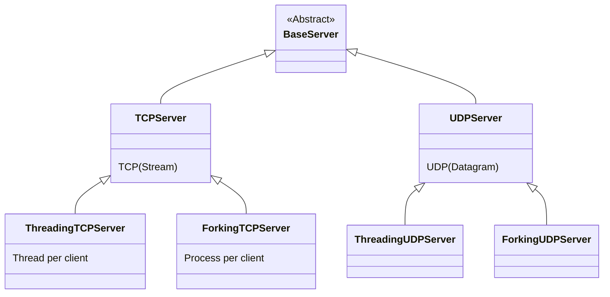
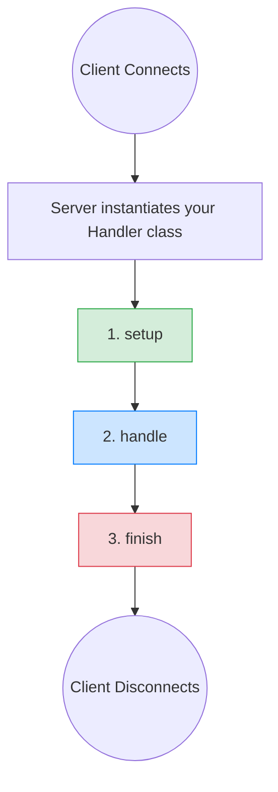

# Part 10: `socketserver` — The Batteries-Included Framework

## 1. Introduction: Why Does This Matter?

Up until now, we’ve written our socket loops from scratch: `socket()`, `bind()`, `listen()`, `accept()`, loop, handle... It works, but it’s repetitive. What if you just want to say, **"Here is how I handle one client — please do the rest for me?"**

Python's built-in `socketserver` module does exactly that. It hides the boilerplate of accepting connections, managing threads or processes, and closing sockets. It provides a structured, object-oriented way to build network servers quickly and safely.

---

## 2. Real-World Analogy 🍔

**Raw Sockets are like cooking from scratch:**
You have to build the kitchen (bind/listen), wait at the front door to greet customers (accept), walk them to a table, cook their food, serve it, and then clean up. If multiple people arrive, you either make them wait (blocking), clone yourself (threads), or juggle everything rapidly (async). 

**`socketserver` is like a Pre-Built Restaurant Franchise:**
The franchise provides the building, the greeting system, and the tables. You just provide the **Chef (the Handler)**. When a customer arrives, the franchise automatically seats them and hands the order to your Chef. Your only job is to write the `handle()` function that cooks the meal!

---

## 3. Core Concepts: The Class Map

The `socketserver` framework is divided into two parts:
1. **Servers:** They handle the network (listening, accepting, and concurrency).
2. **Handlers:** They handle the actual conversation (receiving and sending data).

### The Server Hierarchy

Here is how the server classes are structured. You pick a base protocol (TCP/UDP) and a concurrency mixin (Threading/Forking).



### The Handler Hierarchy

You write the logic by subclassing one of these:

1. **`BaseRequestHandler`**: The bare minimum. You interact with raw socket objects directly.
2. **`StreamRequestHandler`**: Perfect for TCP. It wraps the socket in file-like objects (`self.rfile` and `self.wfile`), letting you read lines (`readline()`) instead of raw bytes.
3. **`DatagramRequestHandler`**: Perfect for UDP. 

---

## 4. The Handler Lifecycle

When a client connects, the Server creates a **brand new Handler instance** just for that client. It then calls three methods in order. 



- **`setup()`**: Optional. Great for initializing variables, opening database connections, or authenticating.
- **`handle()`**: **Required.** This is where you actually `recv` and `send` data.
- **`finish()`**: Optional. Great for cleanup. **💡 Tip:** `finish()` runs even if `handle()` crashes with an exception!

---

## 5. Code Example: TCP Echo Server

Let's build a server that echoes back everything you send to it, in UPPERCASE. We'll use `StreamRequestHandler` to make reading easy.

```python
import socketserver

# 1. Define the Handler (The Chef)
class EchoHandler(socketserver.StreamRequestHandler):
    """
    Because we inherit from StreamRequestHandler, we get:
    - self.rfile: A file-like object to read from the client.
    - self.wfile: A file-like object to write to the client.
    - self.client_address: A tuple of (IP, Port).
    """
    
    def handle(self):
        print(f"✅ Client connected: {self.client_address}")
        
        # Send a welcome message
        self.wfile.write(b"Welcome! Send me lines of text.\n")
        
        # Iterate over lines from the client (blocks until newline \n is received)
        for line in self.rfile:
            print(f"Received from {self.client_address}: {line.decode().strip()}")
            
            # Send back the uppercase version
            self.wfile.write(line.upper())
            
        print(f"❌ Client disconnected: {self.client_address}")


if __name__ == "__main__":
    HOST, PORT = "127.0.0.1", 65432
    
    # 2. Setup the Server (The Franchise)
    # We use ThreadingTCPServer so multiple clients can connect at once.
    # We tell it to use our EchoHandler class.
    with socketserver.ThreadingTCPServer((HOST, PORT), EchoHandler) as server:
        
        # 🔑 Interview Tip: Always set daemon_threads = True
        # If False, the server won't shut down if a client is still connected.
        server.daemon_threads = True 
        
        print(f"🚀 Server running on {HOST}:{PORT} (Ctrl+C to stop)")
        
        # 3. Start the loop
        server.serve_forever()
```

---

## 6. Code Example: UDP Server

UDP doesn't have continuous connections. Instead of a stream, we get discrete packets. `socketserver` handles this slightly differently: `self.request` becomes a tuple of `(data, socket)`.

```python
import socketserver

class UDPHandler(socketserver.BaseRequestHandler):
    
    def handle(self):
        # In UDP, self.request is a tuple: (the_data_received, the_server_socket)
        data, sock = self.request
        
        print(f"Received UDP packet from {self.client_address}: {data.decode()}")
        
        # We must use sendto() because UDP is connectionless!
        sock.sendto(data.upper(), self.client_address)

if __name__ == "__main__":
    # Note: Using ThreadingUDPServer
    with socketserver.ThreadingUDPServer(("127.0.0.1", 9999), UDPHandler) as server:
        print("UDP Server listening on port 9999...")
        server.serve_forever()
```

---

## 7. Server Attributes & Methods to Know

When you configure your server (before calling `serve_forever()`), you have access to some crucial settings:

| Attribute / Method | What it does |
|--------------------|--------------|
| `server.serve_forever()` | Starts the infinite listening loop. Internally, it uses `selectors`! |
| `server.shutdown()` | Tells `serve_forever()` to stop. **Must be called from a different thread.** |
| `server.allow_reuse_address` | If `True`, sets `SO_REUSEADDR`. Prevents the "Address already in use" error when restarting the server. Default is `False` for `TCPServer`. |
| `server.daemon_threads` | If `True`, worker threads are daemons. If you hit Ctrl+C, the server exits immediately instead of waiting for clients to leave. |
| `server.request_queue_size` | The TCP backlog (default is 5). Increase this for high-traffic servers! |

### ThreadingTCPServer vs ForkingTCPServer

- **`ThreadingTCPServer`**: Spawns a new **Thread** per client. Shares memory. Good for typical I/O bound tasks. Fails to scale past ~1000 clients due to OS limits.
- **`ForkingTCPServer`**: Spawns a new **Process** (`os.fork()`) per client. Does *not* share memory (safer). Bypasses the Python GIL. (Unix/Linux only, does not work on Windows).

---

## 8. The Graceful Shutdown Pattern

A common mistake is forcefully killing a server (Ctrl+C) while it is in the middle of processing. If you want a server to shut down safely (perhaps finishing current jobs), you run `serve_forever()` in a background thread, and call `shutdown()` from the main thread.

```python
import socketserver
import threading
import time

class FastHandler(socketserver.BaseRequestHandler):
    def handle(self):
        self.request.sendall(b"Hello!\n")

# Create the server
server = socketserver.ThreadingTCPServer(("127.0.0.1", 0), FastHandler)
ip, port = server.server_address

# Start the server in a background thread
server_thread = threading.Thread(target=server.serve_forever)
server_thread.start()
print(f"Server running in background on port {port}...")

# Do other work in the main thread...
time.sleep(2)

print("Shutting down the server gracefully...")
server.shutdown()       # Tells serve_forever() to stop
server.server_close()   # Closes the listening socket
server_thread.join()    # Waits for the thread to exit cleanly
print("Server stopped.")
```

---

## 9. Unix Domain Servers

If your clients are on the **exact same machine** (like Docker, or a local database), you don't need TCP. You can use Unix Domain Sockets. `socketserver` provides classes for this:

- `socketserver.UnixStreamServer`
- `socketserver.UnixDatagramServer`

Instead of an `(IP, Port)` tuple, you just pass a file path (e.g., `"/tmp/myapp.sock"`).

---

## 10. Decision Guide: When to use what?

| Tool | When to use it |
|------|----------------|
| **Raw Sockets** | Learning, debugging, or building a very custom protocol where you need extreme low-level control. |
| **`socketserver`** | Small-to-medium internal tools, local scripts, simple prototypes. Code clarity is your #1 priority, and you expect < 200 concurrent clients. |
| **`selectors` (Non-blocking)**| Building a scalable synchronous system, or you need to understand how event loops work under the hood. |
| **`asyncio`** | Modern production Python servers. High concurrency (10,000+ clients), WebSockets, chatting apps, proxies. |

---

## 11. Complete Multi-Client Example

Here is a full, robust implementation of a server using `socketserver`, incorporating best practices like `allow_reuse_address`.

```python
import socketserver
import threading

class ChattyHandler(socketserver.StreamRequestHandler):
    def handle(self):
        # We can find out which thread is handling this client
        thread_name = threading.current_thread().name
        print(f"[{thread_name}] Client {self.client_address} connected.")
        
        self.wfile.write(b"You are connected to the super server!\n")
        
        try:
            for line in self.rfile:
                msg = line.decode().strip()
                if msg == "quit":
                    break
                # Echo with a prefix
                reply = f"Server says: {msg}\n"
                self.wfile.write(reply.encode())
        except ConnectionResetError:
            print(f"[{thread_name}] Client closed abruptly.")
            
        print(f"[{thread_name}] Client {self.client_address} left.")

# Custom Server Class to set allow_reuse_address
class ReusableServer(socketserver.ThreadingTCPServer):
    allow_reuse_address = True  # Prevent "Address already in use" on restart
    daemon_threads = True       # Don't hang on exit

if __name__ == "__main__":
    with ReusableServer(("0.0.0.0", 8080), ChattyHandler) as server:
        print("Listening on 0.0.0.0:8080. Connect using: nc localhost 8080")
        try:
            server.serve_forever()
        except KeyboardInterrupt:
            print("\nShutting down...")
            # Note: since daemon_threads=True, exiting the block kills workers
```

---

## 12. Common Mistakes & Pitfalls ⚠️

1. **Forgetting `allow_reuse_address = True`:** If you restart your server and get `OSError: [Errno 98] Address already in use`, it's because TCP is in `TIME_WAIT`. Always set this to `True` for custom TCP servers!
2. **Infinite blocking in `handle()`:** If a client connects and sends nothing, `self.rfile.readline()` will block forever. Because it's a Threading server, that thread is held hostage. Use timeouts!
3. **Sharing variables without Locks:** Every client runs in a different thread. If your `handle()` method modifies a global dictionary (e.g., adding a user to a global list), you MUST use a `threading.Lock()` to prevent race conditions.
4. **Calling `shutdown()` in the main thread without threads:** If you call `server.serve_forever()` in your main thread, it blocks forever. You cannot reach the line of code underneath it to call `server.shutdown()`. 

---

## 13. Quick Reference / Cheat Sheet

| Task | Code Snippet |
|------|--------------|
| Create TCP server | `socketserver.ThreadingTCPServer((host, port), MyHandler)` |
| Create UDP server | `socketserver.ThreadingUDPServer((host, port), MyUDPHandler)` |
| Easy TCP read/write | Inherit `socketserver.StreamRequestHandler`, use `self.rfile` / `self.wfile` |
| Fix "Port in use" | `class MySrv(ThreadingTCPServer): allow_reuse_address = True` |
| Handle UDP data | `data, sock = self.request` |
| Graceful stop | `server.shutdown()` (must be called from another thread) |

---

## 14. Self-Check Questions

1. What is the difference between `BaseRequestHandler` and `StreamRequestHandler`?
2. If two clients connect to a `ThreadingTCPServer` at the exact same time, how many instances of your Handler class exist?
3. Why does `server.serve_forever()` seemingly "freeze" your python script? How do you bypass this?
4. What happens if a client disconnects unexpectedly while your `handle()` method is running? Which lifecycle method guarantees it will run to clean up?
