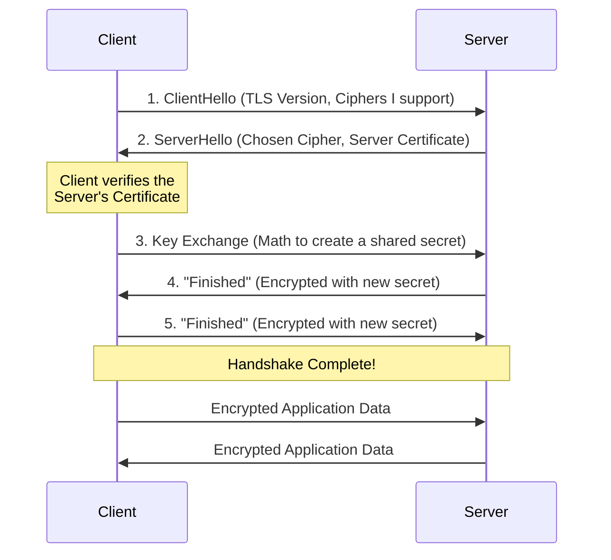
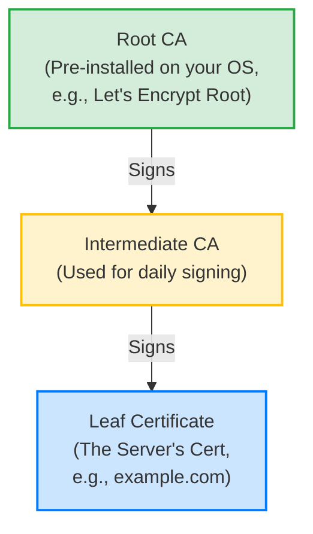

# Part 11: TLS/SSL — Encrypted Sockets

> **Why does this matter?** 
> By default, everything you send over a TCP socket is sent in **plaintext**. Anyone on the network (your ISP, a router along the way, or a hacker on the same coffee shop Wi-Fi) can see, read, and even secretly modify your data. TLS (Transport Layer Security) wraps your raw TCP socket in a layer of impenetrable math, guaranteeing **privacy** (encryption), **identity** (authentication), and **integrity** (tamper-proofing). If you are sending passwords, personal data, or anything important over the internet, you *must* use TLS.

---

## 1. The Real-World Analogy: The Crowded Room

Imagine you and a friend, Alice, are at opposite ends of a crowded, noisy room full of eavesdroppers. 

- **Plain TCP:** You shout across the room: *"Hey Alice, my password is password123!"* Everyone in the room hears it.
- **TLS (Encryption):** You and Alice agree on a secret language that nobody else knows. You shout *"Xyq rtbzq mnx!"* Everyone hears it, but only Alice understands it.
- **TLS (Authentication):** How do you know the person shouting back is *actually* Alice and not an imposter pretending to be her? Before you start sharing secrets, she holds up an **ID card** (a Certificate). The ID card is signed by the Government (a Certificate Authority), whom you both trust. You check the signature, verify her face matches the ID, and *then* you agree on your secret language.

---

## 2. Core Concepts: What Happens Under the Hood?

TLS sits exactly between your application and the TCP socket. You write plaintext into the TLS wrapper, it encrypts it, and then sends it over the TCP socket. 

### The TLS Handshake
Before you can send any encrypted data, the client and server must perform a "Handshake" to agree on how to encrypt the data.



### The Chain of Trust
How does the client know the server's Certificate is real? Certificates are verified using a **Chain of Trust**. Your operating system comes pre-installed with "Root" certificates from trusted organizations (like Let's Encrypt or DigiCert).



---

## 3. The Gateway: `SSLContext`

In Python, you don't just "turn on TLS". You configure an **`SSLContext`** object first. 
> 🔑 **Interview Tip:** Think of `SSLContext` as a factory for secure connections. It holds your certificates, your security policies (like which TLS versions are allowed), and your verification rules. You configure the context *once*, and then use it to wrap as many sockets as you want.

**Never call `ssl.wrap_socket()` directly.** It is deprecated and insecure. Always create an `SSLContext` first, then call `context.wrap_socket()`.

There are two ways to create a context:
1. `ssl.create_default_context()`: Use this for **Clients**. It comes pre-loaded with your OS's trusted Root CAs and uses the strictest, most secure settings by default.
2. `ssl.SSLContext()`: Use this for **Servers** (or advanced custom setups), where you need to load your own certificates.

---

## 4. Writing a TLS Server

### Step 1: Generate a Certificate
To run a TLS server, you need a Certificate (your ID card) and a Private Key (used to prove you own the ID). For production, you get these from a real Certificate Authority (CA) like Let's Encrypt. For local development, we generate a **Self-Signed Certificate** using the terminal:

```bash
openssl req -x509 -newkey rsa:2048 -keyout key.pem -out cert.pem -days 365 -nodes -subj "/CN=localhost"
```
**What this command does:**
- `-x509`: Create a self-signed certificate.
- `-newkey rsa:2048`: Generate a new 2048-bit RSA private key.
- `-keyout key.pem`: Save the private key here (KEEP THIS SECRET!).
- `-out cert.pem`: Save the public certificate here (You share this).
- `-nodes`: "No DES" - don't password-protect the private key (easier for dev).
- `-subj "/CN=localhost"`: Sets the "Common Name" (the hostname) to `localhost`.

### Step 2: The Server Code

```python
import socket
import ssl

# 1. Create a context specifically for a SERVER
# ssl.PROTOCOL_TLS_SERVER sets secure defaults for receiving connections
context = ssl.SSLContext(ssl.PROTOCOL_TLS_SERVER)

# 2. Load our "ID card" and "Secret proof of ID"
context.load_cert_chain(certfile="cert.pem", keyfile="key.pem")

# 3. Create a normal TCP socket
with socket.create_server(("0.0.0.0", 8443)) as listener:
    print("Listening on port 8443...")
    
    # 4. Wrap the LISTENING socket. 
    # Any connection accepted from this listener will automatically be an SSLSocket!
    with context.wrap_socket(listener, server_side=True) as tls_listener:
        while True:
            # 5. Accept connection. The TLS Handshake happens lazily RIGHT HERE.
            conn, addr = tls_listener.accept()
            with conn:
                print(f"Secure connection from {addr}")
                print(f"Agreed Cipher: {conn.cipher()}")
                
                # Send and receive exactly like a normal socket
                conn.sendall(b"Hello, you are connected securely!\n")
```

---

## 5. Writing a TLS Client

Clients are easier because `create_default_context()` handles the hard work of finding your system's Root CAs.

```python
import socket
import ssl

# 1. Create a secure-by-default client context
# This automatically demands the server prove who they are.
context = ssl.create_default_context()

# IMPORTANT FOR DEV: Since our server uses a self-signed certificate (which is not
# signed by a trusted Root CA), the default context will reject it. 
# To tell the client to trust our specific dev cert, we load it:
context.load_verify_locations(cafile="cert.pem")

# 2. Connect the normal TCP socket
with socket.create_connection(("localhost", 8443), timeout=10) as raw_sock:
    
    # 3. Wrap the socket to secure it.
    # server_hostname (SNI) is MANDATORY when check_hostname=True (the default).
    with context.wrap_socket(raw_sock, server_hostname="localhost") as ssock:
        
        # 4. We are now secure.
        print("Connected and verified!")
        
        data = ssock.recv(1024)
        print("Received:", data.decode())
```

### What is `server_hostname` (SNI)?
**Server Name Indication (SNI)** is a crucial part of modern TLS. A single IP address might host 100 different websites (e.g., `apple.com` and `banana.com`). When the client connects, it must tell the server *which* website it wants *during the handshake*, so the server knows which Certificate to present. Additionally, the client uses `server_hostname` to verify that the Certificate it receives actually belongs to the domain it asked for (`check_hostname`).

---

## 6. Mutual TLS (mTLS): When the Server Checks the Client

Normally, only the Server proves its identity to the Client (e.g., your browser checks Google's certificate, but Google doesn't ask for your personal certificate). 
In high-security systems (like corporate microservices or banking APIs), the Server ALSO demands that the Client present a valid Certificate. This is **Mutual TLS (mTLS)**.

```python
# --- On the Server Side ---
context = ssl.SSLContext(ssl.PROTOCOL_TLS_SERVER)
context.load_cert_chain(certfile="server_cert.pem", keyfile="server_key.pem")

# Demand the client present a certificate
context.verify_mode = ssl.CERT_REQUIRED 
# Tell the server which CA to trust when verifying client certificates
context.load_verify_locations(cafile="corporate_ca.pem") 

# --- On the Client Side ---
context = ssl.create_default_context(cafile="corporate_ca.pem")
# Client loads its own certificate to present to the server
context.load_cert_chain(certfile="client_cert.pem", keyfile="client_key.pem")
```

---

## 7. Advanced Configurations & Verification Knobs

You can tweak the `SSLContext` to change how verification works.

| Setting | What it does | When to use it |
|---------|--------------|----------------|
| `context.verify_mode = ssl.CERT_REQUIRED` | The peer *must* present a valid certificate. | Default for clients. Servers use this for mTLS. |
| `context.check_hostname = True` | Ensures the cert's name matches `server_hostname`. | Always (for clients). Prevents man-in-the-middle attacks. |
| `context.load_verify_locations(...)` | Adds custom Root CAs to trust. | Trusting self-signed dev certs or corporate proxies. |
| `context.minimum_version = ssl.TLSVersion.TLSv1_2` | Sets the oldest allowed TLS version. | TLS 1.2 or 1.3 is the modern standard. Reject older, broken versions (SSLv3, TLS 1.0). |
| `context.check_hostname = False`<br>`context.verify_mode = ssl.CERT_NONE` | ⚠️ **Disables ALL security verification.** | **NEVER IN PRODUCTION.** Only for quick-and-dirty testing where you don't care if you're being hacked. |

> ✅ **Best Practice (PROTOCOL_TLS_SERVER vs CLIENT):**
> Python 3.6+ introduced `ssl.PROTOCOL_TLS_SERVER` and `ssl.PROTOCOL_TLS_CLIENT`. These auto-configure the context with the best-practice security settings for their respective roles. Always use these instead of hardcoding specific versions like `PROTOCOL_TLSv1_2`.

---

## 8. SSLSocket vs Regular Socket: The Pitfalls

An `SSLSocket` acts like a regular socket, but with a few critical differences:

1. **`recv() == b""` Means Something Different**
   On a regular TCP socket, a zero-byte read means the connection was closed. On an `SSLSocket`, it means the peer sent a clean TLS `close_notify` message (a polite goodbye). If the underlying TCP connection is suddenly killed *without* a `close_notify` (e.g., someone pulled the ethernet cable), `SSLSocket.recv()` will raise an **`ssl.SSLEOFError`** or `ConnectionResetError`.
   
2. **The Non-Blocking Dance**
   If you use `setblocking(False)` with TLS, you enter a world of pain. A simple `recv()` call might require the underlying socket to *write* data (e.g., to renegotiate keys). 
   If this happens, Python raises **`ssl.SSLWantReadError`** or **`ssl.SSLWantWriteError`**. You must catch these, update your `selectors` loop to wait for the required event, and then retry the exact same operation later. 
   *(Advice: Use `asyncio` if you need non-blocking TLS. It handles this dance for you perfectly).*

---

## 9. Common Errors and How to Fix Them

| Error | What it means | How to fix it |
|-------|---------------|---------------|
| `ssl.SSLCertVerificationError` | The certificate is expired, self-signed, or not signed by a trusted CA. | Load the specific cert via `load_verify_locations` or fix the server's cert chain. |
| `SSLCertVerificationError: ... IP address mismatch` | The domain you asked for (`server_hostname`) doesn't match the names on the cert. | Ensure you connect via the domain name on the cert, not its IP address. |
| `ssl.SSLEOFError` | The TCP connection dropped unexpectedly without a clean TLS shutdown. | Often happens when a non-TLS client (like regular `nc` or a port scanner) connects to your TLS port. Catch and ignore. |
| `ssl.SSLError: [SSL: WRONG_VERSION_NUMBER]` | A TLS version mismatch, or you tried to speak plaintext to a TLS port. | Ensure both sides are speaking TLS and using compatible versions. |

---

## 10. Self-Check Questions

1. Why is it broken to call `ssl.wrap_socket(sock)` directly without an `SSLContext`?
2. What does `server_hostname` do in a TLS client, and why is it mandatory?
3. In a real-world application, how does your computer know it can trust `google.com`'s certificate?
4. What is Mutual TLS (mTLS), and how does it differ from standard web browsing?
5. You get an `SSLEOFError` on your server. What most likely happened?
