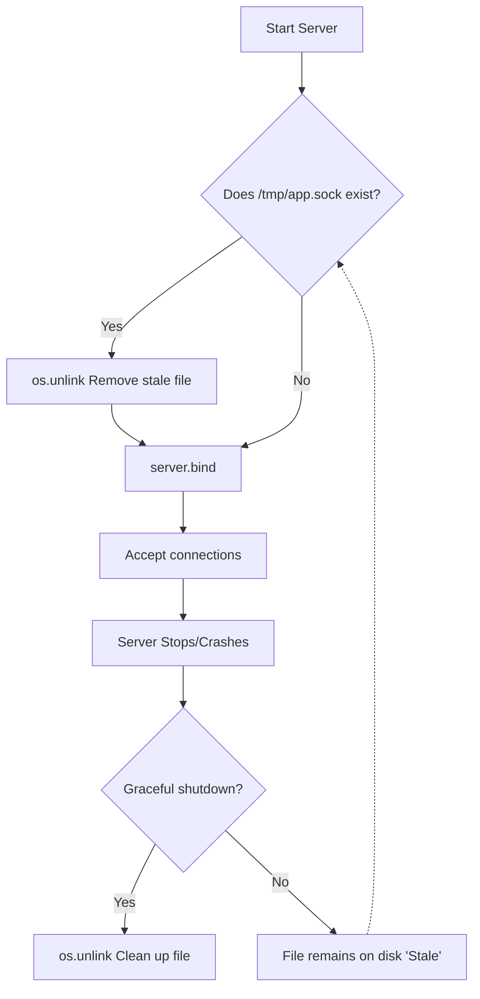

# Part 12: Unix Domain Sockets & Exotic Families

## 1. What Are Unix Domain Sockets?

**Why does this matter?** 
Normally, sockets are used to talk to *other computers* over a network. But what if two programs running on the **same machine** need to talk to each other? You *could* use a standard TCP socket bound to `127.0.0.1` (localhost), but routing data through the operating system's entire networking stack just to talk to your neighbor is incredibly inefficient. Enter **Unix Domain Sockets** (`AF_UNIX`).

> **Real-World Analogy:** 
> - **TCP/IP Sockets (Localhost):** This is like mailing a letter to your roommate who lives in the same house. The letter goes out to the mailman, to the local post office sorting facility, gets routed back to your local mailman, and finally dropped off in your own mailbox. It works, but it's a massive waste of time and effort.
> - **Unix Domain Sockets:** This is like slipping a note directly under your roommate's door. It skips the postal system entirely. It’s direct, instantaneous, and strictly local.

Instead of binding to an IP address and Port (like `192.168.1.5:8080`), Unix domain sockets bind to a **file path on the local filesystem** (like `/tmp/myapp.sock`).

---

## 2. Why Use `AF_UNIX` Over TCP for Same-Machine IPC?

When building Inter-Process Communication (IPC) on a single machine, `AF_UNIX` is the gold standard.

### 💡 Key Benefits
1. **Zero Network Overhead:** Data never touches the TCP/IP stack. There is no routing, no packet encapsulation (IP headers, TCP headers), no checksum calculations, and no retransmission logic. Data is just copied directly from one process's memory to another's via the kernel.
2. **Double the Throughput:** Because it bypasses the network stack, `AF_UNIX` can achieve roughly 2x the throughput and half the latency of a TCP socket over `127.0.0.1`.
3. **Built-in Access Control:** Because the socket is represented as a file on the disk (e.g., `/var/run/docker.sock`), you can use standard Linux file permissions (`chmod`, `chown`) to control exactly which users and groups can connect to your server.
4. **Advanced Magic:** `AF_UNIX` allows passing *file descriptors* between completely separate processes.

---

## 3. Server and Client: The Code

Let's build a simple Echo Server using `AF_UNIX`.

### The Server Code

```python
import socket
import os

# Define the file path for the socket
SOCKET_PATH = "/tmp/echo.sock"

# ⚠️ PITFALL: If the server crashed previously, the file might still exist.
# A socket cannot bind to an existing file, so we MUST remove it first.
if os.path.exists(SOCKET_PATH):
    os.unlink(SOCKET_PATH)

print(f"Starting server on {SOCKET_PATH}...")

# Create the socket. 
# AF_UNIX = Unix Domain Socket family
# SOCK_STREAM = Reliable, ordered, stream-oriented (like TCP)
with socket.socket(socket.AF_UNIX, socket.SOCK_STREAM) as server:
    server.bind(SOCKET_PATH)  # Creates the physical file on disk
    server.listen()
    
    print("Waiting for a connection...")
    conn, addr = server.accept()
    
    with conn:
        print("Client connected!")
        while True:
            data = conn.recv(1024)
            if not data:
                break  # Client disconnected
            print(f"Received: {data.decode()}")
            conn.sendall(data) # Echo back

# ✅ BEST PRACTICE: Always clean up the socket file when shutting down gracefully.
if os.path.exists(SOCKET_PATH):
    os.unlink(SOCKET_PATH)
```

### The Client Code

```python
import socket

SOCKET_PATH = "/tmp/echo.sock"

with socket.socket(socket.AF_UNIX, socket.SOCK_STREAM) as client:
    # Connect directly to the file path
    client.connect(SOCKET_PATH)
    
    message = "Hello from the local client!"
    client.sendall(message.encode())
    
    # Receive the echo
    response = client.recv(1024)
    print(f"Server replied: {response.decode()}")
```

---

## 4. The Stale Socket File Problem

Beginners almost always encounter the **"Address already in use"** error when running their `AF_UNIX` server a second time.

Why? When `bind()` is called, the kernel creates a special file on the filesystem. When your program exits (or crashes), **that file is not automatically deleted**. The next time you run the server, `bind()` sees the file exists and refuses to overwrite it, throwing an `OSError`.



### How to Fix It
As shown in the code above, **always `os.unlink()` the file before binding**, and ideally, wrap your code in a `try/finally` block to `os.unlink()` it upon graceful exit.

---

## 5. Linux Abstract Sockets: No Filesystem, No Cleanup

If you are on **Linux**, there is a brilliant hack to avoid the stale file problem entirely: **Abstract Sockets**.

If the first character of the socket path is a null byte (`\0`), Linux creates the socket in a hidden, abstract namespace in memory, rather than on the hard drive. 

```python
# Linux ONLY!
# Notice the \0 at the start.
SOCKET_PATH = "\0my_hidden_app_socket" 

with socket.socket(socket.AF_UNIX, socket.SOCK_STREAM) as s:
    s.bind(SOCKET_PATH)
    # No os.unlink() needed! When the program closes, it disappears instantly.
```

✅ **Pros**: Zero cleanup required, immune to filesystem permission issues, impossible to accidentally delete.
⚠️ **Cons**: Not portable (fails on macOS/Windows), and you lose the ability to use filesystem permissions for security.

---

## 6. `socketpair()`: The Pre-Connected Pair

What if you are spawning a child process and want to talk to it instantly, without messing with `bind()` or paths? 

`socket.socketpair()` creates a pair of already-connected `AF_UNIX` sockets. It's an instant two-way pipe.

```python
import socket
import os

# Create two connected sockets
parent_sock, child_sock = socket.socketpair()

pid = os.fork()

if pid == 0:
    # Child Process
    parent_sock.close() # Close the end we don't need
    child_sock.sendall(b"Hello from child process!")
    child_sock.close()
else:
    # Parent Process
    child_sock.close() # Close the end we don't need
    data = parent_sock.recv(1024)
    print(f"Parent received: {data.decode()}")
    parent_sock.close()
```
💡 **Interview Tip:** `socketpair()` is often used in event loops (like `select` or `epoll`) to wake up a blocking thread from another thread.

---

## 7. Advanced Magic: File Descriptor Passing (`SCM_RIGHTS`)

This is the ultimate superpower of `AF_UNIX`. You can pass an open File Descriptor (like an open file, or even an open TCP socket connection) from one process to an entirely separate process!

Imagine an Nginx server running as `root` that binds to port 80, accepts a TCP connection, and then securely **passes that live connection** to a worker process running as a low-privileged user. 

This uses `sendmsg` and `recvmsg` with ancillary data (Control Messages).

```python
import socket
import array

def send_fd(unix_sock, fd_to_send):
    """Pass an open file descriptor over a Unix socket."""
    # SCM_RIGHTS is the magic constant that tells the kernel "I am sending file descriptors"
    unix_sock.sendmsg(
        [b'Here is the FD!'], 
        [(socket.SOL_SOCKET, socket.SCM_RIGHTS, array.array("i", [fd_to_send]))]
    )

def recv_fd(unix_sock):
    """Receive an open file descriptor from a Unix socket."""
    msg, ancdata, flags, addr = unix_sock.recvmsg(
        1, socket.CMSG_LEN(4) # 4 bytes for one 32-bit integer (the fd)
    )
    for cmsg_level, cmsg_type, cmsg_data in ancdata:
        if cmsg_level == socket.SOL_SOCKET and cmsg_type == socket.SCM_RIGHTS:
            # Decode the raw bytes back into an integer file descriptor
            fd = array.array("i")
            fd.frombytes(cmsg_data[:4])
            return fd[0]
```

---

## 8. Authenticating the Peer: `SO_PEERCRED`

Because `AF_UNIX` sockets are strictly local, the Linux kernel knows exactly which process is on the other end of the connection. You can ask the kernel for the credentials (UID, GID, PID) of the client!

```python
import socket
import struct

# After accepting a connection on an AF_UNIX socket...
# conn, addr = server.accept()

# Request peer credentials from the kernel
creds = conn.getsockopt(socket.SOL_SOCKET, socket.SO_PEERCRED, struct.calcsize('3i'))

# Unpack the Process ID, User ID, and Group ID
pid, uid, gid = struct.unpack('3i', creds)

print(f"Client is running as User ID: {uid}, Process ID: {pid}")
if uid != 0:
    print("Rejecting: You must be root to use this service!")
    conn.close()
```

---

## 9. `AF_UNIX` Socket Types

Just like IP sockets have TCP and UDP, Unix sockets have variations:

| Type | Analogy | Description |
|---|---|---|
| `SOCK_STREAM` | Like TCP | Reliable, ordered, continuous stream of bytes. No message boundaries. (Most common). |
| `SOCK_DGRAM` | Like UDP | Datagrams. Preserves message boundaries. Unlike UDP, `AF_UNIX` datagrams are **reliable** and won't drop packets because they never leave the kernel. |
| `SOCK_SEQPACKET`| The Best of Both | Reliable and ordered (like STREAM), but preserves message boundaries (like DGRAM). Extremely useful, but less widely supported across all OSs. |

---

## 10. Real-World Examples

Where are Unix Domain Sockets actually used? Everywhere.
1. **Docker:** The Docker daemon (`dockerd`) listens on `/var/run/docker.sock`. When you type `docker ps`, the Docker CLI is essentially acting as an HTTP client sending API requests over this `AF_UNIX` socket.
2. **Databases:** PostgreSQL and MySQL create local `.sock` files. Connecting to a local DB via the socket file is noticeably faster than connecting to `localhost:5432`.
3. **systemd:** systemd uses socket activation. It listens on an `AF_UNIX` socket on behalf of a service. If data comes in, systemd boots the service and passes the file descriptor to it via `SCM_RIGHTS`.

---

## 11. Unix Domain Sockets vs. Named Pipes (FIFOs)

Both are files on disk used for IPC. What's the difference?

| Feature | Named Pipe (`mkfifo`) | Unix Domain Socket (`AF_UNIX`) |
|---|---|---|
| **Directionality** | Unidirectional (One writes, one reads). | Bidirectional (Full-duplex chat). |
| **Connection Model**| No concept of "accepting". Writers just block until a reader opens it. | True Client/Server model (`bind`, `listen`, `accept`). |
| **Multiple Clients**| Terrible. Data from multiple writers gets mixed up. | Excellent. Every `accept()` gives a dedicated, isolated socket. |
| **Advanced Features**| None. Just a byte tube. | File Descriptor passing, `SO_PEERCRED` auth. |

---

## 12. Exotic Address Families (Brief Overview)

While `AF_INET` (IPv4) and `AF_UNIX` cover 99% of a developer's life, there are bizarre, specialized sockets hiding in the OS:

*   **`AF_PACKET` (Linux):** Operates at Layer 2 (Data Link). Allows you to read and write raw Ethernet frames. This is what tools like Wireshark or `tcpdump` use to sniff networks. Requires `root`.
*   **`AF_NETLINK` (Linux):** A specialized socket used to talk directly to the Linux Kernel. Used to modify routing tables, read firewall rules, or listen for hardware plug-in events (uevents).
*   **`AF_BLUETOOTH`:** Used for writing Bluetooth applications (RFCOMM, L2CAP protocols).
*   **`AF_CAN`:** Controller Area Network. Used to communicate with the internal hardware bus of cars and industrial machinery.
*   **`AF_VSOCK`:** Used for high-speed, zero-configuration communication between a Virtual Machine (guest) and the Hypervisor (host).
*   **`AF_ALG`:** The Linux kernel's cryptography API. Allows user-space programs to use kernel-level hardware-accelerated encryption without writing C drivers.

---

## 13. Self-Check Questions

1. Why is `AF_UNIX` faster than using a TCP socket bound to `127.0.0.1`?
2. What causes the "Address already in use" error when restarting an `AF_UNIX` server, and what are two ways to fix/avoid it on Linux?
3. What is the difference between `SOCK_STREAM` and `SOCK_DGRAM` when used over `AF_UNIX`? Does `SOCK_DGRAM` drop packets here?
4. How does `socketpair()` differ from a standard socket setup? 
5. What is `SCM_RIGHTS` used for, and why is it considered a powerful feature of Unix domain sockets?
