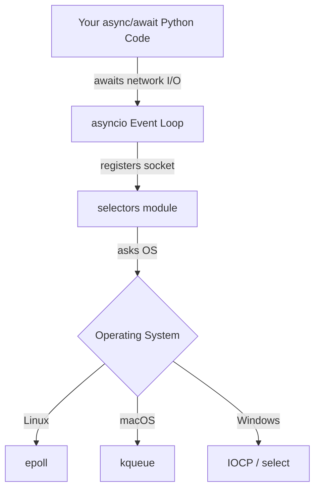
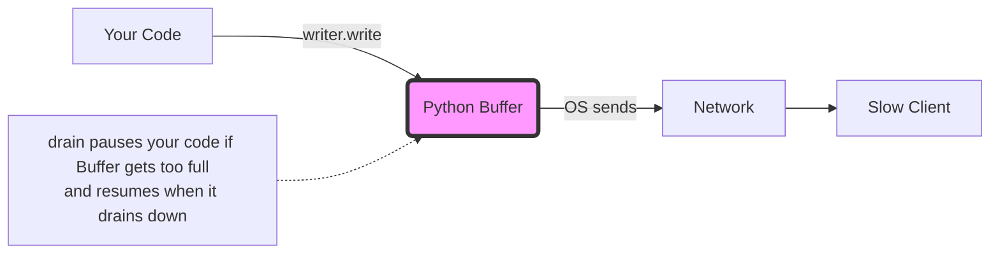

# Part 14: asyncio Networking — The Modern Path

## Introduction: Why Does This Matter?
In previous sections, we learned about **threads** (hiring a separate worker for every single connection) and **selectors** (one super-worker checking thousands of connections at once). 
While `selectors` gives us incredible performance, writing non-blocking code by hand is *hard*. You have to manually track states, handle partial reads/writes, and manage callbacks. 

Enter `asyncio`. It gives us the **performance of `selectors`** but lets us write code that **looks like simple, blocking code**. It is the modern standard for writing high-concurrency network applications in Python (used by frameworks like FastAPI and AIOHTTP).

---

## The Core Concept: The Juggling Chef Analogy

Imagine a busy restaurant:
- **Thread-per-connection** is like hiring a **separate cook for every single customer**. If you have 10,000 customers, you need 10,000 cooks. Most of the time, they are just standing around waiting for food to bake (I/O bound). This uses massive amounts of memory and wages.
- **asyncio** is like having **one Master Chef**. The chef puts a pizza in the oven (starts an I/O task) and, *instead of staring at the oven until it's done*, sets a timer and immediately pivots to chop onions for the next order. When the oven dings, the chef goes back to the pizza. 

One chef, juggling thousands of tasks, never waiting idly. That's `asyncio`.

---

## Under the Hood: asyncio and Selectors

How does `asyncio` actually know when the "oven dings"? It uses the exact same OS mechanisms we learned in the `selectors` module! `asyncio` is just a beautiful wrapper around `epoll`, `kqueue`, or `select`.



💡 **Key Insight**: When you write `await`, you are yielding control *back to the event loop*, which then uses `selectors` to wait for the socket to become ready, and wakes your code back up when data arrives.

---

## async/await Basics for Beginners

If you've never used `asyncio` before, you need to understand three rules:
1. **Coroutines**: A function defined with `async def` is a coroutine. Calling it doesn't run it; it creates a coroutine object.
2. **The Event Loop**: The engine that drives coroutines. It schedules them and manages the OS network polling.
3. **`await`**: The magic keyword. It means *"Pause this function here until the result is ready. Hey Event Loop, go run some other code while I wait!"*

---

## High-Level Streams API (TCP)

Python provides `StreamReader` and `StreamWriter`. These hide all the dirty details of `recv()`, `send()`, and `BlockingIOError`.

### Echo Server & Client Example

Here is a complete, runnable, non-blocking echo server and client.

#### The Server (`async_server.py`)

```python
import asyncio

async def handle_client(reader: asyncio.StreamReader, writer: asyncio.StreamWriter):
    """This function is run concurrently for EVERY connected client."""
    
    # Get client IP and port for logging
    addr = writer.get_extra_info('peername')
    print(f"[+] New connection from {addr}")

    try:
        # Loop to continuously read data from this client
        while True:
            # await means: "Pause here until we get up to 4096 bytes. Go serve others!"
            data = await reader.read(4096) 
            
            # If data is empty (b""), the client closed the connection
            if not data:
                print(f"[-] Connection closed by {addr}")
                break
                
            print(f"Received {data!r} from {addr}")
            
            # Write data back (this doesn't need 'await' as it just buffers it)
            writer.write(data.upper())
            
            # MANDATORY: wait until it's safe to write more (Flow Control)
            await writer.drain()

    except ConnectionError:
        print(f"[!] Connection lost to {addr}")
    finally:
        # Clean up the connection
        writer.close()
        await writer.wait_closed()

async def main():
    # start_server creates the listening socket and binds it to the address
    server = await asyncio.start_server(handle_client, '127.0.0.1', 65432)
    
    addrs = ', '.join(str(sock.getsockname()) for sock in server.sockets)
    print(f"[*] Serving on {addrs}")

    # Keep the server running forever
    async with server:
        await server.serve_forever()

# Start the event loop!
if __name__ == "__main__":
    asyncio.run(main())
```

#### The Client (`async_client.py`)

```python
import asyncio

async def tcp_echo_client(message: str):
    print(f"[*] Connecting to server...")
    
    # open_connection resolves DNS and connects
    reader, writer = await asyncio.open_connection('127.0.0.1', 65432)
    
    print(f"[*] Sending: {message!r}")
    writer.write(message.encode())
    await writer.drain() # Ensure it gets sent over the network
    
    # Wait for the server's reply
    data = await reader.read(100)
    print(f"[*] Received: {data.decode()!r}")
    
    print("[*] Closing the connection")
    writer.close()
    await writer.wait_closed()

if __name__ == "__main__":
    asyncio.run(tcp_echo_client('Hello asyncio world!'))
```

---

## Built-in Framing: reader.read(), readexactly(), readuntil()

In Part 8, we learned that TCP is a continuous stream of bytes, not messages. We had to write complex loops to frame our data. 
`asyncio.StreamReader` does this for us!

- **`await reader.read(n)`**: Reads *up to* `n` bytes. (Like a raw `recv()`).
- **`await reader.readexactly(n)`**: Pauses until *exactly* `n` bytes are read. Perfect for reading 4-byte fixed headers!
- **`await reader.readuntil(separator)`**: Reads until a specific byte sequence (like `b"\n"`). Great for text protocols.

✅ **Best Practice**: `readuntil()` prevents buffer overflow attacks by limiting how much it reads before finding the separator (default limit is 64KB, adjustable via the `limit` param).

---

## Flow Control: writer.drain() and Backpressure

⚠️ **Warning**: Never skip `await writer.drain()`! 

Why? Because `writer.write()` is **synchronous**. It doesn't send data over the network immediately; it just shoves it into a local memory buffer in Python.

If you have a fast server reading a file and `write()`-ing it to a client on a slow 3G mobile connection, Python will buffer the entire file into RAM, crashing your server.

This is called **Backpressure**. `await writer.drain()` fixes this:



`await writer.drain()` checks the buffer. If it's too full, it pauses your coroutine until the OS manages to send some data to the client.

---

## UDP with asyncio: The Protocol Pattern

UDP doesn't have "streams" because it's connectionless. So, `asyncio` uses a lower-level pattern called **Transports and Protocols** for UDP.

```python
import asyncio

class EchoUDPProtocol(asyncio.DatagramProtocol):
    def connection_made(self, transport):
        self.transport = transport
        print("UDP server is up and listening!")

    def datagram_received(self, data, addr):
        print(f"Received {data.decode()} from {addr}")
        # Echo it back! Note: No await needed here, UDP doesn't have backpressure
        self.transport.sendto(data.upper(), addr)

async def main():
    loop = asyncio.get_running_loop()
    
    # Create the UDP endpoint and attach our protocol to it
    transport, protocol = await loop.create_datagram_endpoint(
        lambda: EchoUDPProtocol(),
        local_addr=('127.0.0.1', 9999)
    )
    
    try:
        await asyncio.sleep(3600)  # Keep server alive for 1 hour
    finally:
        transport.close()

asyncio.run(main())
```

---

## Low-Level Sockets & Passing Existing Sockets

Sometimes you need fine-grained control, or you already have a raw `socket` object (maybe passed in from a parent process). You can use raw sockets with `asyncio` directly using the `loop.sock_*` methods:

```python
import socket
import asyncio

async def manual_async_socket():
    loop = asyncio.get_running_loop()
    
    # 1. Create a normal, blocking socket
    sock = socket.socket(socket.AF_INET, socket.SOCK_STREAM)
    sock.setblocking(False) # MANDATORY for asyncio!
    
    # 2. Use the loop to do async operations on it
    await loop.sock_connect(sock, ('example.com', 80))
    
    await loop.sock_sendall(sock, b"GET / HTTP/1.1\r\nHost: example.com\r\n\r\n")
    
    response = await loop.sock_recv(sock, 4096)
    print(response[:100])
    
    sock.close()
```

---

## TLS/SSL with asyncio

Adding encryption (HTTPS/WSS/TLS) in raw sockets requires a complex state machine to handle the non-blocking handshake (`SSLWantReadError`, etc.).
In `asyncio`, it is a **single argument**.

```python
import ssl
import asyncio

# For a server:
ssl_context = ssl.SSLContext(ssl.PROTOCOL_TLS_SERVER)
ssl_context.load_cert_chain(certfile="cert.pem", keyfile="key.pem")

# Just pass ssl=ssl_context! The handshake is handled automatically.
server = await asyncio.start_server(
    handle_client, '0.0.0.0', 8443, ssl=ssl_context
)
```

---

## Timeouts: `asyncio.wait_for()`

In blocking sockets, we used `socket.settimeout()`. In the async world, we wrap our awaits in `asyncio.wait_for()`:

```python
async def fetch_data(reader):
    try:
        # If the peer doesn't send data within 5 seconds, raise TimeoutError
        data = await asyncio.wait_for(reader.read(1024), timeout=5.0)
        return data
    except TimeoutError:
        print("The client took too long to send data!")
        return None
```

---

## Platform Specifics: ProactorEventLoop and uvloop

### Why ProactorEventLoop on Windows?
On Linux, `epoll` handles tens of thousands of sockets perfectly. 
On Windows, the `select` system call is limited to ~512 sockets. To handle thousands of connections on Windows, the OS provides an API called **IOCP** (I/O Completion Ports).

`asyncio` automatically uses `ProactorEventLoop` on Windows, which uses IOCP under the hood. This is a massive advantage over the `selectors` module (which falls back to slow `select` on Windows).

### uvloop (The Speed King)
If you are deploying an `asyncio` server on Linux/macOS and want maximum performance, install `uvloop`. It replaces the built-in Python event loop with a C-based loop built on `libuv` (the same engine that powers Node.js). It makes Python networking 2-4x faster.

```python
import asyncio
import uvloop

# Just add this one line, and your whole app becomes drastically faster
uvloop.install()
asyncio.run(main())
```

---

## Comparison: asyncio vs selectors vs threads

| Feature | `threading` | `selectors` | `asyncio` |
|---------|-------------|-------------|-----------|
| **Mental Model** | Easy (blocking) | Hard (state machines) | Medium (await) |
| **Max Connections** | ~1,000 (RAM/GIL limits) | 10k - 1M+ | 10k - 1M+ |
| **Windows Scaling** | Poor | Poor (~512 max) | **Excellent** (IOCP) |
| **Framing helpers** | `makefile()` | Do it yourself | `readexactly()` |
| **Best For** | Heavy CPU tasks, simple scripts | Low-level C-like control | Web servers, WebSockets, Proxies |

🔑 **Interview Tip**: If an interviewer asks how to scale a Python server to 100,000 idle websocket connections (like a chat app), the answer is `asyncio`. Threads will crash due to memory overhead (8MB stack per thread).

---

## Capstone Example: Complete Async Chat Server

Let's combine everything into a production-ready async chat server.

```python
import asyncio

# Global dictionary to map writers to nicknames
clients = {}

async def handle_chat(reader: asyncio.StreamReader, writer: asyncio.StreamWriter):
    # Get IP info
    addr = writer.get_extra_info('peername')
    
    # 1. Ask for a nickname
    writer.write(b"Enter your nickname: ")
    await writer.drain()
    
    try:
        # Read until newline
        nick_bytes = await reader.readuntil(b'\n')
        nickname = nick_bytes.decode().strip()
    except asyncio.IncompleteReadError:
        writer.close()
        return

    # 2. Register the client
    clients[writer] = nickname
    print(f"[*] {nickname} joined from {addr}")
    
    # Announce to everyone else
    await broadcast(f"*** {nickname} has joined the chat ***\n", exclude=writer)

    # 3. Main chat loop
    try:
        while True:
            # Wait for them to type a message
            msg_bytes = await reader.readuntil(b'\n')
            message = msg_bytes.decode()
            
            # Broadcast their message
            await broadcast(f"[{nickname}] {message}", exclude=writer)
            
    except asyncio.IncompleteReadError:
        pass # Client disconnected gracefully
    except ConnectionError:
        pass # Client crashed or lost internet
    finally:
        # 4. Cleanup on exit
        print(f"[*] {nickname} left.")
        del clients[writer]
        await broadcast(f"*** {nickname} has left the chat ***\n")
        writer.close()
        await writer.wait_closed()

async def broadcast(message: str, exclude=None):
    """Sends a message to all connected clients except the sender."""
    msg_bytes = message.encode()
    for writer in clients.keys():
        if writer is not exclude:
            try:
                writer.write(msg_bytes)
                await writer.drain() # Backpressure check!
            except ConnectionError:
                # If a client died but we haven't detected it yet, ignore it.
                # Their own handle_chat task will clean them up.
                pass

async def main():
    server = await asyncio.start_server(handle_chat, '0.0.0.0', 7000)
    print("Async Chat Server running on port 7000...")
    async with server:
        await server.serve_forever()

if __name__ == "__main__":
    asyncio.run(main())
```

---

## Quick Reference / Cheat Sheet

| Task | Code snippet |
|---|---|
| **Start TCP Server** | `server = await asyncio.start_server(handler, host, port)` |
| **Start TCP Client** | `r, w = await asyncio.open_connection(host, port)` |
| **Send Data** | `w.write(b"data"); await w.drain()` |
| **Receive N Bytes** | `data = await r.readexactly(4)` |
| **Read Line** | `line = await r.readuntil(b'\n')` |
| **Close Connection** | `w.close(); await w.wait_closed()` |
| **Add Timeout** | `await asyncio.wait_for(r.read(10), timeout=2.0)` |
| **Run Event Loop** | `asyncio.run(main())` |

---

## Self-Check Questions

1. Why do we need to call `await writer.drain()` after `writer.write()`? What happens if we don't?
2. What is the fundamental difference between `reader.read(100)` and `reader.readexactly(100)`?
3. Why does `asyncio` scale better than threads for thousands of idle connections?
4. True or False: `asyncio` bypasses the OS's networking stack entirely to achieve high performance. (Explain your answer).
5. If you have an existing raw blocking `socket` object, how can you use it safely within an `asyncio` application without freezing the event loop?

*(Answers: 1. It applies backpressure to prevent memory explosion if the client is slow. 2. `read` returns *up to* 100 bytes, `readexactly` guarantees exactly 100 bytes or throws an error. 3. Threads consume MBs of stack memory each; `asyncio` tasks are tiny state machines. 4. False, it relies on the OS `epoll`/`kqueue`/`IOCP` APIs. 5. Set it to non-blocking (`sock.setblocking(False)`) and use `loop.sock_recv` / `loop.sock_sendall`.)*
