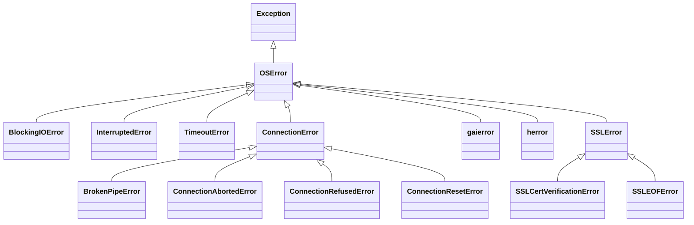

# Error Handling and Debugging in Sockets

Have you ever tried to call a friend, but got a busy signal? Or the line went dead in the middle of a sentence? Or maybe you accidentally dialed a number that doesn't exist?

Network programming is exactly like that. When your code reaches out across the internet (or even just across your own computer), **things will go wrong**. Wires get unplugged, servers crash, firewalls block traffic, and typos happen. 

If you don't write your socket code to expect these errors, your entire program will crash the moment it encounters a small hiccup. This guide will show you how to decode what these crashes mean, how to handle them gracefully, and how to use the ultimate detective tools to find out what's going wrong under the hood.

---

## 📞 Real-World Analogy: The Telephone System

When dealing with sockets, errors fall into a few predictable buckets, just like phone calls:
- **Connection Refused:** You call a business, but they are closed. (Nothing is listening on that port).
- **Connection Reset:** You're talking to someone, and they suddenly hang up on you aggressively. (The other computer crashed or forcefully closed the connection).
- **Timeout:** You dial a number, and it just rings forever. (The network is slow or dropping packets).
- **Broken Pipe:** You're talking, but you didn't realize the other person hung up 5 minutes ago! (You wrote data to a closed connection).

---

## 1. The Complete Exception Hierarchy

In Python, all socket errors eventually trace back to one big parent exception called `OSError`. 

Here is the family tree of errors you will encounter. 



💡 **Key Insight:** Because everything inherits from `OSError`, you can catch `OSError` to act as a "catch-all" bucket for ANY network failure! But for specific behaviors (like retrying a connection), you'll want to catch the specific subclass.

### Detailed Breakdown of Exceptions

#### The I/O and Timing Errors
- **`BlockingIOError`:** Raised when you have a non-blocking socket (which means "do this instantly or fail"), and the operation would have required waiting. It literally means "Try again later."
- **`TimeoutError`:** (Also known as `socket.timeout`). Raised when an operation takes longer than the time you set with `socket.settimeout()`. 
- **`InterruptedError`:** A system signal interrupted your socket operation. (In modern Python, the background system usually auto-retries these for you, so you rarely see it).

#### The `ConnectionError` Subtypes
These are the big ones. They happen when the TCP connection itself fails.
- **`ConnectionRefusedError`:** You tried to connect, but no server is listening on that port. 
- **`ConnectionResetError`:** The other side sent a harsh "RST" (Reset) packet. This means their app crashed, or they forcefully destroyed the connection without saying a polite goodbye.
- **`ConnectionAbortedError`:** Usually a local problem where your computer's networking stack aborted the connection (e.g., the software in the middle decided to kill it).
- **`BrokenPipeError`:** You tried to `send()` data, but the connection was already closed by the other side. TCP is lazy and sometimes doesn't tell you the connection is dead until you try to speak!

#### The Name Resolution Errors
- **`socket.gaierror`:** "Get Address Info Error". This means DNS failed. You typed `google.con` instead of `google.com`, or your internet is down.
- **`socket.herror`:** Legacy error for older address lookups. You'll rarely see it today.

#### The SSL / TLS Errors
- **`ssl.SSLCertVerificationError`:** The server you connected to has an invalid, expired, or self-signed certificate, or the hostname doesn't match.
- **`ssl.SSLEOFError`:** The connection was cut at the TCP level without completing the secure TLS "goodbye" handshake. Often happens if a non-encrypted client tries to talk to your encrypted server.

---

## 2. The `errno` Cheat Sheet

Underneath Python's nice Exception names, the operating system kernel is returning standard integer error codes called `errno`. Sometimes, logging systems only give you the number. 

Here is what they mean and how to fix them:

| `errno` Name | Number (Linux) | What it means | How to fix it |
|---|---|---|---|
| `ECONNREFUSED` | 111 | Connecting to a closed port. | Check if the server is running. Check IP/Port typos. |
| `ECONNRESET` | 104 | Peer sent a TCP RST (abort). | The peer crashed or rejected you. Drop the client/reconnect. |
| `EPIPE` | 32 | Sending after peer closed. | Handle the error, close the socket, don't write to dead peers. |
| `ETIMEDOUT` | 110 | Network took too long. | Retry the connection. Check if firewall is dropping packets. |
| `EADDRINUSE` | 98 | Port is already taken. | Kill the old server. Use `SO_REUSEADDR` to avoid TIME_WAIT blocks. |
| `EADDRNOTAVAIL`| 99 | Binding to an IP you don't own. | Bind to `0.0.0.0` or `127.0.0.1`. |
| `EACCES` | 13 | Permission denied. | Trying to bind ports < 1024 without `sudo`/root. Use port > 1024. |
| `EAGAIN` | 11 | Non-blocking operation would block.| Wait (using `selectors`) and try again later. |
| `EHOSTUNREACH` | 113 | Router can't find the target. | The destination IP is invalid or down at the network level. |
| `EMFILE` | 24 | Too many open files (sockets). | You are leaking sockets (not calling `.close()`), or you need to raise the OS limit with `ulimit -n`. |

---

## 3. "What does this crash mean?" Decoder

Here are 10 common real-world crashes and exactly what they mean:

1. **`ConnectionResetError` on the first `recv()` after `accept()`**
   *Cause:* A client connected, but immediately disconnected before you could even read their data. (Often caused by port scanners or health checks).
   *Fix:* Wrap your `recv()` in a try/except, log it, and move on. Don't let it crash your server.

2. **`BrokenPipeError` when calling `sendall()`**
   *Cause:* You are writing data to a client who disconnected 10 seconds ago. 
   *Fix:* Catch `BrokenPipeError` and cleanly close your end of the socket.

3. **`socket.timeout` when calling `accept()`**
   *Cause:* You set a timeout on the listening socket, and no new client connected in that time.
   *Fix:* This is actually a good pattern for allowing graceful shutdowns! Just catch the timeout, check if you should shut down, and loop back to `accept()` again.

4. **`OSError: [Errno 24] Too many open files`**
   *Cause:* Every socket is a "file" to the OS. You opened too many. Usually, you forgot to call `socket.close()` when clients disconnect, causing a leak.
   *Fix:* ALWAYS use `with conn:` or a `try/finally` block to ensure `close()` is called. If you genuinely have 10,000 active clients, run `ulimit -n 65535` in your terminal.

5. **`gaierror: [Errno -2] Name or service not known`**
   *Cause:* DNS failure. The domain name doesn't exist, or you have no Wi-Fi.
   *Fix:* Check spelling. Add retry logic for flaky internet connections.

6. **`SSLEOFError` on a TLS server**
   *Cause:* Someone tried to talk plain HTTP (or random junk) to your secure HTTPS port. The TLS parser panicked and gave up.
   *Fix:* Catch the error, close the connection, and ignore it.

7. **`PermissionError: [Errno 13] Permission denied` on `bind()`**
   *Cause:* You tried to run a server on port 80 or 443 as a normal user. Ports 1-1023 are restricted to administrators.
   *Fix:* Run with `sudo` (not recommended for beginners) or use port 8080 or 8443 instead.

8. **`OSError: [Errno 98] Address already in use`**
   *Cause:* You restarted your server too fast. The OS keeps old connections in a "TIME_WAIT" state for 60 seconds to catch stray delayed packets.
   *Fix:* Add `sock.setsockopt(socket.SOL_SOCKET, socket.SO_REUSEADDR, 1)` *before* you call `bind()`.

9. **`BlockingIOError` on `recv()`**
   *Cause:* You set the socket to non-blocking mode, and there is no data to read yet.
   *Fix:* This isn't a crash! It's normal. It means "come back later."

10. **`ValueError: uncaptured python exception` or `MemoryError`**
    *Cause:* You read a size header (e.g., 4 bytes) that said the next message is 10 Gigabytes, and you tried to allocate a buffer that big.
    *Fix:* ALWAYS cap your message sizes! Refuse to read if the header claims a size larger than (for example) 10 MB.

---

## 4. The Debugging Toolkit

When your code isn't working, don't just stare at it. Use the tools network engineers use. 

### 🔧 Basic CLI Tools

- **`nc` (Netcat): The Swiss Army Knife**
  Netcat lets you easily spin up a fake server or client from the terminal.
  - Start a dummy server: `nc -l 127.0.0.1 9000` (Wait for connections, print what they say, type to reply)
  - Connect to your Python server: `nc 127.0.0.1 8080` (Type data to send it to your server)

- **`telnet`**
  Like `nc`, great for interacting with text-based TCP servers.
  - `telnet example.com 80` (Then type `GET / HTTP/1.1`)

- **`ss` (Socket Statistics)**
  Shows you exactly what sockets are open on your machine.
  - `ss -tlnp` (Shows all **T**CP, **L**istening sockets, with **N**umeric ports and **P**rocess IDs)
  - *Tip: If you get "Address already in use", `ss -tlnp` will tell you which program is hogging your port!*

- **`lsof -i :65432`**
  List open files. Tells you exactly which app owns port 65432.

- **`openssl s_client`**
  Netcat for TLS/SSL. Tests if your secure server is working.
  - `openssl s_client -connect localhost:8443`

### 🕵️ Advanced Deep Dive Tools

#### Reading System Calls with `strace`
`strace` watches your Python script and prints every single conversation it has with the OS kernel. It is pure magic for socket debugging.

```bash
strace -f -e trace=network python your_server.py
```
*What it does:* You will see the exact `bind()`, `listen()`, `accept()`, `recv()`, and `sendto()` commands as they happen in real-time, along with their return values. If a connection fails, `strace` shows you the exact `errno`.

#### Viewing Raw Bytes with Wireshark and `tcpdump`
Sometimes you need to prove whether the bug is in your Python code, or if the bytes were simply never sent over the wire.

- **`tcpdump` (Terminal based):**
  See the actual bytes flying over your local loopback interface.
  `sudo tcpdump -i lo port 65432 -X` 
  *(Shows packet headers and the ASCII data inside them)*

- **Wireshark (GUI):**
  The industry standard packet sniffer.
  1. Open Wireshark, select the `Loopback (lo)` interface.
  2. Type `tcp.port == 65432` into the green filter bar.
  3. Right-click a packet and select **"Follow -> TCP Stream"**.
  4. *Boom!* You can see exactly what the client sent (in red) and what the server replied (in blue).

---

## 5. Testing Best Practices

Writing tests for network code is notoriously flaky. Here is how the pros do it:

✅ **The Port 0 Trick**
Never hardcode port `8080` in your unit tests. If two test suites run at once, they will crash with `EADDRINUSE`. 
Instead, bind to port `0`. The OS will assign a random, guaranteed-free ephemeral port.
```python
srv = socket.create_server(("127.0.0.1", 0))
actual_port = srv.getsockname()[1] # Fetch the port the OS chose
# Pass actual_port to your test client...
```

✅ **Use 127.0.0.1, Not Public IPs**
Keep tests offline. 

✅ **The Byte-Dripping Test**
`127.0.0.1` is incredibly fast. If your code has a "framing bug" (assuming one `recv()` equals one full message), tests on `127.0.0.1` might magically pass because all bytes arrive instantly in one chunk.
*To prove your code is robust, write a test client that sends the message 1 single byte at a time with a tiny `time.sleep(0.01)` in between.* If your server still reads the message correctly, your framing is perfect!

✅ **Use `socket.socketpair()` for Unit Tests**
Want to test your `send_message()` and `recv_message()` functions without actually booting up a server?
```python
import socket
# Creates two sockets already connected to each other in memory!
client_sock, server_sock = socket.socketpair() 
client_sock.sendall(b"Hello")
print(server_sock.recv(1024)) # Prints b"Hello"
```

---

## 6. Complete Error-Handling Template Code

Here is how you write robust network code. Notice how we use patterns like **graceful degradation** (ignoring bad clients without crashing the server) and **retry with exponential backoff** (for the client).

### The Robust Server (Graceful Degradation)

```python
import socket
import logging

logging.basicConfig(level=logging.INFO)

def run_server():
    # 1. create_server sets SO_REUSEADDR automatically!
    with socket.create_server(("127.0.0.1", 65432)) as srv:
        logging.info("Server listening...")
        
        while True:
            try:
                # Wait for a client
                conn, addr = srv.accept()
            except KeyboardInterrupt:
                logging.info("Shutting down gracefully...")
                break
            except OSError as e:
                logging.error(f"Failed to accept connection: {e}")
                continue # Graceful degradation: don't crash, try the next one

            # 2. Use a context manager to guarantee connection cleanup
            with conn:
                logging.info(f"Connected by {addr}")
                try:
                    # 3. Add timeouts so a silent client can't freeze our thread forever!
                    conn.settimeout(10.0) 
                    data = conn.recv(1024)
                    
                    if not data:
                        logging.info("Client cleanly disconnected.")
                        continue
                        
                    # Process and reply
                    conn.sendall(data.upper())
                    
                except TimeoutError:
                    logging.warning(f"Client {addr} took too long to speak. Dropping.")
                except ConnectionResetError:
                    logging.warning(f"Client {addr} crashed/reset the connection.")
                except Exception as e:
                    # Catch-all for unexpected app errors so the loop survives
                    logging.error(f"Unexpected error handling {addr}: {e}")

if __name__ == "__main__":
    run_server()
```

### The Robust Client (Retry with Backoff)

If the network is flaky, the client shouldn't just crash. It should retry, waiting a bit longer each time.

```python
import socket
import time
import logging

logging.basicConfig(level=logging.INFO)

def connect_with_retry(host, port, max_retries=5):
    attempt = 0
    delay = 1.0 # Start with a 1 second delay
    
    while attempt < max_retries:
        try:
            logging.info(f"Attempting connection to {host}:{port} (Attempt {attempt+1})")
            
            # create_connection handles IPv4 vs IPv6 automatically!
            sock = socket.create_connection((host, port), timeout=5.0)
            logging.info("Connection successful!")
            return sock
            
        except ConnectionRefusedError:
            logging.warning("Server is down (Connection Refused).")
        except TimeoutError:
            logging.warning("Network timed out.")
        except socket.gaierror:
            logging.error("DNS failed. Check your internet or typo.")
            break # No point retrying a bad domain name immediately
        except OSError as e:
            logging.error(f"Network error: {e}")
            
        # Exponential backoff
        logging.info(f"Retrying in {delay} seconds...")
        time.sleep(delay)
        delay *= 2 # Double the wait time: 1s, 2s, 4s, 8s...
        attempt += 1
        
    logging.error("Max retries reached. Giving up.")
    return None

if __name__ == "__main__":
    # Try connecting to a port we know is closed to see the backoff in action
    sock = connect_with_retry("127.0.0.1", 9999)
    if sock:
        sock.close()
```

---

## 7. Quick Reference

| Issue | Typical Exception | Action to Take |
|---|---|---|
| Server down | `ConnectionRefusedError` | Backoff and retry. |
| Peer crashed / hung up | `ConnectionResetError` | Cleanly close your socket. Drop client state. |
| Wrote to dead peer | `BrokenPipeError` | Cleanly close your socket. |
| Stuck waiting | `TimeoutError` | Drop the client to free up resources. |
| Non-blocking not ready | `BlockingIOError` | Wait for selector to wake you up. |
| Cannot start server | `OSError: [Errno 98]` | Check `ss -tlnp`, add `SO_REUSEADDR`. |

---

## ✅ Self-Check Questions

1. Why shouldn't you write a server that crashes the moment a `ConnectionResetError` occurs inside the `while True:` loop?
2. What is the difference between `ConnectionRefusedError` and `ConnectionResetError`?
3. You are writing unit tests for your network app. Why should you bind your test server to port `0` instead of port `5000`?
4. If your network code works perfectly on `127.0.0.1` but breaks on the public internet, what is the most likely cause, and how can the "byte-dripping test" prove it?
5. You try to start your server and get `Address already in use`. You didn't leave it running. What TCP state is causing this, and what socket option fixes it?

🔑 **Interview Tip:** Interviewers love asking about `SO_REUSEADDR`, the difference between `ConnectionRefused` vs `ConnectionReset`, and how to test for "framing bugs" (assuming all bytes arrive at once). Master the byte-dripping test and the port 0 trick!
