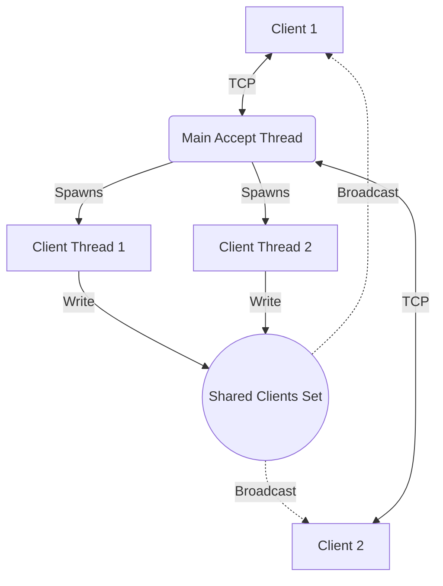
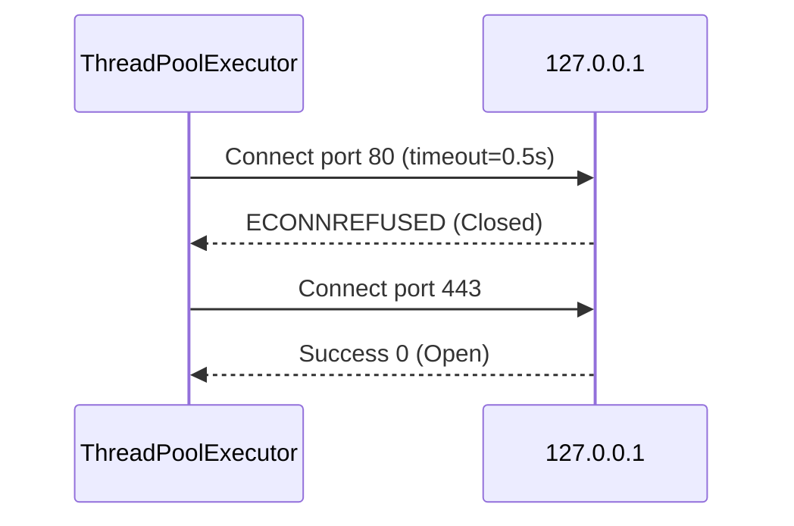

# 🏆 The Final Boss: Sockets Mastery, Pitfalls, Projects, and Interviews

Welcome to the culmination of your socket programming journey! If sockets were a video game, this is the final level. You've learned the theory, the API, and the architecture. Now it's time to test your mettle against the real world.

## ☕️ Why does this matter?
Knowing *how* to write a socket program is completely different from knowing *how to write a production-ready* socket program. The real world is messy. Connections drop. Attackers send malicious payloads. Buffers overflow. This guide bridges the gap between "it works on my machine" and "it survives in production," giving you the tools to ace network engineering interviews and build robust systems.

---

## 🚧 Section 1: The 24 Pitfalls Checklist (Expanded)

Here are the 24 most common mistakes beginners make. Treat this as your pre-flight checklist.

### 1. Assuming `send()` sent everything
* **What the mistake is:** Calling `sock.send(data)` and assuming all bytes were transmitted.
* **Why it happens:** Beginners think `send()` works like `print()`—you call it, and the data is magically delivered.
* **What breaks (The symptom):** Data gets truncated under heavy network load or large payloads.
* **The fix:** Use `sendall()`, which loops internally until everything is sent.
  ```python
  # ❌ Bad
  sock.send(large_data) 
  
  # ✅ Good
  sock.sendall(large_data)
  ```
* **☕️ Scenario:** You try to send a 5MB image. Only the top half loads on the client because `send()` only pushed 2.5MB into the OS buffer before returning.

### 2. Assuming one `recv()` = one message
* **What the mistake is:** Believing `recv(1024)` returns exactly what the peer sent in one `sendall()`.
* **Why it happens:** In local testing (loopback), it often *looks* like 1 send = 1 recv.
* **What breaks:** In production, one `recv()` might return half a message, or two messages glued together.
* **The fix:** Implement framing (delimiters or length-prefixing).
  ```python
  # ❌ Bad
  msg = sock.recv(1024) 
  
  # ✅ Good (Length Prefixing)
  length = struct.unpack("!I", recv_exact(sock, 4))[0]
  msg = recv_exact(sock, length)
  ```
* **☕️ Scenario:** You send "Hello" and "World". The client reads "HelloWorld" and crashes trying to parse it as one command.

### 3. Treating `recv() == b""` as "try again later"
* **What the mistake is:** Ignoring empty byte returns from `recv()`.
* **Why it happens:** Beginners think an empty return means the network is just quiet.
* **What breaks:** Infinite loops that spin at 100% CPU.
* **The fix:** Treat `b""` as an EOF (connection closed by peer). Break the loop and close the socket.
  ```python
  data = sock.recv(1024)
  if not data:
      break # Peer disconnected!
  ```
* **☕️ Scenario:** A client disconnects. Your server spins wildly, maxing out a CPU core because `recv()` keeps returning `b""` instantly.

### 4. Forgetting `SO_REUSEADDR`
* **What the mistake is:** Not setting the reuse address option on a listening socket.
* **Why it happens:** It's an extra line of obscure code that doesn't seem to do anything... until you restart the server.
* **What breaks:** Restarting the server crashes with `OSError: [Errno 98] Address already in use`.
* **The fix:** Set it before `bind()`.
  ```python
  sock.setsockopt(socket.SOL_SOCKET, socket.SO_REUSEADDR, 1)
  sock.bind((HOST, PORT))
  ```
* **☕️ Scenario:** You find a bug, kill your server with `Ctrl+C`, and restart it. It crashes. You have to wait 60 seconds (TIME_WAIT) before you can start it again.

### 5. Backlog too small under burst load
* **What the mistake is:** Calling `listen(1)` or `listen(5)` on a high-traffic server.
* **Why it happens:** 5 is the legacy default in many old tutorials.
* **What breaks:** Sudden bursts of clients get `ConnectionRefusedError` because the accept queue is full.
* **The fix:** Use a larger backlog (e.g., 128 or `socket.SOMAXCONN`). Also, accept connections faster!
* **☕️ Scenario:** Your service gets mentioned on Hacker News. Thousands of users connect instantly. Most get errors because your queue is too small.

### 6. Blocking `recv` on an idle connection forever
* **What the mistake is:** Waiting in `recv()` indefinitely without any timeouts or checks.
* **Why it happens:** It's the default behavior of blocking sockets.
* **What breaks:** A client loses power or their internet drops. Your server thread hangs forever, consuming resources.
* **The fix:** Implement application-level heartbeats (pings) or enable TCP keepalives.
* **☕️ Scenario:** After 3 days, your server crashes from "Too many open files". Dead connections have slowly eaten up all your file descriptors.

### 7. No timeout anywhere
* **What the mistake is:** Never calling `settimeout()` on sockets.
* **Why it happens:** Timeouts add error-handling logic beginners want to avoid.
* **What breaks:** Slowloris attacks or hung network paths stall your entire application.
* **The fix:** Set a reasonable timeout for operations.
  ```python
  sock.settimeout(10.0) # 10 seconds
  ```
* **☕️ Scenario:** A malicious client connects, sends 1 byte every 5 minutes. Your thread is held hostage.

### 8. Mixing `makefile()` reads with raw `recv()`
* **What the mistake is:** Using `sock.makefile('r').readline()` and then calling `sock.recv()`.
* **Why it happens:** Trying to mix convenient line-reading with binary data reading.
* **What breaks:** `makefile` buffers data under the hood. Raw `recv()` skips the buffer. You lose data.
* **The fix:** Pick one strategy and stick to it. If you need both, build your own buffered reader.
* **☕️ Scenario:** You read an HTTP header with `makefile()`, then try to read the image body with `recv()`. Half the image is missing because it was already sucked into the `makefile` buffer.

### 9. Timeout + `makefile()` reads
* **What the mistake is:** Combining `settimeout` with `makefile` operations.
* **Why it happens:** It seems like a logical combination to prevent hanging reads.
* **What breaks:** The Python docs explicitly warn against this; it behaves unreliably and can corrupt the internal buffer state.
* **The fix:** If you need timeouts with text streams, use `asyncio` streams or write a custom non-blocking buffered reader.
* **☕️ Scenario:** A timeout triggers during a long line read. You catch the timeout and try to read again, but the buffer is now permanently out of sync.

### 10. Forgetting `SO_BROADCAST`
* **What the mistake is:** Sending UDP packets to `255.255.255.255` without setting the socket option.
* **Why it happens:** Beginners assume UDP can just send anywhere instantly.
* **What breaks:** `PermissionError` crash.
* **The fix:** Explicitly opt-in to broadcasting.
  ```python
  sock.setsockopt(socket.SOL_SOCKET, socket.SO_BROADCAST, 1)
  ```
* **☕️ Scenario:** You try to build a LAN discovery tool. It works when you hardcode an IP, but crashes when you try to ping the whole subnet.

### 11. UDP buffer smaller than datagrams
* **What the mistake is:** Calling `recvfrom(1024)` when the sender sends 2000 bytes.
* **Why it happens:** Copying and pasting `1024` everywhere.
* **What breaks:** The first 1024 bytes are read. The remaining 976 bytes are **silently discarded** by the OS.
* **The fix:** Always read the max possible size (`65535`) or the known max MTU.
* **☕️ Scenario:** Your video streaming app glitches heavily because large I-frames are being truncated without any error messages.

### 12. Native `struct` packing on the wire
* **What the mistake is:** Using `struct.pack("I", val)` instead of `struct.pack("!I", val)`.
* **Why it happens:** Missing the tiny `!` character in the format string.
* **What breaks:** Data is sent in the machine's native endianness (usually Little Endian). If the other machine is Big Endian, numbers are corrupted.
* **The fix:** Always use `!` for network (Big Endian) byte order.
* **☕️ Scenario:** An x86 PC sends the number `1` to an ARM microcontroller. The microcontroller reads it as `16777216`.

### 13. No cap on length-prefixed sizes
* **What the mistake is:** Blindly allocating memory based on the header length. `size = recv_header(); data = recv(size)`.
* **Why it happens:** Trusting the client.
* **What breaks:** A malicious client sends a header saying "I am about to send 4 Gigabytes". Your server tries to allocate 4GB of RAM and instantly crashes (OOM).
* **The fix:** Enforce a maximum message size.
  ```python
  if size > 1024 * 1024: # 1 MB limit
      raise ValueError("Message too large")
  ```
* **☕️ Scenario:** A script kiddie connects to your game server, sends `0xFFFFFFFF` as the packet size, and your server goes offline instantly.

### 14. Threads sharing one socket for concurrent `send`
* **What the mistake is:** Multiple threads calling `sock.send()` on the same socket at the exact same time.
* **Why it happens:** Sharing a connection object to broadcast messages.
* **What breaks:** Bytes interleave. Thread A sends "HE", Thread B sends "WO", Thread A sends "LLO", Thread B sends "RLD". The client sees "HEWOLLORLD".
* **The fix:** Use a `threading.Lock()` around `sendall`, or have a single dedicated writer thread per connection with a message queue.
* **☕️ Scenario:** In a chat app, two users send a message simultaneously. The receiving client crashes because the JSON brackets got scrambled.

### 15. Non-blocking loop registering EVENT_WRITE permanently
* **What the mistake is:** Telling `selectors` you want to know when a socket is writable, even when you have nothing to send.
* **Why it happens:** Registering `EVENT_READ | EVENT_WRITE` initially and never changing it.
* **What breaks:** Sockets are almost *always* writable. `select()` returns instantly in an infinite loop, maxing out CPU (100% spin).
* **The fix:** Only register `EVENT_WRITE` when your output buffer is non-empty. Unregister it immediately when the buffer is empty.
* **☕️ Scenario:** Your server handles 5 clients perfectly, but the server fans sound like a jet engine.

### 16. Catching only `socket.error` in modern Python
* **What the mistake is:** `except socket.error:` expecting it to catch everything, including timeouts.
* **Why it happens:** Reading Python 2 tutorials.
* **What breaks:** In Python 3.3+, exceptions were reorganized. `TimeoutError` might escape your block.
* **The fix:** Catch `OSError` (the modern base class for all networking errors).
* **☕️ Scenario:** Your error handling block misses a timeout exception, crashing your main worker thread.

### 17. `close()` without `shutdown(SHUT_WR)`
* **What the mistake is:** Just calling `close()` when you are done sending data.
* **Why it happens:** `close()` sounds like it does everything.
* **What breaks:** If you `close()`, but another process (like a fork) still has the socket open, the connection stays alive. The peer doesn't get an EOF and hangs waiting for data.
* **The fix:** Call `sock.shutdown(socket.SHUT_WR)` first to guarantee a FIN packet is sent, then `close()`.
* **☕️ Scenario:** Your web scraper hangs forever on certain websites because it didn't cleanly terminate the HTTP request.

### 18. Leaking sockets (no `with` block)
* **What the mistake is:** Creating sockets and forgetting to call `close()` in all code paths (especially exception paths).
* **Why it happens:** Sloppy resource management.
* **What breaks:** You hit the OS limit for open file descriptors (usually 1024). New connections crash.
* **The fix:** Always use context managers (`with socket.socket() as s:`).
* **☕️ Scenario:** After running for a week, your server stops accepting new users. A restart fixes it temporarily, but it happens again.

### 19. Assuming `gethostbyname(gethostname())` gives your LAN IP
* **What the mistake is:** Using this snippet to find your machine's IP address.
* **Why it happens:** It's the most upvoted StackOverflow answer from 2009.
* **What breaks:** On many Linux systems, this just returns `127.0.1.1` (the loopback).
* **The fix:** Use the UDP connect trick (connect a UDP socket to an external IP, like 8.8.8.8, and read `getsockname()`).
* **☕️ Scenario:** Your multiplayer game advertises its IP as `127.0.1.1` to the master server. No one can join.

### 20. Using `pickle` on untrusted input
* **What the mistake is:** Deserializing network data with `pickle.loads()`.
* **Why it happens:** `pickle` is built-in and magically serializes complex Python objects easily.
* **What breaks:** `pickle` allows arbitrary code execution by design. If I send you a maliciously crafted pickle, I own your server.
* **The fix:** **Never use pickle over a network.** Use JSON, Protocol Buffers, or MessagePack.
* **☕️ Scenario:** You use pickle in a school project. A classmate sends a payload that deletes your home directory.

### 21. `verify_mode = CERT_NONE` in production
* **What the mistake is:** Disabling TLS certificate validation to "make the errors go away" during dev, and leaving it in production.
* **Why it happens:** Self-signed certs are annoying to configure.
* **What breaks:** You have encrypted the traffic, but you have no idea *who* you are encrypting it for. Any coffee-shop hacker can Man-in-the-Middle (MitM) you.
* **The fix:** Use `create_default_context()` and properly load custom CAs if needed.
* **☕️ Scenario:** An attacker intercepts your app's login requests, presenting their own certificate. Your app accepts it and hands over passwords.

### 22. Forgetting Windows selector limits
* **What the mistake is:** Building a `selectors` based server and deploying it on Windows expecting to handle 10,000 connections.
* **Why it happens:** `selectors.DefaultSelector` falls back to `select()` on Windows.
* **What breaks:** `select()` on Windows has a hardcoded limit of 512 file descriptors. App crashes at 513 clients.
* **The fix:** Use `asyncio` (which uses IOCP via ProactorEventLoop on Windows) for high-scale Windows networking.
* **☕️ Scenario:** Your perfectly crafted Linux server is ported to Windows. It crashes the moment traffic spikes.

### 23. Killing TIME_WAIT with SO_LINGER(1,0)
* **What the mistake is:** Using the `SO_LINGER` option with a zero timeout to force an abortive close (RST) just to avoid the TIME_WAIT state.
* **Why it happens:** Developers get annoyed by TIME_WAIT showing up in `netstat`.
* **What breaks:** Any delayed packets from the old connection can now bleed into a new connection on the same port, causing silent data corruption.
* **The fix:** Let TIME_WAIT do its job. Use `SO_REUSEADDR` for server restarts.
* **☕️ Scenario:** You "optimize" your server by removing TIME_WAIT. A month later, random users start receiving corrupted payloads due to packet cross-talk.

### 24. Ignoring backpressure in asyncio
* **What the mistake is:** Calling `writer.write(data)` in a loop without `await writer.drain()`.
* **Why it happens:** `write()` is synchronous, so it feels fast.
* **What breaks:** If you produce data faster than the network can send it, asyncio buffers it in RAM. Eventually, your program OOMs (runs out of memory).
* **The fix:** Always `await writer.drain()` after writing to allow flow-control to pause your loop until the buffer clears.
* **☕️ Scenario:** You write an asyncio proxy server. Someone downloads a 10GB file. Your proxy reads it instantly from disk, stuffs it into RAM, and crashes your server.

---

## 🏗️ Section 2: Capstone Projects

To truly master sockets, you must build with them. Here are 5 capstone projects that graduate you from beginner to expert.

### Project 1: Multi-Client Chat Server (Threads + Framing)
**Requirements:** Clients can join with a nickname, send messages broadcast to everyone, and type `/quit` to leave cleanly. Must handle network fragmentation.
**Architecture:**


**Code:**
```python
import socket, threading, json, struct

lock = threading.Lock()
clients = set()

def broadcast(obj, exclude=None):
    data = json.dumps(obj).encode()
    frame = struct.pack("!I", len(data)) + data
    with lock:
        dead = []
        for c in clients:
            if c is exclude: continue
            try: 
                c.sendall(frame) # Send to all active
            except OSError: 
                dead.append(c)
        for c in dead: 
            clients.discard(c) # Cleanup dead connections

def handle(conn, addr):
    with conn:
        nick = f"{addr[0]}:{addr[1]}"
        broadcast({"type": "join", "who": nick})
        try:
            while True:
                # 1. Read exactly 4 byte header
                hdr = conn.recv(4)
                if not hdr: break
                (n,) = struct.unpack("!I", hdr)
                
                # 2. Read exactly N bytes body (Framing!)
                body = b""
                while len(body) < n:
                    chunk = conn.recv(n - len(body))
                    if not chunk: break
                    body += chunk
                    
                msg = json.loads(body)
                if msg.get("text") == "/quit": break
                broadcast({"type": "chat", "who": nick, "text": msg["text"]}, exclude=conn)
        except (ConnectionError, OSError, json.JSONDecodeError):
            pass
        finally:
            with lock: clients.discard(conn)
            broadcast({"type": "leave", "who": nick})

if __name__ == "__main__":
    with socket.create_server(("0.0.0.0", 7000)) as srv:
        print("Chat server running on port 7000...")
        while True:
            conn, addr = srv.accept()
            with lock: clients.add(conn)
            threading.Thread(target=handle, args=(conn, addr), daemon=True).start()
```
* **What it teaches:** Shared mutable state across threads (using locks), implementing length-prefixed framing, handling graceful and ungraceful disconnects.
* **Upgrade ideas:** Add private messaging (`/msg user`), channel rooms, or an admin kick command.

### Project 2: High-Speed Port Scanner
**Requirements:** Scan a target IP for open ports (1-1024) rapidly using thread pools and non-blocking techniques.
**Architecture:**


**Code:**
```python
import socket
from concurrent.futures import ThreadPoolExecutor

def scan(host, port, timeout=0.5):
    with socket.socket() as s:
        s.settimeout(timeout)
        # connect_ex returns 0 on success, or an errno code on failure
        if s.connect_ex((host, port)) == 0:
            return port
        return None

target = "127.0.0.1"
print(f"Scanning {target}...")

with ThreadPoolExecutor(max_workers=200) as ex:
    # Map the scan function over ports 1 to 1024
    results = ex.map(lambda p: scan(target, p), range(1, 1025))
    open_ports = [p for p in results if p is not None]

print(f"Open ports: {open_ports}")
```
* **What it teaches:** Thread pools, the utility of `connect_ex` (doesn't raise exceptions, just returns C-style error codes), network timeouts.
* **Upgrade ideas:** Add banner grabbing (read the first 100 bytes after connecting to identify the service), or rewrite it using `asyncio` to scan 65,535 ports in seconds.

### Project 3: Secure File Transfer (TCP + Integrity)
**Requirements:** Send large files efficiently without loading them entirely into memory. Verify data integrity using SHA-256 hashes.
**Architecture:**
```text
[Header: 4-byte name length] [Name bytes] [Header: 8-byte file size] [File Data Stream...] [32-byte SHA256 Hash]
```

**Code:**
```python
import socket, struct, hashlib, os

def send_file(sock, path):
    name = os.path.basename(path).encode()
    size = os.path.getsize(path)
    
    # Send protocol headers
    # !I = 4-byte unsigned int, !Q = 8-byte unsigned long long
    sock.sendall(struct.pack("!I", len(name)) + name + struct.pack("!Q", size))
    
    h = hashlib.sha256()
    # Stream the file to prevent Out-Of-Memory errors
    with open(path, "rb") as f:
        while chunk := f.read(65536): # Read in 64KB chunks
            sock.sendall(chunk)
            h.update(chunk)
            
    # Send the cryptographic hash trailer
    sock.sendall(h.digest()) 
    print("Transfer complete.")
```
* **What it teaches:** Streaming binary protocols, avoiding memory exhaustion, rolling cryptographic hashes, mixing different data types in one stream.
* **Upgrade ideas:** Implement `os.sendfile()` for zero-copy kernel-level transfers, or add pause/resume capabilities by negotiating a starting offset.

### Project 4: Non-Blocking Proxy (The Rite of Passage)
*(Code omitted for brevity—this is a classic 150-line exercise).*
**Requirements:** A single-threaded server using `selectors` that accepts connections on port A and forwards all traffic to port B, and vice versa.
* **What it teaches:** Managing multiple state machines, edge cases of non-blocking I/O (`BlockingIOError`), bidirectional buffering, and half-closes (`SHUT_WR`).
* **Why it matters:** If you can build this, you understand how Nginx and HAProxy work under the hood.

### Project 5: DNS-over-UDP Mini-Resolver
**Requirements:** Construct a raw DNS query packet for an A-record, send it to Google DNS (`8.8.8.8:53`) via UDP, and parse the raw binary response to find the IP.
* **What it teaches:** UDP connectionless nature, bit-masking, big-endian network struct parsing, parsing variable-length complex headers.

---

## 🎙️ Section 3: Interview Questions

These are the exact questions asked in systems engineering, backend, and trading firm interviews.

### 1. "Why can one TCP port serve a million connections simultaneously?"
* **Testing:** Do you understand how connections are identified?
* **Model Answer:** A TCP connection is not identified by the server's port alone. It is identified by the **5-tuple**: `(Protocol, Source IP, Source Port, Destination IP, Destination Port)`. Since every client has a unique IP or uses a unique ephemeral source port, the 5-tuple is always unique. The OS routes packets based on the full 5-tuple, not just the destination port 80 or 443.
* **Common Mistake:** Saying "threads handle it" or "the port is virtual."

### 2. "What exactly does `accept()` return, and why is the listening socket never used for data?"
* **Testing:** Do you know the difference between listening and connected sockets?
* **Model Answer:** `accept()` returns a brand new socket object (the connected socket) and the address of the client. The listening socket is a passive entity—it just sits in the OS accept queue waiting for SYN packets. It cannot send or receive data; it only spawns active sockets.

### 3. "Your server restarts and crashes with EADDRINUSE. Why, and how do you fix it?"
* **Testing:** Knowledge of TCP state machines (TIME_WAIT).
* **Model Answer:** When the server actively closes the connection (e.g., you hit Ctrl+C), TCP requires the socket to linger in the `TIME_WAIT` state for ~60 seconds to catch any delayed network packets. During this time, the OS blocks rebinding to that exact port. The fix is setting `SO_REUSEADDR` before binding, which tells the kernel "allow me to bind here even if a socket is in TIME_WAIT."

### 4. "If you call `sendall()` and it returns without error, does that mean the peer received the data?"
* **Testing:** Understanding of TCP abstractions.
* **Model Answer:** No. It only means the data was successfully copied from your application's memory into the **OS kernel's network buffer**. The kernel will handle transmitting it asynchronously. If the cable is unplugged right after `sendall()` returns, the peer gets nothing, and your OS will retry until it times out. Application-level receipts (ACK messages in your protocol) are the only way to know the peer processed it.

### 5. "What is Nagle's algorithm and when should you disable it?"
* **Testing:** Performance tuning and latency vs. throughput.
* **Model Answer:** Nagle's algorithm groups small outbound packets together to reduce network overhead (waiting for an ACK before sending more small chunks). It's great for throughput but terrible for latency. You should disable it using `TCP_NODELAY` when building real-time apps, multiplayer games, or RPC systems where a 40ms delay is unacceptable.

### 6. "How do you detect a dead peer on an idle TCP connection?"
* **Testing:** Understanding that TCP is completely silent when idle.
* **Model Answer:** TCP connections do not naturally send traffic when idle. If a peer's router dies, you won't know until you try to send data. To fix this, you must implement application-layer heartbeats (ping/pong messages every X seconds) or enable OS-level `SO_KEEPALIVE` options to send empty probe packets.

### 7. "Compare select, poll, and epoll."
* **Testing:** C10k problem knowledge and scalability.
* **Model Answer:** 
  * `select`: The oldest. Limited to 1024 file descriptors (FD_SETSIZE). O(N) complexity because you must pass the whole array of FDs every time.
  * `poll`: Removed the 1024 limit, but still O(N) complexity.
  * `epoll` (Linux) / `kqueue` (Mac): O(1) or O(ready) complexity. The kernel tracks the state, and only returns the FDs that actually have events. This is what allows node.js/Nginx/asyncio to handle millions of connections efficiently.

*(Note: Thorough mastery means being able to discuss edge-triggered vs. level-triggered epoll for bonus points).*

---

## 📜 Section 4: One-Page Cheat Sheet

Keep this reference handy when coding.

### Creation & Basic Setup
```python
import socket, ssl, selectors, struct

# TCP IPv4 Socket
s = socket.socket(socket.AF_INET, socket.SOCK_STREAM)
# UDP IPv4 Socket
u = socket.socket(socket.AF_INET, socket.SOCK_DGRAM)

# The modern, safest way to create a server (Python 3.8+)
srv = socket.create_server(("0.0.0.0", 8080), reuse_port=True)

# The modern way to create a client (includes timeouts, dual-stack resolution)
c = socket.create_connection(("example.com", 80), timeout=5.0)
```

### Essential Options
```python
s.setsockopt(socket.SOL_SOCKET, socket.SO_REUSEADDR, 1) # Fix EADDRINUSE
s.setsockopt(socket.IPPROTO_TCP, socket.TCP_NODELAY, 1) # Kill Nagle's alg (low latency)
s.setsockopt(socket.SOL_SOCKET, socket.SO_BROADCAST, 1) # Enable UDP broadcast
```

### Safe Data Handling
```python
# Safe Send
s.sendall(data_bytes)

# Safe Receive (Framing required)
def recv_exact(sock, n):
    buf = bytearray()
    while len(buf) < n:
        packet = sock.recv(n - len(buf))
        if not packet:
            raise ConnectionError("Peer closed connection mid-message")
        buf.extend(packet)
    return bytes(buf)
```

### Modern TLS (Client Side)
```python
# ALWAYS use create_default_context to verify certificates
ctx = ssl.create_default_context()
with socket.create_connection(("api.github.com", 443)) as raw_sock:
    # server_hostname enables SNI (Server Name Indication)
    with ctx.wrap_socket(raw_sock, server_hostname="api.github.com") as secure_sock:
        secure_sock.sendall(b"GET / HTTP/1.1\r\nHost: api.github.com\r\n\r\n")
```

---

## 📖 Section 5: Glossary (60 Seconds to Fluency)

* **5-Tuple:** The unique identifier of a network connection: (Protocol, Source IP, Source Port, Dest IP, Dest Port).
* **Backlog:** The size of the OS queue holding clients that have completed the TCP handshake but haven't been `accept()`ed by your app yet.
* **Ephemeral Port:** A temporary, randomized port (usually 49152–65535) assigned to a client by the OS when making an outbound connection.
* **FIN / RST:** Two ways to end a TCP connection. FIN is polite ("I have no more data to send"). RST is abrupt ("Abort! Something crashed or I'm dropping you").
* **Framing:** The logic of chopping a continuous stream of bytes back into individual, discrete messages (e.g., using length prefixes or `\n` delimiters).
* **Half-close:** Using `shutdown(SHUT_WR)` to tell the peer you are done sending data, but keeping the socket open to read the rest of their response.
* **SNI (Server Name Indication):** A TLS extension where the client tells the server which domain it is looking for *before* the handshake finishes, allowing one IP to host multiple HTTPS certificates.
* **TIME_WAIT:** A 60-second purgatory state where a recently closed port is kept locked by the OS to ensure wandering, delayed packets from the old connection don't accidentally corrupt a new connection.
* **Zero-copy:** Moving data directly from disk to the network interface card (NIC) purely in kernel space (e.g., `os.sendfile`), bypassing the CPU-heavy user-space memory buffers entirely.

---
> *End of mastery file. If you can confidently explain everything in this document and build the 5 capstone projects from scratch, you are ready for any networking challenge.*
